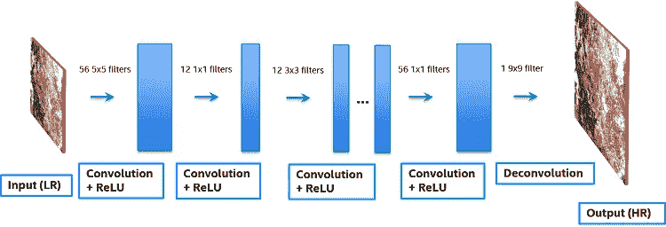
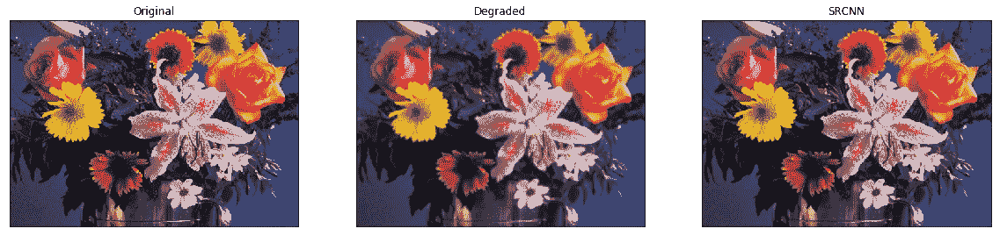
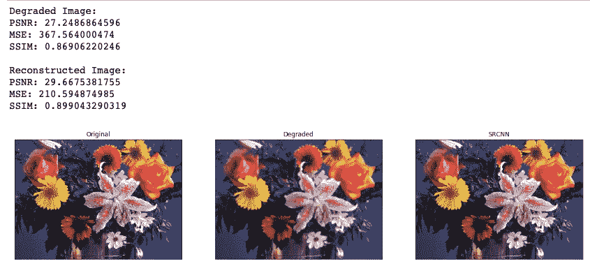

# 用于图像恢复的超分辨率卷积神经网络

> 原文：<https://medium.datadriveninvestor.com/using-the-super-resolution-convolutional-neural-network-for-image-restoration-ff1e8420d846?source=collection_archive---------0----------------------->

欢迎来到单幅图像超分辨率教程。超分辨率(SR)的目标是从低分辨率输入中恢复高分辨率图像，或者像他们在任何现代犯罪节目中所说的那样，**增强！**

SRCNN 的作者描述了他们的网络，指出了他们的方法与稀疏编码方法 4 的等价性，稀疏编码方法 4 是一种广泛用于图像 SR 的学习方法。这是他们工作的一个重要和教育方面，因为它显示了基于示例的学习方法如何适应和推广到 CNN 模型。

SRCNN 由以下操作组成 1:

1.  **预处理**:将 LR 图像放大到所需的 HR 尺寸。
2.  **特征提取**:从放大后的 LR 图像中提取一组特征图。
3.  **非线性映射**:将代表 LR 的特征映射到 HR 斑块。
4.  **重建**:从 HR 补片生成 HR 图像。



为了实现这一目标，我们将使用 Keras 部署超分辨率卷积神经网络(SRCNN)。这个网络发表在 2014 年 Chao Dong 等人的论文“使用深度卷积网络的图像超分辨率”中。你可以在 https://arxiv.org/abs/1501.00092 阅读全文。

[](https://www.datadriveninvestor.com/2019/03/03/editors-pick-5-machine-learning-books/) [## DDI 编辑推荐:5 本让你从新手变成专家的机器学习书籍|数据驱动…

### 机器学习行业的蓬勃发展重新引起了人们对人工智能的兴趣

www.datadriveninvestor.com](https://www.datadriveninvestor.com/2019/03/03/editors-pick-5-machine-learning-books/) 

如题所示，SRCNN 是一个深度卷积神经网络，它学习低分辨率到高分辨率图像的端到端映射。因此，我们可以用它来改善低分辨率图像的图像质量。为了评估该网络的性能，我们将使用三个图像质量指标:峰值信噪比(PSNR)、均方误差(MSE)和结构相似性(SSIM)指数。

简而言之，通过更好的超分辨率方法，我们可以获得更高质量的大图像，即使我们最初只能获得小图像。


此外，我们将使用 OpenCV，开源计算机视觉库。OpenCV 最初由英特尔开发，用于许多实时计算机视觉应用。在这个特定的项目中，我们将使用它来预处理和后处理我们的图像。正如您稍后将看到的，我们将频繁地在 RGB、BGR 和 YCrCb 色彩空间之间来回转换我们的图像。这是必要的，因为 SRCNN 网络是在 YCrCb 色彩空间中的亮度(Y)通道上训练的。

在本项目中，您将学习如何:

*   使用 PSNR、MSE 和 SSIM 图像质量度量，
*   使用 OpenCV 处理图像，
*   在 RGB、BGR 和 YCrCb 色彩空间之间转换，
*   在 Keras 建立深度神经网络，
*   部署和评估 SRCNN 网络

# 美国有线电视新闻网


# 1.导入包

让我们开始吧！在第一个单元格中，我们将导入我们将在这个项目中使用的库和包，并打印它们的版本号。这是确保我们意见一致的重要一步；此外，它将帮助其他人复制我们获得的结果。

```
*# check package versions*
**import** **sys**
**import** **keras**
**import** **cv2**
**import** **numpy**
**import** **matplotlib**
**import** **skimage**

print('Python: **{}**'.format(sys.version))
print('Keras: **{}**'.format(keras.__version__))
print('OpenCV: **{}**'.format(cv2.__version__))
print('NumPy: **{}**'.format(numpy.__version__))
print('Matplotlib: **{}**'.format(matplotlib.__version__))
print('Scikit-Image: **{}**'.format(skimage.__version__))
```

## *导入必要的包*

```
**from** **keras.models** **import** Sequential
**from** **keras.layers** **import** Conv2D
**from** **keras.optimizers** **import** Adam
**from** **skimage.measure** **import** compare_ssim **as** ssim
**from** **matplotlib** **import** pyplot **as** plt
**import** **cv2**
**import** **numpy** **as** **np**
**import** **math**
**import** **os**

*# python magic function, displays pyplot figures in the notebook*
%matplotlib inline
```

# 2.图像质量指标

首先，让我们定义几个可以用来计算 PSNR、MSE 和 SSIM 的函数。结构相似性(SSIM)指数直接从 scikit-image 库中导入；然而，我们将不得不为 PSNR 和 MSE 定义我们自己的功能。此外，我们将把所有这三个指标包装成一个函数，以便以后调用。

```
*# define a function for peak signal-to-noise ratio (PSNR)*
**def** psnr(target, ref):

    *# assume RGB image*
    target_data = target.astype(float)
    ref_data = ref.astype(float)

    diff = ref_data - target_data
    diff = diff.flatten('C')

    rmse = math.sqrt(np.mean(diff ** 2.))

    **return** 20 * math.log10(255\. / rmse)

*# define function for mean squared error (MSE)*
**def** mse(target, ref):
    *# the MSE between the two images is the sum of the squared difference between the two images*
    err = np.sum((target.astype('float') - ref.astype('float')) ** 2)
    err /= float(target.shape[0] * target.shape[1])

    **return** err

*# define function that combines all three image quality metrics*
**def** compare_images(target, ref):
    scores = []
    scores.append(psnr(target, ref))
    scores.append(mse(target, ref))
    scores.append(ssim(target, ref, multichannel =**True**))

    **return** scores
```

# 3.准备图像

在这个项目中，我们将使用原始 SRCNN 论文中使用的相同图像。我们可以从 http://mmlab.ie.cuhk.edu.hk/projects/SRCNN.html 的[下载这些图片。的。识别为 MATLAB 代码的 zip 文件包含了我们想要的图像。将 Set5 和 Set14 数据集复制到名为“source”的新文件夹中。](http://mmlab.ie.cuhk.edu.hk/projects/SRCNN.html)

现在我们有了一些图像，我们想制作这些相同图像的低分辨率版本。我们可以通过使用 OpeCV 上下调整图像大小来实现这一点。有几种插值方法可以用来调整图像的大小；然而，我们将使用双线性插值。

一旦我们制作了这些低分辨率的图像，我们可以将它们保存在一个新的文件夹中。

```
*# prepare degraded images by introducing quality distortions via resizing*

**def** prepare_images(path, factor):

    *# loop through the files in the directory*
    **for** file **in** os.listdir(path):

        *# open the file*
        img = cv2.imread(path + '/' + file)

        *# find old and new image dimensions*
        h, w, _ = img.shape
        new_height = h / factor
        new_width = w / factor

        *# resize the image - down*
        img = cv2.resize(img, (new_width, new_height), interpolation = cv2.INTER_LINEAR)

        *# resize the image - up*
        img = cv2.resize(img, (w, h), interpolation = cv2.INTER_LINEAR)

        *# save the image*
        print('Saving **{}**'.format(file))
        cv2.imwrite('images/**{}**'.format(file), img)prepare_images('source/', 2)
```

# 3.测试低分辨率图像

为了确保我们的图像质量指标计算正确，并且图像得到有效降级，让我们计算一下参考图像和我们刚刚准备的降级图像之间的 PSNR、MSE 和 SSIM。

```
*# test the generated images using the image quality metrics*

**for** file **in** os.listdir('images/'):

    *# open target and reference images*
    target = cv2.imread('images/**{}**'.format(file))
    ref = cv2.imread('source/**{}**'.format(file))

    *# calculate score*
    scores = compare_images(target, ref)

    *# print all three scores with new line characters (\n)* 
    print('**{}\n**PSNR: **{}\n**MSE: **{}\n**SSIM: **{}\n**'.format(file, scores[0], scores[1], scores[2]))
```

# 4.构建 SRCNN 模型

现在我们有了低分辨率图像，所有三个图像质量指标都正常工作，我们可以开始构建 SRCNN 了。在 Keras 中，这就像一个接一个地添加层一样简单。SRCNN 网络的架构和超参数可以从上面引用的出版物中获得。

```
*# define the SRCNN model*
**def** model():

    *# define model type*
    SRCNN = Sequential()

    *# add model layers*
    SRCNN.add(Conv2D(filters=128, kernel_size = (9, 9), kernel_initializer='glorot_uniform',
                     activation='relu', padding='valid', use_bias=**True**, input_shape=(**None**, **None**, 1)))
    SRCNN.add(Conv2D(filters=64, kernel_size = (3, 3), kernel_initializer='glorot_uniform',
                     activation='relu', padding='same', use_bias=**True**))
    SRCNN.add(Conv2D(filters=1, kernel_size = (5, 5), kernel_initializer='glorot_uniform',
                     activation='linear', padding='valid', use_bias=**True**))

    *# define optimizer*
    adam = Adam(lr=0.0003)

    *# compile model*
    SRCNN.compile(optimizer=adam, loss='mean_squared_error', metrics=['mean_squared_error'])

    **return** SRCNN
```

# 5.部署 SRCNN

现在我们已经定义了我们的模型，我们可以使用它进行单幅图像的超分辨率处理。然而，在此之前，我们需要定义几个图像处理函数。此外，在将图像用作网络输入之前，有必要对其进行广泛的预处理。该处理将包括裁剪和色彩空间转换。

此外，为了节省我们训练深度神经网络的时间，我们将为 SRCNN 加载预训练的权重。这些重量可以在下面的 GitHub 页面找到:【https://github.com/MarkPrecursor/SRCNN-keras 

一旦我们测试了我们的网络，我们就可以对我们所有的输入图像执行单图像超分辨率。此外，在处理之后，我们可以计算我们产生的图像上的 PSNR、MSE 和 SSIM。我们可以直接保存这些图像，或者创建支线剧情来方便地并排显示原始、低分辨率和高分辨率图像。

```
*# define necessary image processing functions*

**def** modcrop(img, scale):
    tmpsz = img.shape
    sz = tmpsz[0:2]
    sz = sz - np.mod(sz, scale)
    img = img[0:sz[0], 1:sz[1]]
    **return** img

**def** shave(image, border):
    img = image[border: -border, border: -border]
    **return** img*# define main prediction function*

**def** predict(image_path):

    *# load the srcnn model with weights*
    srcnn = model()
    srcnn.load_weights('3051crop_weight_200.h5')

    *# load the degraded and reference images*
    path, file = os.path.split(image_path)
    degraded = cv2.imread(image_path)
    ref = cv2.imread('source/**{}**'.format(file))

    *# preprocess the image with modcrop*
    ref = modcrop(ref, 3)
    degraded = modcrop(degraded, 3)

    *# convert the image to YCrCb - (srcnn trained on Y channel)*
    temp = cv2.cvtColor(degraded, cv2.COLOR_BGR2YCrCb)

    *# create image slice and normalize* 
    Y = numpy.zeros((1, temp.shape[0], temp.shape[1], 1), dtype=float)
    Y[0, :, :, 0] = temp[:, :, 0].astype(float) / 255

    *# perform super-resolution with srcnn*
    pre = srcnn.predict(Y, batch_size=1)

    *# post-process output*
    pre *= 255
    pre[pre[:] > 255] = 255
    pre[pre[:] < 0] = 0
    pre = pre.astype(np.uint8)

    *# copy Y channel back to image and convert to BGR*
    temp = shave(temp, 6)
    temp[:, :, 0] = pre[0, :, :, 0]
    output = cv2.cvtColor(temp, cv2.COLOR_YCrCb2BGR)

    *# remove border from reference and degraged image*
    ref = shave(ref.astype(np.uint8), 6)
    degraded = shave(degraded.astype(np.uint8), 6)

    *# image quality calculations*
    scores = []
    scores.append(compare_images(degraded, ref))
    scores.append(compare_images(output, ref))

    *# return images and scores*
    **return** ref, degraded, output, scoresref, degraded, output, scores = predict('images/flowers.bmp')

*# print all scores for all images*
print('Degraded Image: **\n**PSNR: **{}\n**MSE: **{}\n**SSIM: **{}\n**'.format(scores[0][0], scores[0][1], scores[0][2]))
print('Reconstructed Image: **\n**PSNR: **{}\n**MSE: **{}\n**SSIM: **{}\n**'.format(scores[1][0], scores[1][1], scores[1][2]))

*# display images as subplots*
fig, axs = plt.subplots(1, 3, figsize=(20, 8))
axs[0].imshow(cv2.cvtColor(ref, cv2.COLOR_BGR2RGB))
axs[0].set_title('Original')
axs[1].imshow(cv2.cvtColor(degraded, cv2.COLOR_BGR2RGB))
axs[1].set_title('Degraded')
axs[2].imshow(cv2.cvtColor(output, cv2.COLOR_BGR2RGB))
axs[2].set_title('SRCNN')

*# remove the x and y ticks*
**for** ax **in** axs:
    ax.set_xticks([])
    ax.set_yticks([])
```



```
**for** file **in** os.listdir('images'):

    *# perform super-resolution*
    ref, degraded, output, scores = predict('images/**{}**'.format(file))

    *# display images as subplots*
    fig, axs = plt.subplots(1, 3, figsize=(20, 8))
    axs[0].imshow(cv2.cvtColor(ref, cv2.COLOR_BGR2RGB))
    axs[0].set_title('Original')
    axs[1].imshow(cv2.cvtColor(degraded, cv2.COLOR_BGR2RGB))
    axs[1].set_title('Degraded')
    axs[1].set(xlabel = 'PSNR: **{}\n**MSE: **{}** **\n**SSIM: **{}**'.format(scores[0][0], scores[0][1], scores[0][2]))
    axs[2].imshow(cv2.cvtColor(output, cv2.COLOR_BGR2RGB))
    axs[2].set_title('SRCNN')
    axs[2].set(xlabel = 'PSNR: **{}** **\n**MSE: **{}** **\n**SSIM: **{}**'.format(scores[1][0], scores[1][1], scores[1][2]))

    *# remove the x and y ticks*
    **for** ax **in** axs:
        ax.set_xticks([])
        ax.set_yticks([])

    print('Saving **{}**'.format(file))
    fig.savefig('output/**{}**.png'.format(os.path.splitext(file)[0])) 
    plt.close() 
```



***更多编程相关玩意儿，关注我上***[***Twitter***](https://twitter.com/xoraus)***&***[***Github***](https://github.com/xoraus)***。***

[](https://github.com/xoraus/Super-Resolution-CNN-for-Image-Restoration) [## GitHub-xor aus/Super-Resolution-CNN-for-Image-Restoration:超分辨率(SR)的目标是…

### 欢迎来到单幅图像超分辨率教程。超分辨率(SR)的目标是恢复图像中的噪声

github.com](https://github.com/xoraus/Super-Resolution-CNN-for-Image-Restoration) [](https://github.com/xoraus) [## xoraus -概述

### 此时您不能执行该操作。您已使用另一个标签页或窗口登录。您已在另一个选项卡中注销，或者…

github.com](https://github.com/xoraus) 

参考文献:
【1】[https://en.wikipedia.org/wiki/Convolutional_neural_network](https://en.wikipedia.org/wiki/Convolutional_neural_network)

[http://keras.io/examples/cifar10_cnn/](http://keras.io/examples/cifar10_cnn/)

[http://keras.io/layers/convolutional/](http://keras.io/layers/convolutional/)

[https://arxiv.org/abs/1501.00092](https://arxiv.org/abs/1501.00092)

[http://mmlab.ie.cuhk.edu.hk/projects/SRCNN.html](http://mmlab.ie.cuhk.edu.hk/projects/SRCNN.html)。

[6] [2014 ECCV] [SRCNN]
[学习图像超分辨率的深度卷积网络](https://arxiv.org/pdf/1501.00092)