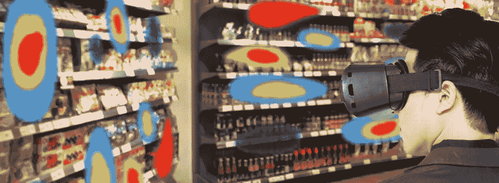

# 使用虚拟现实零售产品店内摆放

> 原文：<https://medium.datadriveninvestor.com/using-virtual-reality-retail-product-in-store-placements-a0272fddd9cd?source=collection_archive---------2----------------------->

各品牌都在争夺货架上最先吸引用户注意力的有利可图的位置。虚拟现实甚至可以在产品进入商店之前帮助找到完美的货架。

Image source: [https://www.popai.co.uk](https://www.popai.co.uk)

有没有想过为什么商店里的某些产品放在眼睛的高度，而有些放在膝盖以下？根据多年的研究，品牌已经发现用户的目光落在货架上的什么地方，他们会把最有价值(或最受欢迎)的产品放在那个地方。这些都是基于摄像机的设置，在实际商店中进行。摄像机组将被安装在天花板上或架子上，并且使用图像处理，用户的旅程以及他们的眼睛交互将被监控。这需要大量的基础设施，而且非常耗时。直到虚拟现实打乱了这个过程。

借助虚拟现实，商店设计师可以创建一个有多个选项的 3D 虚拟商店，然后在虚拟空间中“漫步”。零售中的虚拟现实可用于 A/B 测试，以估计交通流量，并提供关于消费者将如何使用布局配置的可测量数据——因此零售商可以通过最少的猜测来优化占地面积。

通过这种设置，零售商可以重新设计、重新测试并不断获取数据，直到找到最佳布局。设计团队可以节省资金和时间，同时创造一个完全满足客户需求和体验的空间。

建立一个虚拟现实商店要比一个真实的商店便宜得多，零售商得到的关于虚拟商店设计的反馈足够接近他们在物理环境中得到的反馈，以至于没有区别。下面由[in version](https://invrsion.com/retail/)制作的演示视频展示了虚拟现实是如何被用于规划商店和零售产品布局的

[https://invrsion.com/retail/](https://invrsion.com/retail/)

这种系统允许准确地测试和绘制顾客旅程，从而根据用户交互行为在货架布局和商品销售调整方面实现更好的零售管理。

retail VR heatmap

通过跟踪用户在虚拟商店中的目光，分析师可以构建热图，了解用户看得最多的地方，然后得出保存有价值品牌的最佳货架。另一方面，品牌利用这些数据来购买零售店的货架空间。例如，零售商可能了解到大多数顾客只看入口处的顶层货架，或者他们更好地响应某些端盖展示。能够跟踪和确认这些行为使零售商能够更有效地设计和布置商店。

这些解决方案允许准确预测用户行为，从而提供良好的用户购物体验。

[*库马尔·阿希尔*](http://www.kumarahir.com) *是沉浸式技术和设计领域的独立顾问。他一直在通过积极举办关于设计思维、AR 和 VR 设计、混合现实技术原型的研讨会来宣传新的沉浸式技术和设计。他的目标是为沉浸式技术创造一个更好的设计生态系统。到目前为止，他已经联合创立了两家公司。*

*在*[*LinkedIn*](https://www.linkedin.com/in/kumarahir)*了解他，在* [*Twitter*](https://twitter.com/kernel_kumar) 关注他