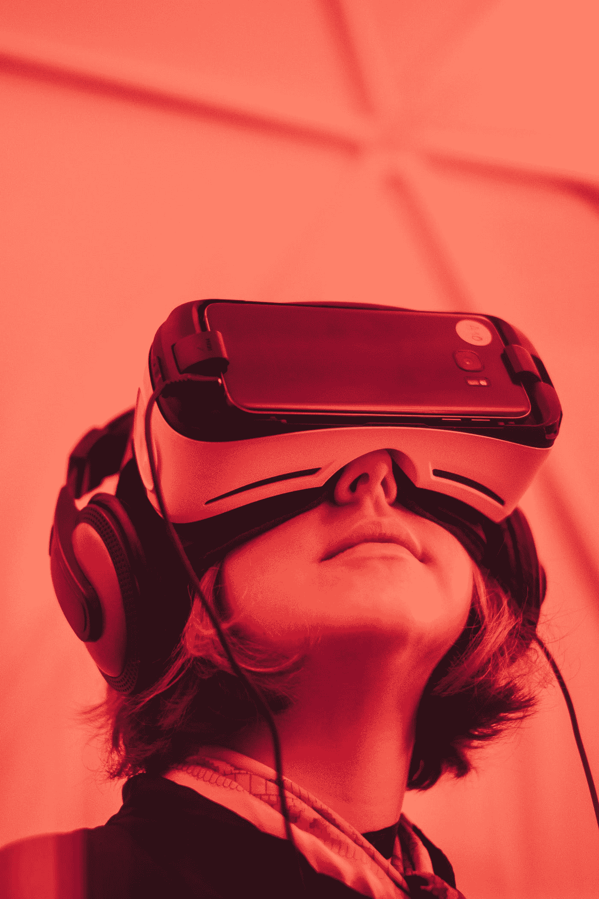

# 利用虚拟现实治疗酒精成瘾

> 原文：<https://medium.datadriveninvestor.com/using-virtual-reality-to-treat-alcohol-addiction-20953d519ec6?source=collection_archive---------0----------------------->

“A person in a virtual reality headset and headphones” by [Samuel Zeller](https://unsplash.com/@samuelzeller?utm_source=medium&utm_medium=referral) on [Unsplash](https://unsplash.com?utm_source=medium&utm_medium=referral)

虚拟现实疗法已被证明有助于酗酒者对抗烟瘾。虚拟现实治疗将患者暴露在模拟的环境中，这种环境通常会在安全和可控的环境中引发焦虑或渴望。这种疗法的倡导者说它有效的原因之一是它允许治疗因人而异。每个人所处的环境都是最有可能导致饮酒的特定环境。

在一项研究中，在为期一周的排毒之后，受试者在练习应对策略的同时接触三种虚拟情境，以帮助他们忍受生理和心理上的渴望(Son，Lee，Seok，Kee，Lee，Kim，& Han，2015)。第一种情况是轻松的场景。第二种情况利用了一个餐馆场景，涉及到其他喝酒的人。第三种情况是厌恶场景，包括其他人饮酒过量后生病的景象、气味和声音。参与者在五周内每周参加两次虚拟现实会议。评估脑代谢变化的 PET 和 CT 扫描显示，与对照组受试者相比，治疗结束后对酒精的渴望降低。

尽管这项研究只是对少数受试者的初步调查，但它确实提供了重要的启示。首先，它表明那些酒精依赖者对触发酒精使用的刺激更加敏感，这可以在他们的边缘系统中观察到。这提供了一种潜在的方法来评估治疗前和治疗后的渴望水平，这有助于控制自我报告措施的低可靠性。

该研究结果还提出了一种潜在的治疗方法，即在逼真的环境中进行暴露，可以在治疗环境中进行管理和控制。暴露已被反复证明是预防酒精使用障碍复发的最有效方法。在治疗的初始阶段，可能会建议避免涉及饮酒的高风险情况，但这种策略很少能维持下去。酒精的使用在我们的社会中很普遍，并且经常是社交和庆祝活动的一部分。因此，很难继续完全避免使用酒精的情况和环境。由于这些情况通常包括导致一个人在过去饮酒的触发因素，除非他们能够在这些高风险的情况下保持清醒，否则在未来暴露于这些情况时，复发将是可能的。

然而，在缺乏治疗支持的情况下，让个体将自己暴露在高风险的情况下也是极其危险的，就像对其他行为困难所做的那样。虚拟现实允许酒精依赖者在逼真的场景中练习抵制酒精使用的应对技巧。虽然认知上个人知道这种情况不是真实的，但生理学发现表明，这种方法仍然可以在现实生活中成功地帮助重新编程大脑。这可以改善对治疗的反应，因为减少的生理渴望可以帮助个体抵抗心理渴望，使认知行为技术更有效，见效更快。

有人批评使用虚拟现实治疗酒精和药物滥用。一些人表示，研究大脑在这些场景中的反应对于理解可能导致的任何神经后果至关重要。这只能通过 MRI 和其他成像技术来确定，需要个人完全静止，这在使用虚拟现实方法时是不可能的。一些研究人员还质疑，由于治疗的现实性质，使用虚拟现实治疗是否会使一些人的症状恶化。需要使用不同年龄、背景和性别的受试者进行更大规模的研究，以进一步调查虚拟现实治疗酒精依赖的有效性以及个体特征如何影响治疗结果。

看[这个链接](https://www.usatoday.com/videos/tech/2016/02/02/79401070/)看一个关于虚拟现实如何被用来治疗一系列精神健康困难和障碍的视频。

**参考文献**

德拉·卡瓦，男(2016 年 2 月 6 日)。虚拟现实的承诺，健康研究人员面临的风险很大。检索自[http://www . USA today . com/story/tech/news/2016/02/02/virtual-reality-promise-and-concerns-both-loom-large-researchers/79360096/](http://www.usatoday.com/story/tech/news/2016/02/02/virtual-reality-promise-and-concerns-both-loom-large-researchers/79360096/)

孙俊辉、李绍辉、徐俊伟、姬伯生、李俊辉、金海辉、韩大辉(2015)。酒精依赖治疗的虚拟现实疗法:正电子发射断层扫描/计算机断层扫描的初步研究。酒精和药物研究杂志，76(4)，620–627。