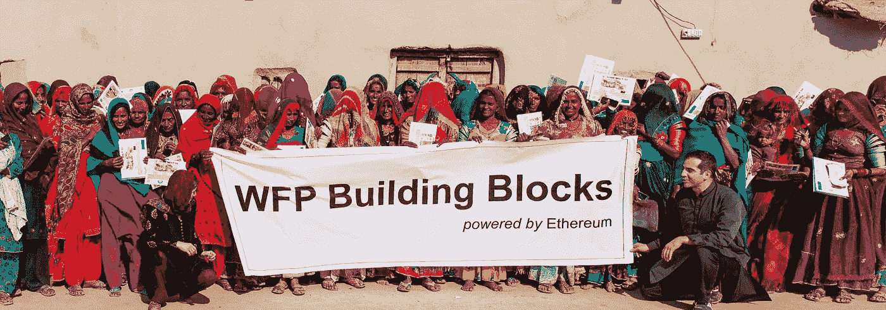

# 利用加密货币和区块链技术造福人类

> 原文：<https://medium.datadriveninvestor.com/utilizing-cryptocurrency-blockchain-technology-for-the-good-of-humankind-28918e61b760?source=collection_archive---------5----------------------->

**秘密社区并非所有贪婪的机会主义者都是为了自己**

《环球邮报》商业报道高级编辑 Rita Trichur 在一篇题为[的文章中写道:“加密货币推广者说他们在帮助人类——但他们只是在帮助自己”](https://www.theglobeandmail.com/business/commentary/article-cryptocurrency-promoters-say-theyre-helping-humanitybut-theyre-just/)，她在文章中谈到了社区中一些成员创造的财富、ICO 骗局和贪婪；一个千禧年男孩俱乐部，所谓的“加密兄弟”，似乎在他们旧金山兄弟会风格的房子里陶醉于他们的沙文主义。

我很清楚这个行业的许多参与者知道这个领域可以赚钱，但我也很荣幸地知道这个领域有许多伟大的创新者，他们不断思考如何在他们的项目中帮助人类。

** *文章没有提到区块链的技术，只是和 crypto 有区别但这篇文章不是先有鸡还是先有蛋的争论。***

我问了一些在区块链加密空间的朋友他们对这篇文章的看法，以下是我收到的一些回复:

> 如果你不是解决方案的一部分，那么你就是问题的一部分。如果你对试图解决问题的人肆意诽谤，那么你就是问题的一部分。区块链开发者社区正试图使用密码经济学作为工具来解决现实世界的问题和挑战，而那些通过诽谤问题解决者来优化点击诱饵 CPM 的记者，需要检查他们所做的导致他们成为问题一部分的所有选择。”—[rnd flo Inc](https://www.rndflo.com/)首席技术官 Arunabh Das。
> 
> *“有趣的是人们如何歪曲事实为自己服务。例如，“hodl”源于一个错别字，但在本文中从“hold”变成了“hold for dear life ”,使得这个缩写听起来像是一件坏事。一般技术也是如此，特别是区块链技术。*
> 
> 有些人发明技术，并努力让它为社会和其他人服务，但也有些人想让它为自己服务，并把它作为致富计划。这里的共同点是人，而不是区块链技术。区块链技术是没有国界的伟大发明，具有解决世界问题的巨大潜力。我们如何使用它是另一个故事。看看人们和他们所做的——不要把这归咎于技术。
> 
> CryptoChicks 确实关心区块链技术及其未来，因为我们看到了它的潜力。我们确实关心通过引入更多的人来使它更多样化、更有用；尤其是女性。我们的女性将如何使用它——这取决于她们，但我们希望给她们和区块链技术一个共同发展的机会。”——T2CryptoChicks 创始人兼首席执行官埃琳娜·辛妮科娃

**区块链技术造福大众**

被许多人称为“未来最大的发明”，区块链的发展可能会彻底改变与人类利益相关的问题。虽然许多人对区块链还没有清晰的了解，但这项技术正慢慢变得越来越广为人知。

**什么是区块链技术？**

> “区块链是一个不朽的经济交易数字账本，可以通过编程不仅记录金融交易，还记录几乎所有有价值的东西。”
> 
> Don & Alex Tapscott，《区块链革命》作者(2016)

**区块链技术有助于遏制儿童贩运—** 人权是区块链技术可以产生重大积极影响的关键领域。联合国帮助开发了一个区块链身份试点项目，旨在遏制贩卖儿童。5 岁以下无证件儿童往往被政府和其他机构视为“隐形”儿童，更有可能落入儿童贩运者手中。令人震惊的是，这占了世界儿童的一半。这些人贩子为这些年幼的孩子制造假身份，这样他们就可以被交易和出售到非法的人体器官交易、现代奴役集团或性交易中。在区块链上存储数字身份可能会大大增加抓住这些人贩子和释放被贩运儿童的机会。

> *“贩卖儿童是最严重的侵犯人权行为之一。利用区块链技术提供了潜在的强大解决方案来应对这一严峻挑战，拯救数百万儿童的生命。”*
> 
> 联合国助理秘书长兼联合国妇女署副执行主任 Yannick Glemarec

**区块链技术帮助难民—** 区块链技术可以帮助数百万难民解决关键问题，如文件、饥饿和获得工作。当难民离开家园时，他们往往被迫迅速离开。这意味着他们中的许多人留下了重要的文件，可以帮助他们在一个新的国家开始新的生活，如护照，结婚证和出生证明。区块链的身份是有时间标记和公开的，这使得难民更容易获得数字身份证件，其他政府可以用它来核实他们的身份。

[Bitnation](https://tse.bitnation.co/) ，世界上第一个去中心化的无边界志愿国家，于 2014 年 7 月开始，举办了世界上第一个区块链婚姻，出生证明，难民紧急 ID，世界公民身份，DBVN 宪法等。该网站的概念验证，包括区块链身份证和公证人，被世界各地成千上万的比特币公民和大使馆使用。2015 年，Bitnation 通过一个名为难民应急响应(BRER)的分散化项目在区块链登记了第一批难民，通过登记区块链的无证人员来帮助解决欧洲当前的难民危机。

World Food Program Building Blocks Project

**区块链技术帮助解决饥饿问题**——当国际组织分发援助时，难民资金管理不善是一个日益严重的问题。世界粮食计划署正在采取措施，利用区块链技术为最需要的人提供有效的援助。通过积木盒子试点，WFP 正在测试区块链技术，作为一种使现金转移更加高效、透明和安全的手段。对于生活在难民营中的难民，Building Blocks 已经集成了由 IrisGuard 开发的现有生物认证技术，使难民可以在眨眼之间识别自己的身份。

通过代金券或预付借记卡进行的现金转移使那些有需要的人能够在当地购买自己的食物，这是使他们能够自己做出购买决定以缓解饥饿的一种有效方式。

截至 2018 年 1 月，超过 10 万名居住在难民营的难民通过这个位于区块链的系统兑换了 WFP 提供的援助。

**区块链技术有助于打击食物链中的侵犯人权行为—**2018 年初，世界野生动物基金会及其合作伙伴将革命性的区块链技术引入太平洋岛屿的金枪鱼行业，这是该地区的第一项此类技术，以帮助杜绝非法捕捞和侵犯人权行为。

> “利用区块链实现从鱼饵到盘子的透明，将意味着非法、无管制和未报告的捕捞活动或那些使用奴隶劳动力或强加可怕条件的经营者无处藏身。”
> 
> -世界自然基金会-澳大利亚首席执行官德莫特·奥格曼

区块链技术允许大型买家(如沃尔玛)知道他们的鱼是否正在被合乎道德地捕捞，甚至允许消费者验证他们的食物实际上来自哪里，以及在什么条件下。

加密货币/区块链领域出现了许多伟大的项目，希望随着监管的加强，好项目将得到更多的关注，因为坏苹果将被挤出这个领域。

> 人类进化过程中的任何重大进步都是由技术推动的。火允许我们物种用从熟食中获得的新营养来大量生长我们的大脑。个人电脑实现了普通公民和计算能力之间的结合，现在区块链实现了对大多数人类交流的无信任记录，包括在技能和思想受到重视的去中心化精英制度中聚合数据和人工智能的关系；性别、国籍、宗教、肤色和社会经济地位变得无关紧要。
> 
> 我是 CodingFly 的联合创始人，这家公司的成立是为了给 IT 开发人员创造一个解决方案，这些开发人员的工作往往得不到报酬，或者他们有权保护自己的知识产权。这很容易用智能合约触发器来弥补，这是区块链技术的一个特别理想的用例。确实有很多这样的例子，从小额信贷履行到区块链影院公司用代币奖励纪录片观众的现有行为，然后这些代币可以捐赠给致力于解决电影中强调的问题的团体，区块链革命充满了致力于让世界变得更美好的工具和充满活力的思想。我们这些消费政府服务以及私营部门商品和服务的全球公民现在需要通过我们的消费行为来决定如何使用和管理我们的数据，以确保一个安全、平等的未来。
> 
> 兰迪·麦奎尔，联合创始人[编码员](http://www.codingfly.com/)

[Rakicevic Nenad](https://www.pexels.com/@rakicevic-nenad-233369)

# 奥黛丽·奈斯比特

[奥黛丽·奈斯比特在 Linkedin 上](https://www.linkedin.com/in/audrey-nesbitt-0388a52a/)

[@ audreynesbit 11 在推特上](https://twitter.com/AudreyNesbitt11)

最初发布于:[https://www . block delta . io/the-crypto-community-just-bunch-of-wanderable-millionaires-and-opportunities-or-no/](https://www.blockdelta.io/the-crypto-community-just-a-bunch-of-wannabe-millionaires-and-opportunists-or-no/)