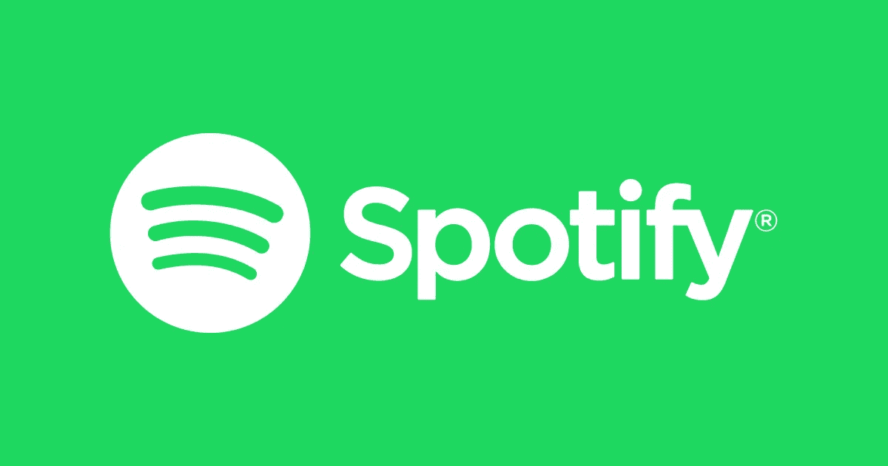
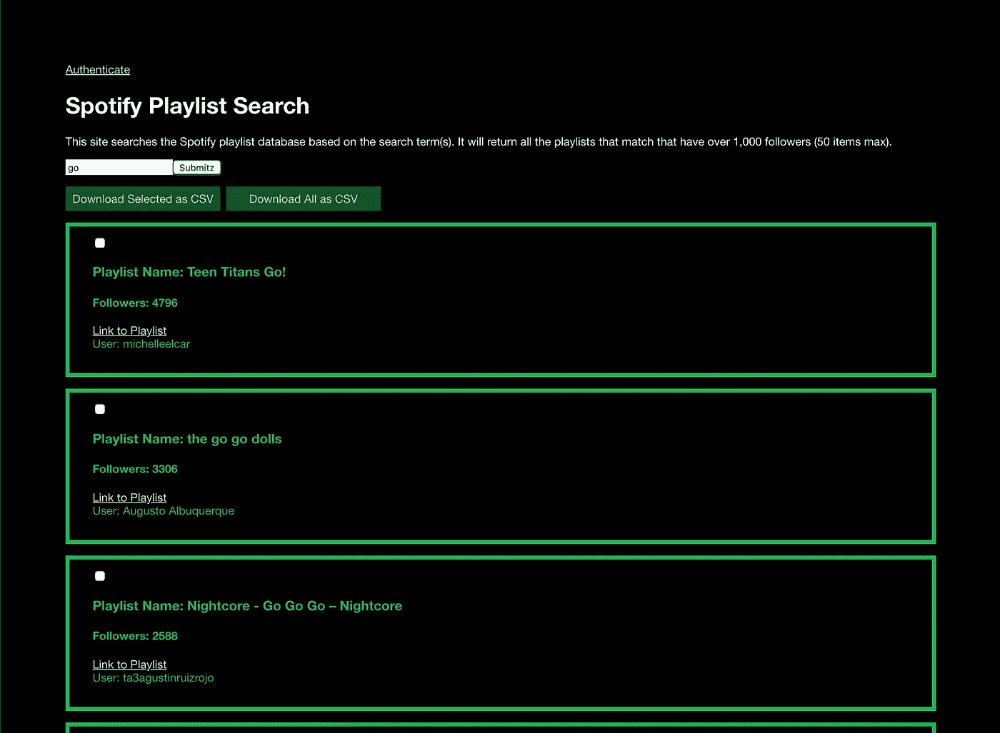
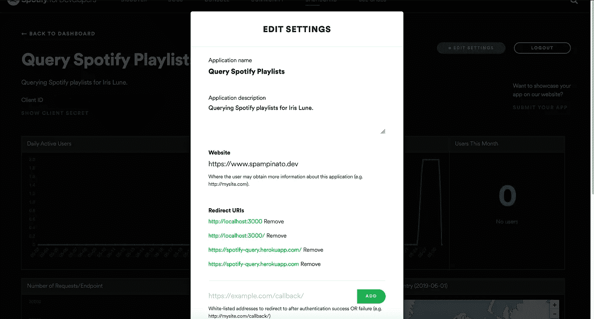
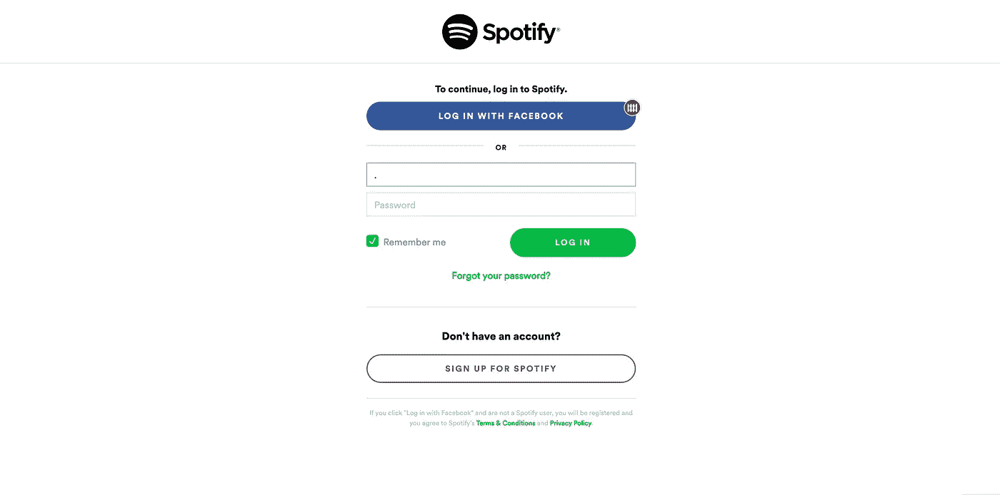

# 利用 Spotify API 进行音乐公关

> 原文：<https://medium.datadriveninvestor.com/utilizing-the-spotify-api-for-music-pr-da2060e0c203?source=collection_archive---------4----------------------->

[](http://www.track.datadriveninvestor.com/1B9E)

如今，艺术家越来越依赖 Spotify 来获得认可，而这通常是通过 Spotify 播放列表实现的。其中很多是通过 Spotify 制作的官方播放列表，但也有数百万由用户制作的播放列表，它们也非常受欢迎。

我的乐队，Iris Lune，很快就要发行音乐了。我们认为与拥有流行播放列表的用户接触是一个好主意，希望我们的音乐能够得到特别介绍。考虑到这一点，我开发了一个 web 应用程序来帮助我们。



该网站允许你搜索 Spotify 的整个播放列表数据库，只返回与搜索词匹配且拥有超过 1000 名粉丝的播放列表。然后，您可以通过链接直接进入播放列表，或者以. csv 文件的形式下载数据。

[](https://www.datadriveninvestor.com/2019/02/25/6-alternatives-to-the-yahoo-finance-api/) [## 雅虎财经 API 的 6 个替代方案——数据驱动投资者

### 雅虎财务 API 是新的财务 API 万岁！雅虎财务 API 长期以来一直是许多公司的可靠工具。

www.datadriveninvestor.com](https://www.datadriveninvestor.com/2019/02/25/6-alternatives-to-the-yahoo-finance-api/) 

# 使用 Spotify API

Spotify API 要求您拥有一个 Spotify 帐户，并通过它来鉴定您正在使用的服务。这个过程的第一步是[创建一个账户](https://www.spotify.com/us/signup/)，如果你还没有的话。

## 制作 Spotify 应用程序

接下来，你必须通过[开发者仪表盘](https://developer.spotify.com/dashboard/applications)创建一个 Spotify 应用。一旦你完成了，编辑设置，使应用程序有一个重定向 URI(如果你在本地运行你的网站，你会想做本地主机)。



Edit your Spotify app settings to include the correct redirect URI

## 授权流程

对你的 app 的用户授权有三种不同的方式，可刷新用户授权: [**授权码**](https://developer.spotify.com/documentation/general/guides/authorization-guide/#authorization-code-flow) ，临时用户授权: [**隐式授予**](https://developer.spotify.com/documentation/general/guides/authorization-guide/#implicit-grant-flow) ，可刷新 app 授权: [**客户端凭证流程**](https://developer.spotify.com/documentation/general/guides/authorization-guide/#client-credentials-flow) 。请随意阅读关于每个方法的更多信息，对于这个例子，我将使用隐式授权，因为我的应用程序没有后端，只有 JavaScript。

通过 Spotify 认证用户是能够访问 API 的第一步。我是这样做的(我使用 React):

```
<a href={`[https://accounts.spotify.com/authorize?client_id=[your client id here]&response_type=token&redirect_uri=http://localhost:3000/&scope=user-read-private%20user-read-email`](https://accounts.spotify.com/authorize?client_id=${process.env.REACT_APP_CLIENT_ID}&response_type=token&redirect_uri=https://spotify-query.herokuapp.com/&scope=user-read-private%20user-read-email`)}>
  Authenticate
</a>
```

从 Spotify 仪表盘中复制并粘贴客户端 ID，并将其输入上面显示`[your client id here]`的链接中。如果设置正确，这将创建一个供用户单击的链接，将用户带到此屏幕:



Spotify OAuth screen

登录后，用户将被重定向到您指定的重定向 URI。

> M 确保你已经在 Spotify 仪表盘中定义了链接中使用的准确的重定向 URI，如果没有，你会得到一个错误。

此外，您在地址栏中的 URL 现在应该看起来像这样:

```
[http://localhost:3000/#access_token=BQCo0LvRi18GhXaoUcsU1b-QxAZDaSIc4Il6pzVWrKOJIzGpkqmtUPJPTOEoL0T84O9yAgSRiUXL6xo1NQmH-_d44jBn0Gsx6RKpDhNmdvQurvzrrP3qHe8OUmn7JQjT2eyEPABzGY2C7qTbmU50Ys7sl9GN4l2fQzA&token_type=Bearer&expires_in=3600](http://localhost:3000/#access_token=BQCo0LvRi18GhXaoUcsU1b-QxAZDaSIc4Il6pzVWrKOJIzGpkqmtUPJPTOEoL0T84O9yAgSRiUXL6xo1NQmH-_d44jBn0Gsx6RKpDhNmdvQurvzrrP3qHe8OUmn7JQjT2eyEPABzGY2C7qTbmU50Ys7sl9GN4l2fQzA&token_type=Bearer&expires_in=3600)
```

现在，您已经获得了开始查询 API 的适当授权！为此，来自该 URL 的访问令牌是必要的。我使用`window.location.hash.substring(14, 177)`检索它，将它保存到 state，并传递给我的 fetch 请求:

```
fetch(`[https://api.spotify.com/v1/search?q=${this.state.searchTerm}&type=playlist&limit=50`](https://api.spotify.com/v1/search?q=${this.state.searchTerm}&type=playlist&limit=50`), {
   method: 'GET',
   headers: {
      'Authorization': 'Bearer ' + this.state.accessToken
   }
})
```

我正在搜索所有的 Spotify 播放列表，关于你可以搜索的更多选项，请查看[官方文档](https://developer.spotify.com/documentation/web-api/reference/search/search/)。

# 结论

有了 API 的响应，您就可以随心所欲地使用数据了！我们的具体用例是查找播放列表，并发送我们的音乐，以便有可能成为特色。虽然可能性是无限的，但 Spotify API 已经有了一些真正创造性的用途，如 [Spotify 音频分析应用](https://spotify-audio-analysis.glitch.me/analysis.html)和[autoconiazer](https://github.com/plamere/autocanonizer)。

希望这能鼓励你做一些很棒的东西，如果你最终通过这个指南做了一些东西，请把它发给我！

## 链接

*   [https://developer.spotify.com/dashboard](https://developer.spotify.com/dashboard)—Spotify 开发仪表板
*   [https://developer.spotify.com/documentation/web-api/](https://developer.spotify.com/documentation/web-api/)—官方文件