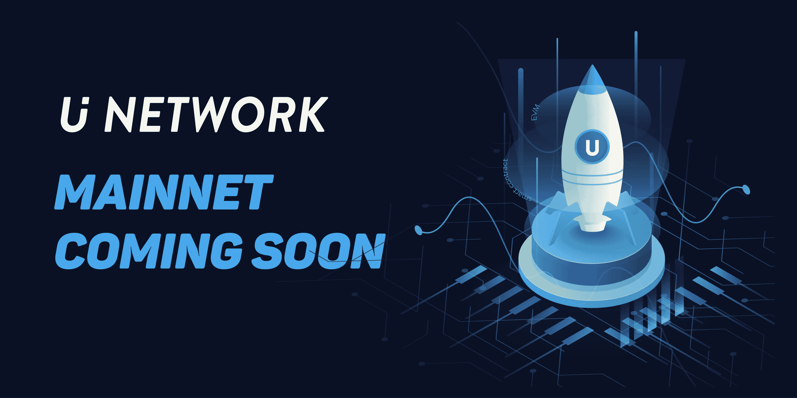

# UUU 新闻— Mainnet、智能合同、Dapps

> 原文：<https://medium.datadriveninvestor.com/uuu-news-mainnet-smart-contracts-dapps-2288841a5fb2?source=collection_archive---------39----------------------->

**来自 U 网的激动人心的消息由该社区成员播报**

成为 U Network 的社区成员是一件令人兴奋的事情。该团队在当前的熊市周期中一直努力工作，以生产出优秀的产品。本月晚些时候，当他们的 mainnet 发布时，他们的努力将达到高潮。

除了 mainnet 之外，U Network 今天还证实，智能合约将能够部署在他们的网络上，并将为内容行业定制和优化虚拟机。这可能为项目的未来发展带来巨大的潜力，并推动项目的采用。

来自[的 Ken You](https://medium.com/u/d677fddeb18e) ，U Network 的社区和营销负责人，今天探讨了在 mainnet 之后这对 U Network 意味着什么:

> 考虑到以太坊目前规模的生态，U 网也兼容以太坊虚拟机(EVM)，这意味着未来以太坊生态中的所有 DApps 都可以运行在 U 网上。这充分拓展了 UUU 未来的应用场景。

他进一步说:

> 我们欢迎开发者现在就在 U 网上部署智能合约。

本周来自 U Network 的其他令人兴奋的消息是,“你自己的代币”比赛已经结束，获胜者已经公布。祝贺获得第一名的政客们，他们的努力将获得 40 万 UUU 代币。也祝贺贸易大师和勇气令牌谁将获得 200，000 UUU 令牌为采取联合第二名。我自己的参赛作品“父母硬币”和其他九个人一起获得了一个小奖。所有结果[点击此处](https://twitter.com/UNetworkHQ/status/1061219771583102978)。如果你想更详细地查看条目，请在[r/unenetwork](https://www.reddit.com/r/UNetwork/)加入 U Network 子编辑。subreddit 也是一个了解 U Network 以及官方媒体频道[unenetwork](https://medium.com/u/2f3be7ec4fc0)的好地方。

最后，U Got beta 测试已经完成，奖励已经分发给参与者。对我个人和社区来说，这是另一次愉快的经历。beta 测试主要针对开发团队的以下几点，我认为现在 U Network 已经有了稳定的市场产品。

*   UI 迭代和用户体验改善
*   后台数据导入导出和反作弊功能的改进
*   令牌提取和转移功能的系统优化
*   修复移动端功能和显示兼容性
*   UI 优化设计和部分交互调整
*   优质内容后端奖励分配功能的开发
*   后端项目管理接口数据可选功能的调整
*   修复奖励计算记录等问题