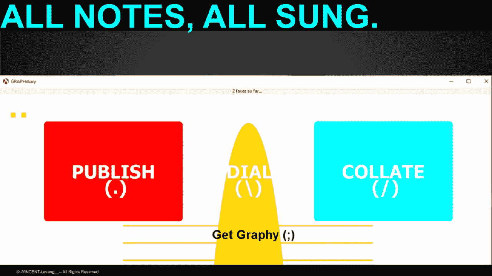

# UXDB:脚本数据存储

> 原文：<https://medium.datadriveninvestor.com/uxdb-a-scripted-data-store-f12be5f3456f?source=collection_archive---------5----------------------->

## “交互式”数据存储是降低数据存储资源需求的关键

当谈到数据库、计算设备和临时存储时，没有太多的*呐喊*和*尖酸刻薄*围绕着将我们的数据存储资源需求保持在最低限度的“必要性”。

当涉及到数据库、计算设备和临时存储时，需要“数据库”和“用户体验”之间的[更紧密的交互。](https://medium.com/@lesdikgole/a-ux-is-a-database-a-database-is-a-ux-8123d6605a17)

 [## 成为数据科学家所需的 8 项技能|数据驱动型投资者

### 数字吓不倒你？没有什么比一张漂亮的 excel 表更令人满意的了？你会说几种语言…

www.datadriveninvestor.com](https://www.datadriveninvestor.com/2019/02/07/8-skills-you-need-to-become-a-data-scientist/) 

这个中的*更接近* **uxdb "** 互动"实际需要的，是 UX 和 db 设计形式之间的清晰路径和严格理解。这些形式所包含的思想是，计算机程序中使用的任何“数据”本质上只是另一种形式的“代码”——程序。

这些新表单有趣的“副作用”当然是保留通常分配给“数据”表单的“空间”。

然而**实际上**随之而来的是，UX 和数据库*的“分离”的改进意味着*将“计算”需求与“存储”需求分离变得更加困难！！！

一不小心，这个“计算”需求*极有可能*，**就变得**格外的复杂！

但是有无数的方法来*减轻*这种“计算”风险，通过 1)在设备、服务器/后端和 CDN 之间分配*计算*；2)利用计算“数据存储”或遵循我们已经习惯的传统“数据库”模型。

# 模型

提出的模型相当简单:将数据存储和计算或显示/ux 的形式“混合”成一个统一的形式。

于是，“计算机”就成了发挥功能性功效的手段，而不仅仅是单纯的“计算”或信息“存储”的手段。

功能功效方面，*确实包括***计算和*信息存储*。并不是一切都没了。但是这个*清洁器*模型收获很大。**

# **怎么会？**

**那么考虑一下，任何“计划”的资源“需求”的任何“计算”必然会稍微复杂一些。**

**但这样做不仅更“准确”；也更加[系统化](https://medium.com/@lesdikgole/the-wrong-function-hypothesis-9bc4bb2981a7)。**

**考虑到大多数“软件工程”已经变得如此抽象，以至于甚至“db”和/或“ux”的“范例”已经变得基本上没有定义的意义(这也包括“客户机”和/或“服务器”的范例)。**

****

**[http://graphdiary.com/](http://graphdiary.com/)**

## **准确(性)**

**由于等式中所有硬件能力的协作，可以更好地实现精度。迄今为止，在计算和软件设计中，一直存在着对“速度”和其他相关计算“能力”的痴迷，坦率地说，这缺乏对为什么以及如何增加这些特定“能力”为总体功能功效增加“价值”的诚实审视。**

**具有讽刺意味的是,“数据存储”的进步非常显著，而且还在持续发展。迄今为止，计算速度的进步令人印象深刻；但是他们也提出了其他与电力使用有关的问题，摩尔定律“慢下来”，以及**故意**鼓励计算范式*越来越*低效、懒惰和*缓慢。***

## **系统的**

**该系统模型基于这样一种理解，即“程序”及其相关功能应该是计算“资源”管理的驱动力。**

**当前的计算方法是“自底向上”；它把大部分“发明”留给了用户和其他程序员。可以理解的是，它更加“开放”和“标准化”,有利于包容性和动态适应市场要求；但是它在适应设计“压力”、基于目的的设计和长期耐久性方面非常缺乏。**

**提议的(替代)模式成本更高，这一点并不完全“明显”。也许是这样的(因为用户可能需要“购买”更多的设备)。但我怀疑只是一小会儿；前提是使用我提出的模型生产的计算“产品”足够超前和耐用。**

# **脚本在商店里！！！**

**从在“用户终端”内提供专用 SOC 到将它们设计到数据库/服务器本身中；这肯定有助于*至少*考虑数据库模型内部的“*-scripts”的配合。***

***这种新提出的模型的内在风险在于，它将完全消除数据库本身。此外，数据库实际上是脚本。他们是程序！！！***

***但是提出的模型要优雅得多:我们需要创建、设计和简化从 UX 方面*通过* CDN 一直到**后端**的硬脚本！***

***(硬件方面的一些支持和“询问”将需要更多的参与)。***

****这个，就是照本宣科的 DB！*UXDB。***

******

***[http://graphdiary.com/](http://graphdiary.com/)***