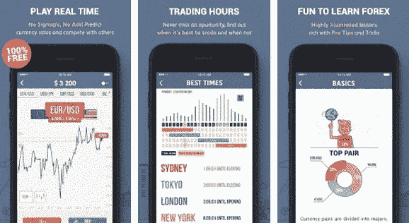

# 市场上最好的 5 款外汇交易应用

> 原文：<https://medium.datadriveninvestor.com/v-vxc-71c314e184e3?source=collection_archive---------0----------------------->

外汇市场的本质是快速变化、千变万化和高度竞争。难怪外汇市场是世界上最大的金融市场，每天的交易额超过 5 万亿美元。

根据《经济学人》公布的数据，我们可以看到 2013 年外汇市场的日交易额为 4 万亿美元。

交易平台是允许投资者和交易者开立、管理和平仓市场头寸的地方。随着高速互联网连接、智能手机和一些一流外汇交易应用的发展，随时随地实时访问外汇变得更加方便和容易。

 [## 外汇投资如何帮助偿还债务|数据驱动的投资者

### 外汇是对外汇市场的投资，不同国家的货币在外汇市场上进行兑换

www.datadriveninvestor.com](https://www.datadriveninvestor.com/2019/02/13/how-forex-investment-helps-to-repay-your-debts/) 

因此，当涉及到你的资金交易时，你必须小心选择最好的外汇交易应用程序，它可以极大地促进你的市场机会，速度，当然，还有你对价格运动反应的准确性。

那么，让我们回顾一下市场上一些非常流行的应用程序

## MetaTrader 5

这是一个优秀的外汇和股票市场移动在线交易平台。

**MetaTrader 6 特性-**

实时报价

所有类型的交易订单

全套交易执行

详细的交易历史

免费金融新闻和信息

技术分析

MT5 应用程序通过将交易者连接到经纪人的服务器，在交易者和经纪人之间架起了一座桥梁。作为交易者，你可以接收股票价格和货币汇率。这个应用程序还允许你使用图表和技术指标来分析金融市场。您还可以交易和查看您的交易操作的所有历史。

这款应用完全免费，在苹果商店和谷歌 Play 商店都能买到。这个应用程序的[开发非常好，你会发现它非常有用。](https://www.enukesoftware.com/iphone-application-development.html)

## NetDania 股票和外汇交易商

当谈到进行有利可图的外汇交易时，了解当前市场非常重要。NetDania 通过提供所有重要的数据和策略，帮助您全面了解市场。

这款应用最棒的地方在于，它汇集了 20，000 多种金融工具和数千种实时股票的数据。

就像个人交易助手一样，这个应用程序也告诉用户进入或退出市场的正确时间。这款应用程序不仅易于使用，还能在经济日历中为您提供实时市场新闻和更新。你可以和其他交易者分享你的策略，这样，你也可以从他们那里学到新的策略。

这款应用配备了非常智能的云技术，允许您在各种设备之间共享和同步数据。

为了确保您不断了解当前的市场形势，您只需注册推送通知。

这款应用有 18 种语言版本，可以从苹果商店和谷歌 Play 商店免费下载，不过也有应用内购买。

## TD Ameritrade 的 Thinkorswim Mobile

Thinorswim 的平台非常直观。你应该没问题操作这个平台，并开始在上面交易货币。

该应用程序还提供新闻提醒和直接美国消费者新闻与商业频道移动流媒体市场新闻。为了让您了解外汇交易市场的最新动态，Thinkorswim 会发送带有设定交易提醒的推送通知。

Thinkorswim 在一个移动平台上几乎囊括了交易者想要的一切。

这款应用程序适用于安卓和苹果用户，而且是免费的。

## 贸易拦截者

Trade Interceptor 是安卓和苹果用户都可以使用的另一款流行的交易应用。该应用程序为交易者提供了相当多的选项，包括通过选择外汇经纪人交易货币对、二元期权和商品期货的能力。该界面带有分析和技术交易工具，使事情对你来说更方便。有 100 多种图表指标可供您使用。

你可以使用实时流媒体报价，包括最新比特币价格的价格图表。你可以得到所有的价格水平和新发布的警报。

这个应用程序有一个独特的功能，允许您使用历史数据运行模拟交易和回溯测试交易。

## 交易游戏

这是做演示交易和从中获得市场经验的最佳应用程序之一。

这个免费的应用程序为您提供了一个真实的外汇市场将提供的实践经验。无论你是一个新的交易者，想得到你的手弄脏外汇交易或有经验的交易者，想磨练你的技能，这个应用程序可以帮助这两个目的。

这个应用程序提供了很多课程，帮助你了解外汇市场如何运作，以及如何制定正确的策略，让你发财。你可以利用这个网站上的谜题来增强你的知识，了解外汇市场。

这些是从市场上大量的外汇交易应用程序中挑选出来的几个应用程序。这些应用程序各有各的用处，为用户提供一流的体验。