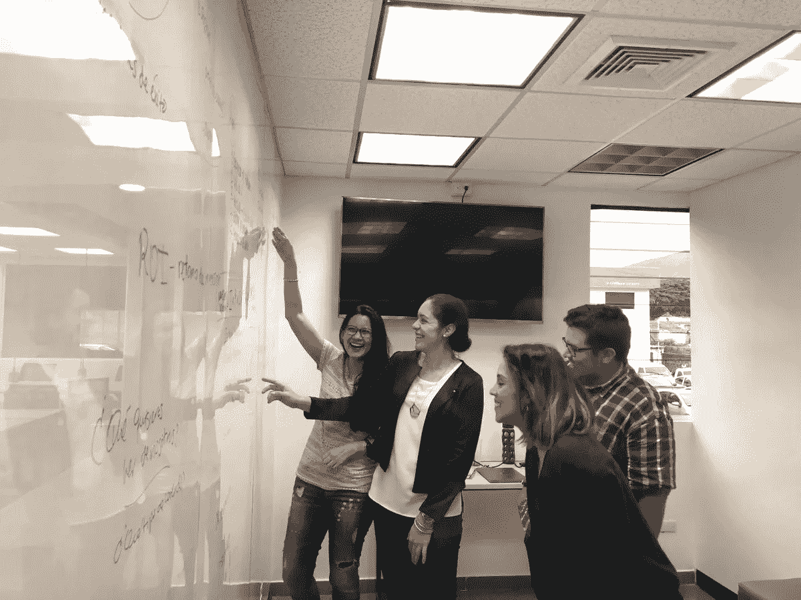

# 像对待比萨饼一样重视内容

> 原文：<https://medium.datadriveninvestor.com/value-content-as-you-would-a-pizza-7b2111b67640?source=collection_archive---------3----------------------->

## 高质量的内容通知和娱乐读者，改善生活

Content that matters starts with brainstorming.

无论是在她的数字营销代理处发号施令，还是权衡比萨饼的优点，[杰西卡·菲格罗亚](https://twitter.com/yescontilde)对生活充满热情。在创作重要内容时尤其如此。

这位来自萨尔瓦多的企业家是一名社交媒体营销和广告策略师。她与北美、南美、中美、西班牙和澳大利亚的品牌合作。

“我热衷于为品牌创建社区，并提供一种能打动受众的参与战略，”菲格罗亚说。

她向销售和营销专家[亚伦·基尔比](https://twitter.com/kilby76)解释说，高质量的内容告知并娱乐读者，让他们带走可以改善他们生活的金块。

“它提供了价值，”菲格罗亚说。"*吸引*你的听众。具有良好的数据性能。

“根据你的品牌类型，这可以有更多的元素，”她说。“你不仅要考虑你想说什么，还要考虑你的听众想知道什么。内容是你品牌的声音。应该一直认真对待。”

 [## 忠诚度是一个简单的命题——数据驱动的投资者

### 万豪在数据泄露后面临集体诉讼，这是使用大数据的危险之一:值得吗…

www.datadriveninvestor.com](https://www.datadriveninvestor.com/2019/03/24/loyalty-is-a-simple-proposition/) 

# 知道你的原因

创作优质内容的第一步是了解*为什么*。这有什么用？它能满足你的观众的需求吗？甚至在那之前，你了解你的观众吗？

菲格罗亚说:“创造有吸引力的内容的唯一方法是知道什么能打动你的观众。“建立关键绩效指标。决定帖子成功的因素是什么:参与度？收到的消息？接到的电话？

“利基市场很重要，”她说。“当你的资源有限时，避免数字噪音。确定你的特定领域。具体点。记住:小众才能致富。”

 [## 用一种特别的方式写博客，开启你的成功之路

### 把你的主张标在一个利基市场上，并每天写下来

medium.com](https://medium.com/datadriveninvestor/blog-your-way-to-success-in-a-special-way-aa07e5364cac) 

如果你想知道你的内容的价值，问问你的观众。你可以让他们投票到死，或者简单地进行一对一的谈话，找出造成伤害的原因，并找出治疗方法。

菲格罗亚说:“有办法问他们。“这是通过监视订婚。试着和你的听众交谈。如果他们发表评论，继续对话。

“别忘了社交监听*，”她说。“这是你获得关于你的观众行为和兴趣的*关键*信息的地方——甚至可能发现新的需求。这些见解将对未来创作新的优质内容非常有用。”*

# *像你说的那样*

*像说话一样写作，让你的内容脱颖而出——不嚼口香糖可能语法更正确一点。每个人说话都不一样。释放你的个性，注入你的创作中。*

*“视觉是关键，但不要过度使用图形设计，”菲格罗亚说。“数据已经证明，大多数人在较少改变图像的情况下会更加投入。真实永远是最好的选择。明确你的信息。避免卖弄。以真实性为目标。*

*“第一句话就用‘钩信息’，”她说。“确保潘趣酒放在那里。人们可能不会读完整本书。让他们至少带着最重要的信息离开。包括行动号召，以保持项目持续进行。你希望你的观众之后做什么？”*

* [## 视频魔术会让你更投入，更难忘，更受欢迎

### 清晰的愿景引领利润之路

medium.com](https://medium.com/datadriveninvestor/video-magic-will-keep-you-more-engaged-memorable-and-popular-11d6365019d0) 

Figueroa 补充说，那些在社交媒体上使用视频的人应该尽量保持在 15 到 30 秒之间。

最基本的内容创作工具就在你的两耳之间。让你的想象力漫游。没有这一点，你尝试的任何硬件或软件都没有价值。

“对于视觉效果，我个人的建议是创建一个免费的商业用照片书签库，”菲格罗亚说。

这些是她最喜欢的一些网站: [Pixels](https://www.pexels.com/) 、 [Unsplash](https://unsplash.com/) 、 [KaboomPics](https://kaboompics.com/) 和 [StockVault](https://www.stockvault.net/) 。

那些不是设计师的人仍然可以使用 [Canva](https://www.canva.com/) 和 [Easil](https://about.easil.com/) 进行设计。

使用[缓冲器](https://buffer.com/)和[挂钩](https://hootsuite.com/)来安排岗位。 [SocialBakers](https://www.socialbakers.com/) 有数据资源。

# 宣传好

在你和你的观众使用的任何平台上推广你的内容。公布你的帖子，之后定期跟进。如果你建造了它，他们不一定会来，除非你告诉他们——并提醒他们——它就在那里。

菲格罗亚说:“进行换位思考，提出问题。“这有助于发现新的关键行为。

“增加一个行动号召，”她说。“敬请读者关注。给他们一个未来帖子的提示。旨在与你的观众建立关系。*你会从一个品牌*中欣赏到什么

 [## 我们讲述自己最精彩的故事

### 讲故事赋予你的品牌个性

medium.com](https://medium.com/datadriveninvestor/we-tell-our-own-best-stories-8a07ec5ab760) 

为了获得伟大内容的灵感，看看你周围的世界，尤其是你的观众。每个人都有一个等待被讲述的故事。如果你能与消费者产生共鸣，你可以讲述他们的故事，融入你和你的产品是如何扭转局面的。

“灵感取决于你的品牌，”菲格罗亚说。以下是她的总体建议:

*   列出与你观点一致的品牌，分析哪些表现最好。不是抄袭他们。这是关于识别什么是有效的，并找到新的方法以你自己的方式与你的观众联系。
*   在网上找到导师。跟着他们走，让自己保持动力。
*   探索相关的标签，阅读人们在说什么。
*   旧的伟大的职位:过去表现良好的内容是伟大的创造新的内容。当你没有主意时，它给你一条路可走。
*   *敢于问你的观众他们想从你身上看到什么。*
*   试着让你的观众能够接触到你，让他们觉得自己很重要。

内容创作的一个大错误是为你而不是你的观众写作。如果你没有北极星跟随，你会在夜晚迷路，浪费你一路上的时间和精力。那是一个糟糕的投资回报。

以下是菲格罗亚的内容创作错误:

*   不了解你的观众。
*   不参与，不听你的观众。
*   没有明确的目标。
*   专注于你想说的，而不是你的听众想听的。
*   不分析数据结果。
*   太性感了。
*   不区分不同平台的内容。
*   没有衡量成功和投资回报的关键绩效指标。
*   没有内容计划。

**关于作者**

吉姆·卡扎曼是拉戈金融服务公司的经理，曾在空军和联邦政府的公共事务部门工作。你可以在[推特](https://twitter.com/JKatzaman)、[脸书](https://www.facebook.com/jim.katzaman)和 [LinkedIn](https://www.linkedin.com/in/jim-katzaman-33641b21/) 上和他联系。*