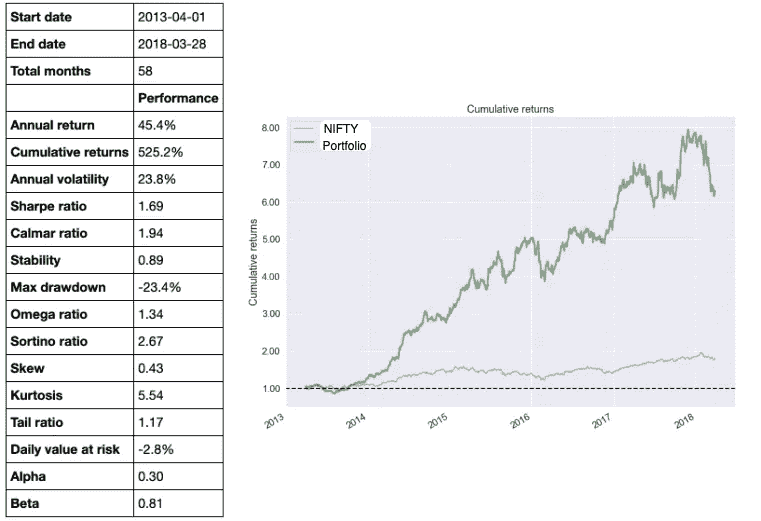
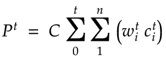
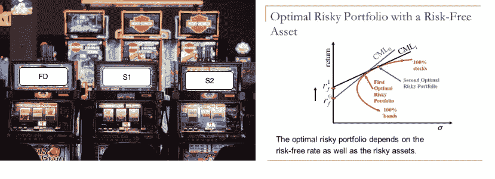
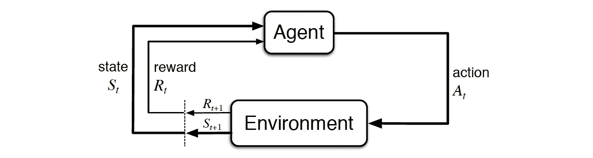
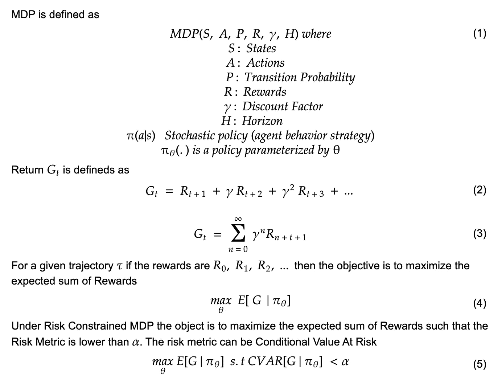
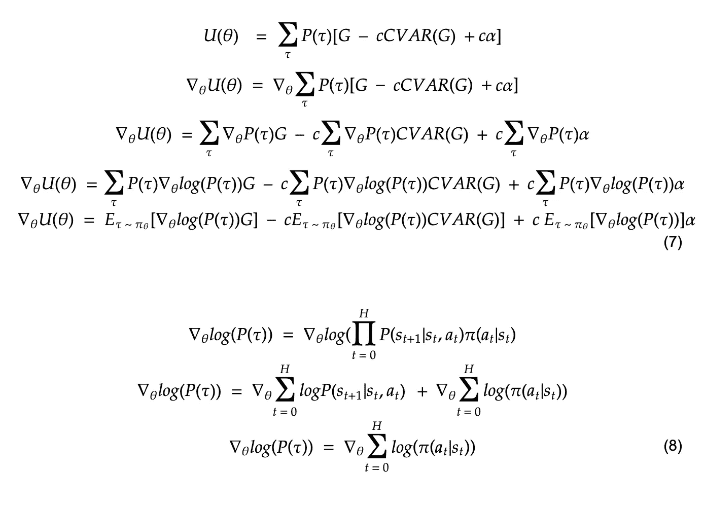

# 价值投资机器——2A

> 原文：<https://medium.datadriveninvestor.com/value-investing-machine-2a-43ce2d05f2a2?source=collection_archive---------1----------------------->

# 部分 2A——价值投资的深度强化学习代理

[第一部分——理解问题](https://medium.com/@vivekys/value-investing-machine-d2718d35d19b)

第 2 部分—价值投资的深度强化学习代理(当前文章)

第 3 部分—构建代理和现场实验

第 4 部分——使其成为产品

在[之前的博文](https://medium.com/@vivekys/value-investing-machine-d2718d35d19b)中，我描述了投资的一般问题。在这篇博文中，让我描述一下我自己训练和部署模型的实验，用价值投资哲学来执行长期投资组合管理。

 [## 金融中的机器学习|数据驱动的投资者

### 在我们讲述一些机器学习金融应用之前，我们先来了解一下什么是机器学习。机器…

www.datadriveninvestor.com](https://www.datadriveninvestor.com/2019/02/08/machine-learning-in-finance/) 

在我描述实验之前，我先总结一下我自己的[投资组合](https://github.com/vivekys/thinker/blob/master/analysis/PyFolio-Analysis.ipynb)的表现，使用的是一个类似的模型，这个模型被人类的决策所增强。

Fig 6:Performance Of Man and the Machine Portfolio

由于这是一个混合系统，机器的决策被人类的判断所增强，因此再现性是一个挑战。因此，在接下来的实验中，再现性是核心，所有决定完全由带有护栏的机器做出，以防止极端不利情况的发生。

## 价格预测与管理风险暴露

Fig 7:Portfolio Value

一种常见的方法是构建 ML 模型来预测宇宙中每家公司的股票价格。考虑到这些预测的股票价格、股票价格的变化和预测中的误差，调整股票投资组合中的权重。这种系统分析和维护起来很复杂。另一种方法是建立一个管理风险敞口的模型(即根据风险调整投资组合中股票的权重)，这样可以避免预测所有股票价格的挑战。

让我们看看如何实现这种替代方法。

Fig 8:Multi Arm Bandit — Risk Free & Risky Asset — Capital Allocation

想象一下，你参观了这个非常特别的赌场，那里有 3 台老虎机。他们根据你投入的钱的百分比给你奖励。假设其中一台老虎机提供类似定期存款(FD)的奖励，一台提供类似 Infosys 股票的奖励，另一台提供类似 HDFC 银行股票的奖励。对于投资者来说，这些信息是隐藏的。因此，作为投资者，现在必须弄清楚如何在这三台老虎机之间分配资本。每个老虎机的不同资本分配权重导致不同的投资组合总回报。S1 和 S2 吃角子老虎机的不同权重将导致如图 8 所示的[红色曲线。目标是找到权重，使得总回报高，回报的标准差低。](https://www.investopedia.com/terms/e/efficientfrontier.asp)

有一整套算法可以解决这个问题。他们被称为[多武装匪徒](https://en.wikipedia.org/wiki/Multi-armed_bandit)。将资本分配问题视为多股武装匪徒是一个开端。这不是最好的方法，原因有二:

1.  奖励并不是真正随机的。它们依赖于特定的上下文。在上面的例子中，它们依赖于利率、公司基本面和宏观经济条件。
2.  [非平稳](https://www.investopedia.com/articles/trading/07/stationary.asp)股票市场的本质。

解决第一点的一个自然扩展是将问题建模为[上下文强盗](https://en.wikipedia.org/wiki/Multi-armed_bandit#Contextual_bandit)。即使这样也不是最好的方法，因为资本分配会随着公司基本面和宏观经济条件的变化而变化。

因此，构建这个问题的最佳方式是将其视为一个[马尔可夫决策过程](https://en.wikipedia.org/wiki/Markov_decision_process) (MDP)。强化学习(RL)算法提供了解决 MDP 的方法之一。因此，让我在进入实际实验及其结果之前，快速描述一下 RL，MDP &的设置。

## 强化学习和投资组合优化

Fig 9:From [http://incompleteideas.net/book/RLbook2018.pdf](http://incompleteideas.net/book/RLbook2018.pdf)

在这个结构中，市场和所有影响市场的事物都是环境的一部分。我们需要用随时间变化的状态来表示它。代理观察状态和来自环境的回报来采取行动。在这种情况下，行动是将资本分配到股票，回报是投资组合与上一时间步相比的百分比变化。agent 是一个深度神经网络模型，它以状态为输入，以投资组合分配为动作。该环境应用这种投资组合分配，计算交易成本，并计算投资组合价值在变化之后的变化作为奖励。奖励和新的状态一起返回给代理。这种循环会持续到预先指定的天数(称为“展望期”)。这个回报包括交易成本。在计算报酬时考虑交易成本的环境优势导致了一个简单的代理。代理人可以完全忽略交易成本。

让我更正式地定义这些

Fig 10: MDP & RL

可以看出，图 5 中的目标函数(投资组合优化问题)与图 10 中的等式 5 相同。[策略梯度](https://lilianweng.github.io/lil-log/2018/04/08/policy-gradient-algorithms.html)是一种最简单的强化学习算法，可用于求解图 10 中的等式 4，并在稍作修改后，求解图 10 中的等式 5，如下所述。

Fig 11: Solving for Eq 5 in fig 10

既然数学结构已经定义好了，在[的下一篇文章](https://medium.com/@vivekys/value-investing-machine-2b-638d71da7e56)中，让我描述一下构建模型的特征和训练过程。