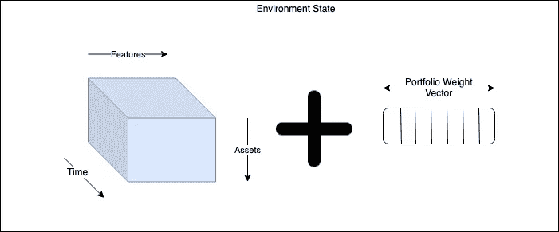
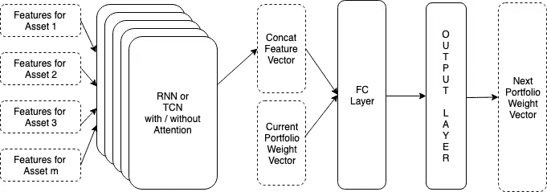
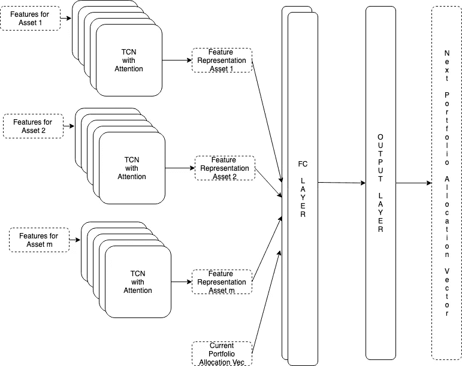
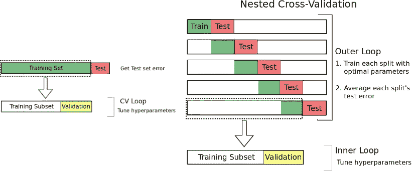
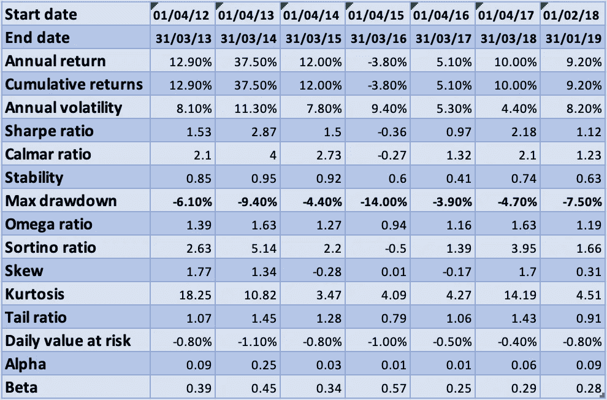

# 价值投资机器——2B

> 原文：<https://medium.datadriveninvestor.com/value-investing-machine-2b-638d71da7e56?source=collection_archive---------2----------------------->

# 部分 2B——价值投资的深度强化学习代理

[第一部分——理解问题](https://medium.com/@vivekys/value-investing-machine-d2718d35d19b)

第 2 部分—价值投资的深度强化学习代理(当前文章)

第 3 部分—构建代理和现场实验

第 4 部分——使其成为产品

[在之前的帖子](https://medium.com/@vivekys/value-investing-machine-2a-43ce2d05f2a2)中，我描述了投资组合管理问题以及作为深度强化学习问题来解决它的数学结构。在这篇文章中，让我描述训练模型的更多细节。

## 特征

对于使用深度学习技术解决的大多数问题，如人脸检测、语音识别，特征工程并没有发挥重要作用。另一方面，对于投资组合优化问题，特征工程起着至关重要的作用。这是用来训练模型的特征列表。

共同特征

*   商品价格——黄金、原油、铜、小麦等
*   全球无风险利率—美国、英国、德国、法国、日本、中国和印度的 1 年、3 年、5 年和 10 年期债券收益率
*   与印度卢比相关的汇率——美国、英国、德国、法国、日本、中国
*   全球头条指数—美国、英国、德国、法国、日本、中国、印度

基本特征

*   来自 [Quandl](https://www.quandl.com/data/DEB-Core-India-Fundamentals-Data/documentation?anchor=data-organization) 的 PE、PB 等 165 个特性(这不是对 Quandl 数据的认可。事实上，对于许多在印度上市的公司来说，他们的数据并不准确。)

技术特性表

*   收盘价的动量、平均值等。(这些特征对投资组合的表现只有微小的影响)

这些特征被预处理如下以表示状态。

1.  只要有意义，就用相对变化代替绝对值。例如，没有使用绝对价格。取而代之的是，每个价格被改为滚动每日变化、每月变化、每季度变化、每半年变化和每年变化。其中估值比率如 PE 或 PB 等按原样使用。
2.  通过使用其 z 得分，这些特征中的每一个都被重新调整为均值 0 和标准差 1。
3.  由于经过前两步预处理后，特征的数量大大增加，因此应用 PCA 来创建特征向量。这将特征尺寸减小了 65%。

经过预处理，我们得到一个时间序列的特征向量。

 [## DDI 编辑推荐:5 本让你从新手变成专家的机器学习书籍|数据驱动…

### 机器学习行业的蓬勃发展重新引起了人们对人工智能的兴趣

www.datadriveninvestor.com](https://www.datadriveninvestor.com/2019/03/03/editors-pick-5-machine-learning-books/) 

## 使用特征向量表示状态

为每个非现金资产创建特征向量的时间序列。假设 f 是特征向量的大小，m 是资产的数量，n 是时间步长。那么张量(n，m，f)形成了状态的一部分。状态的另一部分是大小为 m+1 的投资组合权重向量。

Fig 12: State Representation

## 网络体系结构

已经尝试了以下具有各种网络架构的网络块。

1.  [RNN](https://colah.github.io/posts/2015-08-Understanding-LSTMs/) —由于数据是时间序列数据，使用 RNN 是有意义的。
2.  [时间卷积网](https://jeddy92.github.io/JEddy92.github.io/ts_seq2seq_conv/) —时间序列数据可以使用扩展的因果卷积层进行特征化，这使其能够正确处理时间顺序和长期依赖性，而不会增加模型的复杂性。这是谷歌 wavenet 架构的核心。

Fig 13: From DeepMind’s post

3.[注意力网络](http://akosiorek.github.io/ml/2017/10/14/visual-attention.html) —这些网络块允许模型专注于特征的子集。粗略地说，这有助于模型记住关键特征。

除此之外，还会使用完全连接的图层和输出图层。

Fig 14: Network Architecture

对上述架构的以下变化进行了实验。

1.  深海 RNN/深海 TCN
2.  有/没有交错注意力网络
3.  形状(n，m，f)的单个张量作为输入馈送到深度 RNN/TCN 网络模块的单个块
4.  形状为(n，f)的 m 个张量作为输入馈送到深度 RNN/TCN 网络模块的 m 个块

根据上述每个选项的排列，图 15 中描绘了始终表现良好的最终架构。

Fig 15: Network Architecture

超级参数是源代码的一部分，已经在这篇文章的结尾分享了。

## 输出层

对于投资组合优化问题，网络最简单的输出可以是投资组合分配向量。代理按原样接受这个输出向量，并将其发送到环境中。维护投资组合的环境通过购买或出售资产来修改代理指定的分配。由于投资组合分配的权重总和需要为 1(图 5)，因此输出层可以是一个简单的 softmax 层。由于输出空间非常大，训练这种网络所需的训练数据量和训练时间将非常大。因此，输出空间减少的替代输出图层可能是更好的选择。这可以通过输出每项资产的投资组合分配变化，并将单步变化限制在-10%到+10%，而不是-100%到+100%来实现。这种输出层的另一个优点是，模型在大多数日子里可以输出 0%的变化。这将导致买入并持有的策略，这是价值投资的核心。

## 训练模型

该模型使用从 2001 年 4 月 1 日收集的历史数据进行训练。有许多方法可以将数据分成训练集、测试集和交叉验证集。时间序列的嵌套交叉验证方法如下所述。

Fig 16: Train Test split

在培训期间，模型培训的时间跨度为 1 年。随后的 3 个月数据用于验证，接下来的 3 个月数据用于测试。一旦模型准备就绪，它将在下一年的数据上进行回溯测试，无需重新训练。在训练时观察到的一个问题是，如果训练数据集在批次之间是连续的，则模型无法学习。为了避免这个问题，训练集在批次之间被混洗，但不在批次内混洗。

# 结果

在投资组合管理的世界中，挑战之一是定量地度量投资组合表现的良好性。没有标准化的方法来衡量它。作为一名投资者，我关心的是年回报和最大提取额。训练模型的目的是建立和维护一个低提取率的投资组合，任何超过 15%的提取率都会受到惩罚并被标记为失败。回溯测试期间的模型性能总结如下所示。据观察，在某些年份(2015 年、2016 年和 2017 年)，如果模型在回溯测试期间每 3 个月重新训练一次，其表现明显更好。由于该决定是在观察回测结果后作出的，因此不包括在下表的结果中。该车型性能的详细报告可在[此处](https://vivekys.github.io/thinker/Tykhy-01-slides.html)找到。

Fig 17: Performance of the Model — Backtesting

该模型有几个选项可以训练，因此它符合个人投资者的偏好。该模型可以被训练以承担更高的风险，从而提高年回报率。当前模型是一个 long only 模型。它可以被训练来执行卖空操作。但是这些选项将增加模型的复杂性，并使其决策不太可靠。为了在现实世界中使用这些模型，需要构建额外的监控系统和护栏。我使用这样一个模型和人类的判断来维持我自己的投资组合，其表现发表在这一系列文章的顶部(图 6)。

## 细微差别

1.  基于可用性对特征进行时间戳标记，即基于季度结果发布日期而不是季度初向模型提供公司的基本面。
2.  类似地，还有基于本地 IST 的可用的全局特征。例如:美国指数当天(比如 2008 年 1 月 1 日)的收盘价只能用于第二天(即 2008 年 1 月 2 日)的建模。
3.  优化曲面似乎有许多局部最优解。不同的随机种子导致不同的结果。由于缺乏计算能力(模型训练需要 GPU，并需要大约 24 到 36 小时才能达到最佳状态)，该模型是用单个随机种子训练的。理想的方法是用多个随机种子进行训练，并从中挑选出最佳模型。
4.  一个公开的问题是确定何时停止训练 RL 代理以及决定重新训练的频率。
5.  所有的超参数及其相应的结果在 https://bitbucket.org/vivekys/tykhe/src/master/results/的[和 https://bitbucket.org/vivekys/tykhe/src/master/runs-gym/的](https://bitbucket.org/vivekys/tykhe/src/master/results/)[被捕获](https://bitbucket.org/vivekys/tykhe/src/master/runs-gym/)

所有的源代码和软件架构将在[的下一篇博客](https://medium.com/@vivekys/value-investing-machine-3-4c1053221940)中描述。