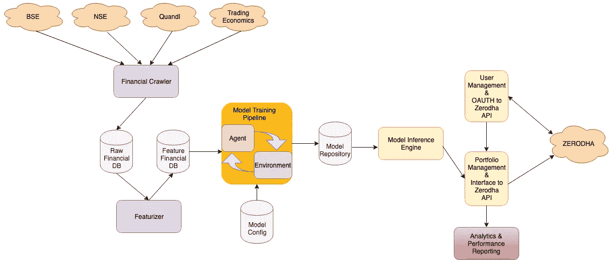

# 价值投资机器— 3

> 原文：<https://medium.datadriveninvestor.com/value-investing-machine-3-4c1053221940?source=collection_archive---------4----------------------->

# 第 3 部分—构建代理和现场实验

[第一部分——理解问题](https://medium.com/@vivekys/value-investing-machine-d2718d35d19b)

[第二部分——价值投资的深度强化学习代理](https://medium.com/@vivekys/value-investing-machine-2a-43ce2d05f2a2)

第 3 部分—构建代理和现场实验(当前文章)

第 4 部分——使其成为产品

在以前的文章中，我描述了投资组合管理问题，作为深度强化学习问题来解决它的数学结构，并解释了如何构建这样的模型。本文讨论了该系统的工程方面。

 [## 机器学习的外汇交易挑战|数据驱动的投资者

### 机器学习是人工智能的一个分支，之前占据了很多头条。人们是…

www.datadriveninvestor.com](https://www.datadriveninvestor.com/2019/02/18/the-challenge-of-forex-trading-for-machine-learning/) 

近 10 年来，我有多个子系统帮助我做投资决策。但在过去的一年里，我决定建立一个完整的系统，唯一的目的是再现和研究。重要的是要认识到回测(不管回测技术有多好)不足以得出模型是否如预期那样工作的结论。因此，该系统是为具有真实资本的投资组合分配而构建的，并在证券交易所执行订单(完全自动化)。要记住的关键是，这些系统主要是为实验而不是为规模而建造的。

Fig 18: Architecture

该系统是按照以下要求构建的

1.  获取和分析财务数据的能力。
2.  数据完整性
3.  更容易同时训练具有不同架构和算法的多个模型。在培训期间和部署后实时跟踪模型的性能。
4.  将多个模型部署到实时系统中。除了具有资本分配的模型，其余模型将执行票据交易。

护栏、监控和警报等关键功能缺失。没有这些，部署大量资本将是不明智的。

这些子系统完全由事件驱动，使用 Lambda functions、SNS、SQS 等 AWS 基础资源开发。

1.  Fetcher —从多个来源获取和解析数据的财务爬虫。构建这个系统的挑战之一是确保集成是稳定的。大多数时候，集成会因为 API 的变化而中断。此外，解析的数据由于格式的改变而中断。另一大挑战是数据完整性。据观察，在不同的日期获取给定日期的过去数据时，这些数据会发生变化。为了捕捉这样的问题，数据的幂等性和快照被内置到提取器中。提取器还支持增量提取。数据保存在 EBS 上，一份拷贝保存在 S3 上。由于外部许可问题，该系统不是开源的。
2.  featurezer—爬行完成后，featurezer 将按照本文前面部分所述对数据进行预处理。Fetcher 和 feature 化在每个交易日运行。特征化数据用于训练和模型推断。努力确保在训练和推理期间运行相同的特征化代码，以便它们之间没有不一致。特征化的数据也与日期时间一起持久化，以便在训练期间没有将来的数据泄漏。
3.  模型培训管道——该系统有两个主要子系统。由于我们是建立深度强化学习模型，所以有一个环境叫 MrMarketGym，代理叫 Tykhe。MrMarketGym 是开放式人工智能健身房环境的扩展，它提供了一个模拟股票交易(买/卖)的环境。它是使用 backtrader 库构建的。MrMarketGym 的源代码可以在[https://bitbucket.org/vivekys/mrmarketgym/src/master/](https://bitbucket.org/vivekys/mrmarketgym/src/master/)获得。特工泰克以幸运女神的名字命名。它实现了深度强化学习算法，如策略梯度和 A2C。Tykhe 的源代码可以在 https://bitbucket.org/vivekys/tykhe/src/master/的[获得。所有的结果和相关的超参数都是源代码的一部分。](https://bitbucket.org/vivekys/tykhe/src/master/)
4.  模型推理机——这是一个子系统，是 Tykhe 包的一部分，其中给定一个模型和特征数据，计算投资组合分配。这种分配被持续到 S3，以供进一步的下游系统拾取。
5.  项目组合管理系统和用户管理系统——这两个系统依赖于 Zerodha API。投资组合管理系统从用户管理系统中获取保存在 S3 上的投资组合分配的变化和用户的当前投资组合分配，以确定要在交易所执行的实际订单。如果标记为纸上交易，则投资组合会相应更新。否则，订单将通过 Zerodha 发送到交易所。一旦订单被执行，投资组合相应地被更新。
6.  分析和业绩报告——这是跟踪投资组合业绩的系统。这是基于 Quantopian 写的库 [pyfolio](https://github.com/quantopian/pyfolio) 。之前共享的所有报告都是使用这个库构建的。

这些文章概述了为执行实验而编写的完整系统，一些代码已经公开。请注意，这不是一个生产系统。如果您使用此代码来配置资本，那么您需要自担风险。

所有这些实验主要是为了管理我自己的投资组合，并最终为零售客户打造一款产品。在下一篇博文中，让我描述一下我设想的产品。