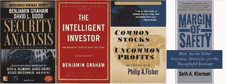
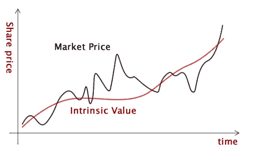
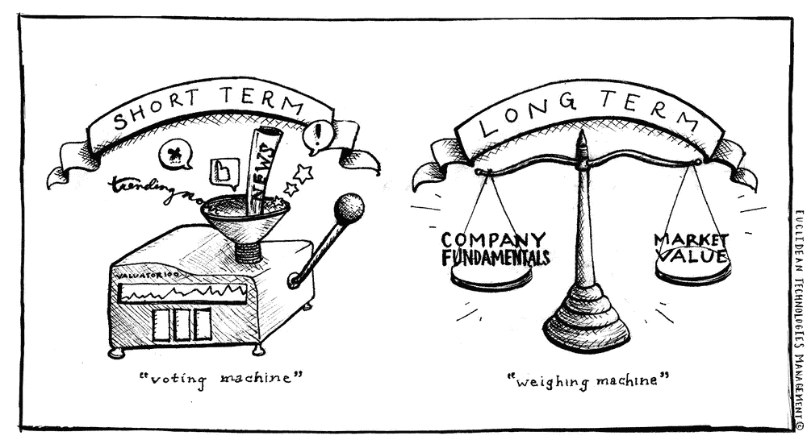
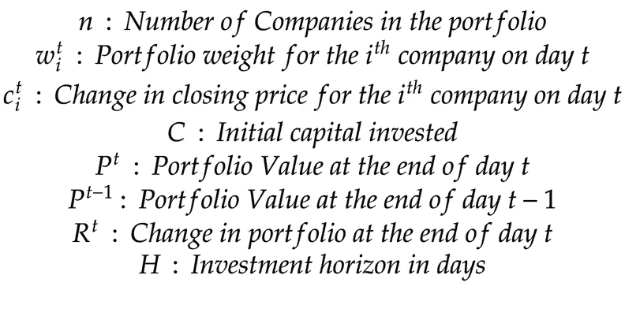
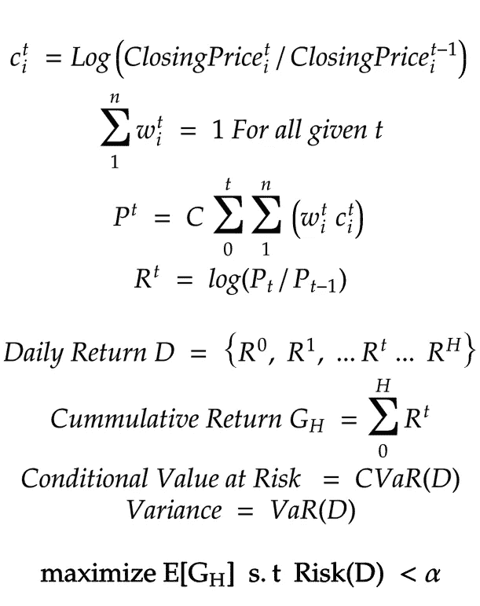

# 价值投资机器— 1

> 原文：<https://medium.datadriveninvestor.com/value-investing-machine-d2718d35d19b?source=collection_archive---------0----------------------->

投资股市一直是一个很有意思的问题，至今仍未解决。投资股票市场的目标很简单，即以你预期的回报率产生回报。实现这一目标相当困难，原因如下

1.  对回报率不切实际的期望
2.  信息不对称
3.  欺骗
4.  非常动态的环境，历史不会以同样的方式重复

除了这些根本性的挑战之外，金融工具的广泛选择以及这些可用于实现目标的金融工具的不透明性使问题变得更加复杂。

 [## 机器学习的外汇交易挑战|数据驱动的投资者

### 机器学习是人工智能的一个分支，之前占据了很多头条。人们是…

www.datadriveninvestor.com](https://www.datadriveninvestor.com/2019/02/18/the-challenge-of-forex-trading-for-machine-learning/) 

有几种投资风格，其中一些在持续达到目标方面非常成功。价值投资风格就是这样一种风格，它一直被证明是有效的。关于这个话题已经有几本书了，我不打算描述价值投资的细微差别。另一方面，下面的一组文章描述了我在教一台机器执行基于价值投资风格的投资组合管理方面的实验。

文章分为四个部分

第 1 部分—理解问题

[第二部分—价值投资的深度强化学习代理](https://medium.com/@vivekys/value-investing-machine-2a-43ce2d05f2a2)

第 3 部分—构建代理和现场实验

第 4 部分——使其成为产品

# 第 1 部分—理解问题

Fig 1 : Books on Value Investing

本杰明·格拉哈姆、菲利普·费希尔、塞思·卡拉曼甚至沃伦·巴菲特以及其他许多人都写过大量关于价值投资风格的文章。这个概念其实很简单:找到低于其内在估值的公司。当公司的内在价值明显高于市场价格时，公司的价值就会被低估。这样的公司有很大的安全边际。当这些公司的内在价值明显低于市场价格时，它们就被高估了。当这些公司的内在价值接近市场价格时，它们的价值是合理的。

Fig 2:

尽管这个概念很简单，但在确定一家公司的内在价值方面存在挑战。此外，价值投资风格并没有提供任何时间框架，说明 Mr 市场何时开始对被低估或估值合理的公司进行适当估值。被低估的公司可能需要很长时间才能得到合理估值。同样，估值过高的公司可能会在很长一段时间内保持过高的估值。本杰明·格拉哈姆将市场的这种现象描述为，“市场在短期内是投票机，在长期内是称重机。”

Fig 3:Image from Euclidian Technologies Management — [www.euclidean.com](http://www.euclidean.com)

除了上述提到的挑战，价值投资风格也没有描述如何建立公司的投资组合和分配资本，以便在可接受的波动性下满足长期的预期回报率。

在高层次上，我们可以将投资问题分解成两个子问题。

1.  根据价值投资原则选择公司。
2.  将资本分配给宇宙中公司的子集，以满足具有可接受波动性的预期回报率。

读过上面所列书籍的人都知道，除了少数定性的技术外，大多数描述的技术本质上都是定量的。由于该技术的定量性质，我们肯定可以应用机器学习技术。

选择基于价值投资原则的公司本身是一个独立的问题，我将在未来的另一系列文章中描述。

在这一系列文章中，我将描述如何将机器学习技术应用于将资本分配给公司宇宙中的公司子集的问题，以便在可接受的波动性下满足预期的回报率。

## 问题设置

比方说

Fig 4:

使用上面的符号，让我用数学方法描述投资组合管理的问题。

Fig 5:

从上面的等式中可以看出，投资组合管理的目标是最大化预期累积回报，使得风险小于某个阈值。风险指标的选择本身是另一个讨论话题。因此，让我们把它放在另一篇未来的文章中。在实验中，我将 CVar、Var 和最大提款作为风险指标。

在文章的第 2 部分中，让我们看看如何建立一个模型来执行投资组合优化。