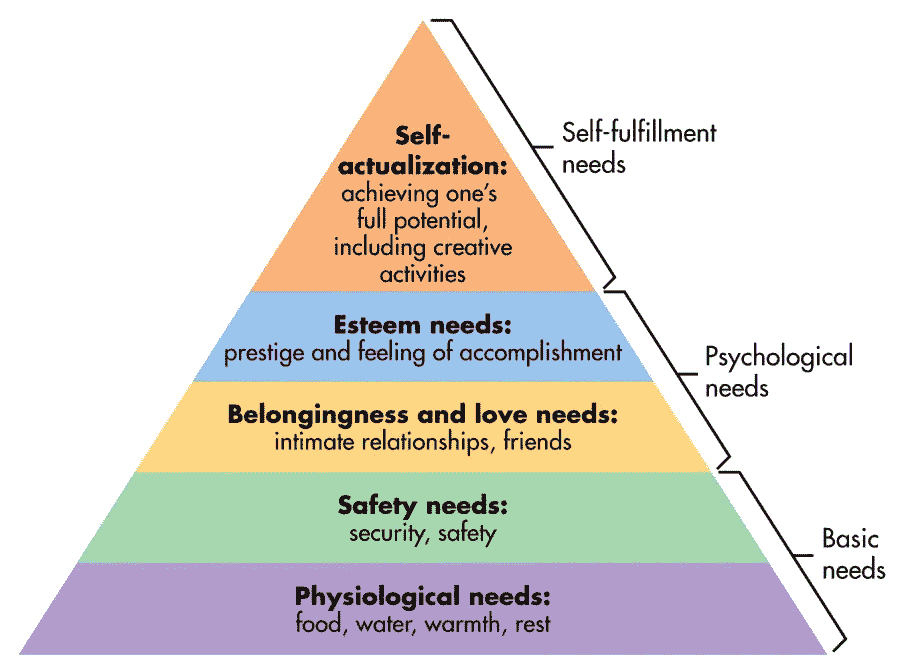
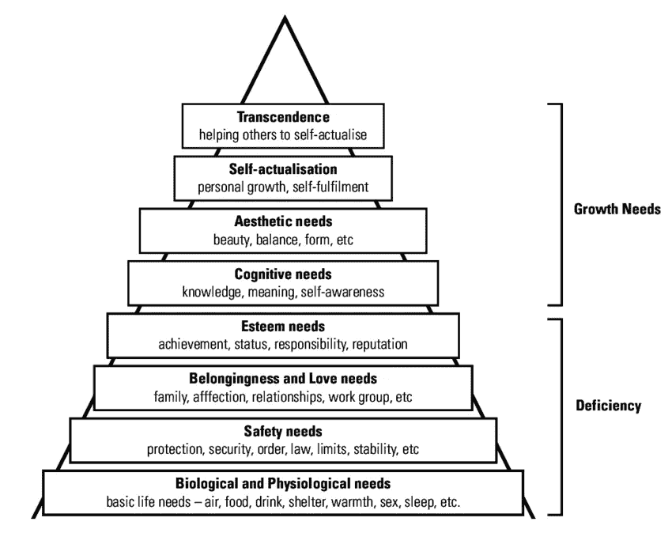
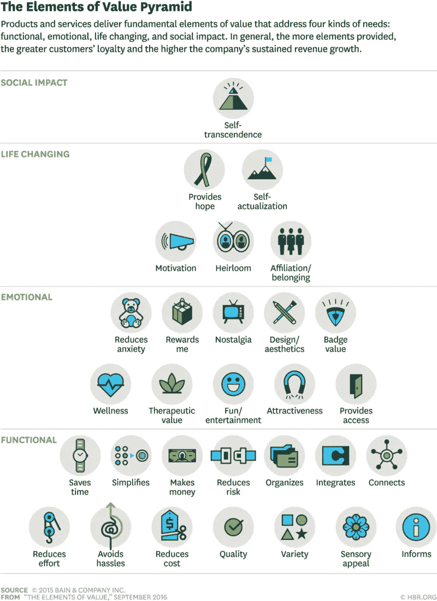
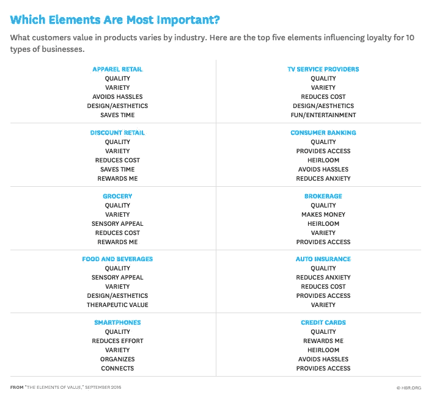

# 客户的需求和价值会随着时间的推移而变化。价值感知的深层分析。

> 原文：<https://medium.datadriveninvestor.com/value-needs-and-needs-the-perception-of-value-for-people-and-business-32f4b3611c0f?source=collection_archive---------1----------------------->

用意大利语演唱的版本。

了解促使消费者购买的原因是发展其业务的第一步。
如今，几乎所有的营销人员都熟悉马斯洛的价值金字塔。新的消费者研究扩展了其金字塔中定义的元素，描述了他们对产品和服务的行为。
在下部有生理和安全需求，在上部有自我实现和自我超越。假设是，人们无法满足顶层的需求，直到他们达到底层的需求。

马斯洛本人采取了一种更加细致入微的观点，认识到可以有许多实现的模式。例如，攀岩者达到自我实现，忽视基本的安全考虑。同样，价值金字塔的元素是一个启发式模型，其中最强大的价值形式位于顶部。为了能够提供更高层次的要素，一个公司必须至少提供特定类别产品所需的一些功能要素。

 [## 2019 年值得关注的 20 种数字营销趋势和技术|数据驱动的投资者

### Faisal 在加拿大工作，拥有金融/经济和计算机方面的背景。他一直积极从事外汇交易…

www.datadriveninvestor.com](https://www.datadriveninvestor.com/2019/02/04/20-digital-marketing-trends-techniques-to-watch-out-for-in-2019/) 

> 消费者欣赏什么很难定义，心理上也很复杂。

有一些普遍的价值要素，它们为公司创造了改善现有市场业绩或进入新市场的机会。

# 消费者需求的金字塔模型

随着我们文化的进步，价值观已经采取和发展了与马斯洛所认为的不同的形式，但是一个需要考虑并且不能低估的方面是新需求的增长。

著名的国际咨询公司“贝恩公司”(Bain & Company)经过几十年的研究(使用定量和定性数据)，在概念上以亚伯拉罕马斯洛的“需求层次”为基础，
定义了 30 个“价值要素”。这些要素分为四类:功能性、情感性、改变生活性和社会影响性。
有些元素更注重内在，主要是为了回应消费者的个人需求。

Copyright [Fitbit](http://www.fitbit.com)

例如，改变生活元素的动机是 Fitbit 运动跟踪产品的基础。其他人则是外向型的，帮助客户与外界互动或导航。功能元素允许管理他们世界的复杂性。这些要素被插入一个金字塔中，根据基本需求的类型，下面是“功能性”方面，因为基本，接下来是“情感”、“生活的改变”，因此“社会影响”在顶点。

# 马斯洛原始金字塔的 5 个层次

(5 级— [pdf 图](https://www.businessballs.com/maslowhierarchyofneeds5.pdf)

1.  **生物和生理需求:**健康、强身健体、振奋身心等。；
2.  **安全需求:**抵御外部因素，安全，秩序，法律，稳定，免于恐惧，
3.  等等。；
4.  **归属感和爱的需求:**团队运动、家庭和人际关系等。；
5.  **估计需求:**竞争、成功、认可等。；
6.  **自我实现的需求:**挑战、新体验、对艺术、自然的热爱等。

# 马斯洛的金字塔改编于 1970 年

(7 级: [pdf 图](https://www.businessballs.com/pluginfile.php/2375/mod_wiki/attachments/312/maslow_hierarchy_of_needs_7.pdf?forcedownload=1)

Designed by Alan Chapman

**1。** **生物和生理需求** —空气、食物、饮料、住所、温暖、性、睡眠等。

**2。安全需求**——对自然环境、安全、秩序、法律、限制、稳定性等的保护。

**3。归属感和爱情需要**——工作团队、家庭、感情、关系等等。

**4。自尊需求**——自尊、成就、掌控、独立、地位、优势、声望、管理责任等。

**5。认知需求** —知识、意义等。

6。审美需求——欣赏和寻找美、平衡、形式等。

7.**自我实现需要**——实现个人潜力、自我实现、寻求个人成长和巅峰体验。

# 马斯洛的金字塔在 1990 年被改编

(8 级: [pdf 图](https://www.businessballs.com/maslowhierarchyofneeds8.pdf))

**1。生物和生理需求** —空气、食物、饮料、住所、温暖、性、睡眠等。

**2。安全需求**——对自然环境、安全、秩序、法律、限制、稳定性等的保护。

**3。归属感和爱情需要**——工作组、家庭、亲情、关系等。

**4。自尊需求**——自尊、成就、掌控、独立、地位、优势、声望、管理责任等。

**5。认知需求** —知识、意义等。

**6。审美需求** —欣赏和寻找美、平衡、形式等。

**7。自我实现需要**——实现个人潜力，自我实现，寻求个人成长和巅峰体验。

**8。超越需要**——帮助他人实现自我实现。

# 马斯洛金字塔 2015 年改编

Elements of value from Bain & Company research published in Harvard Business Review in 2016

1.  **功能性:省时**，简化活动，组织等。；
2.  **情绪:**减少焦虑、奖励、乐趣、健康等。；
3.  **改变人生:**自我实现、激励等。；
4.  **社会影响:**帮助他人或社会实现自我。

很明显，我们注意到对金字塔底部元素的解释，那些对人类生存至关重要的元素，已经被完全改变了，取而代之的是没有任何重要意义的功能方面。

## 感知价值

当顾客评估产品或服务时，他们会将感知价值与要求的价格进行比较。在这个等式中，营销人员通常将大量时间和精力集中在价格管理上，因为提高价格可以增加利润。

Copyright [Lynda](https://www.lynda.com/Business-tutorials/Understanding-Consumer-Behavior/371321-2.html)

在刚刚描述的价值元素的新配置中，如何积极地管理价值？无论它们是功能性的(节省时间、降低成本)还是情感性的(减少焦虑和娱乐)，将这些元素与客户或潜在客户的问题的解决方案联系起来是很重要的。

挑战在于创造新的元素，但要预测人们可能认为有用的东西。
然而，**存在价值的普遍要素**，从中可以“拒绝”新的要素，为公司创造新的机会，提高他们在当前市场的表现或进入新的市场。

**此表有助于理解消费者感知的价值，**几年前由“Bain & Company”在《哈佛商业评论》上发表，其中对客户价值最重要的元素(在他们那个时代出现)按行业分类。多年研究。显示的值与金字塔相关，也是由它们创建的，如上所述。

I valori più importanti per i consumatori — copyright [Harvard Business Review](https://www.hbg.org)

例如，在食物和饮料中，感官吸引力排在第二位。这与个人银行业务不同，容易获得和为后代储蓄是最重要的因素；事实上，由于金钱和遗产之间的联系，家庭储蓄在总体金融服务中至关重要。

> 所有细分市场都有一个共同要素，那就是质量

为了帮助公司更直接地思考如何管理价值方程式，这些因素中的一些比另一些更重要，还是足以与金字塔顶端的人竞争以取得成功？
产品和服务必须达到一定的最低消费者满意度。

# 业务和价值元素之间的联系

关于马斯洛的原始金字塔，我们可以尝试确定一些产品作为例子，以更好地理解价值观和产品之间的关联:

1.  **生物和生理需求:**控制生物机能、睡眠的产品；
2.  **安防需求:**用于家庭安防的产品(报警器等。)、保险、反暴力产品；
3.  **归属和爱的需求:**爱情匹配约会和服务、聊天、社区；
4.  **估计需求:**化妆品、快速豪华车、家庭自动化、家具、时装、饮料、生活用品和服务；
5.  **自我实现的需要:**电子学习，技能认证(只有 2%的人口是自我激励者，所以他们不是主流市场中非常重要的一部分)

关于“贝恩公司”创造的金字塔，取而代之的是:

1.  **功能性:**产品和商业，应用程序来组织自己的储蓄或降低成本；
2.  **情感:**专属旅游服务，让你看电视剧的产品；
3.  **改变人生:**培训认证服务，聚合产品；
4.  **社会影响:**与购买产品或服务相关的社会关怀。

# 解释与价值相关的人类行为的实例

马斯洛的需求层次(5 个层次)是理解人类动机的极好模型，但如果某种行为不能与层次联系起来，它就变成了一个宽泛的概念。

可以放在哪里，模型内部“为乐趣而做事”？答案是不可能做到这一点的，直到更准确地称之为“为乐趣而做事”。
根据马斯洛的层次理论，更精确地定义一个人“为乐趣而做事”的每一种情况来分析动机是有好处的，因为“乐趣”活动的原因可能是马斯洛最初的五种需求的一部分。

它能和与认可相关的乐趣联系起来吗？那么它属于**估计**元素。还是因为这是一个团队游戏，是**社区**的一部分，所以很有趣？

Photo by [rawpixel.com](https://www.pexels.com/@rawpixel?utm_content=attributionCopyText&utm_medium=referral&utm_source=pexels) from [Pexels](https://www.pexels.com/photo/people-working-at-the-office-desk-1081225/?utm_content=attributionCopyText&utm_medium=referral&utm_source=pexels)

*用户研究在理解感知方面、收集收集的定性数据方面非常有用。*

# 顾客感知的价值观的定义和研究是一个永远开放和变化的挑战，就像我们的社会在进化，渴望并将随着社会的不断进步而变化。

# 👉查看我的网站，阅读其他关于数据分析、营销自动化和机器学习的文章。