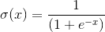
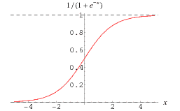
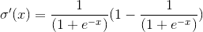
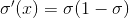
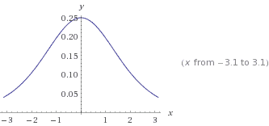
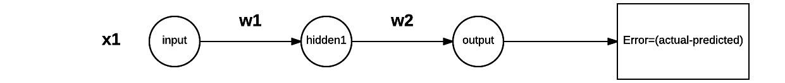
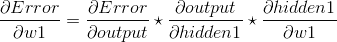
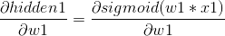
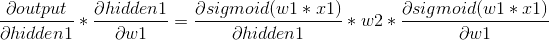

# 训练神经网络时消失梯度

> 原文：<https://medium.datadriveninvestor.com/vanishing-gradients-while-training-neural-network-42d6d5d83cdf?source=collection_archive---------1----------------------->

用基于梯度的方法训练深度神经网络面临的困难之一是梯度消失问题。使用反向传播算法来训练神经网络，并且在这种技术中我们面临的基本问题是消失梯度和一些时间爆炸梯度，这导致训练时间的增加和精度损失。这个问题是由某些激活函数引起的，并且变得难以调整神经网络中不同层的参数，并且随着神经网络中层数的增加，这个问题变得更加显著。

我们用一个 sigmoid 激活函数的例子来解释一下。

Sigmoid

Plot of Sigmoid function

Sigmoid 函数接受任何输入，并将其值压缩到(0，1)之间。通过看这个图，我们可以理解渐近线附近的梯度趋向于零。这使得网络的训练极其缓慢，因为网络参数的更新非常小。我们可以将这种情况表示为网络不再学习的**饱和神经元**或**死亡神经元**。

让我们深入细节，对 sigmoid 函数求导，并绘制出来。

**Derivative of sigmoid can be represented as**

该函数的最大值是. 25，当 x 的值在正侧或负侧增加时，渐近值接近零。sigmoid 的导数的范围在(0，. 25)之间。

考虑具有输入 x1、具有单个神经元的隐藏层和输出层的神经网络。误差将是实际值和预测值的差异。

将误差对重量求导，根据链式法则，我们将得到。

输出=隐藏 1*w2

hidden1=sigmoid(w1*x1)

如果我们看到这一项，我们乘以 sigmoid 的导数两次，sigmoid 的导数值在(0，. 25)之间。当一个数的值介于 0 和 1 之间时，该数相乘的乘积给出一个较小的值。这是一个隐藏层的情况，想象一下，如果它是一个深度神经网络，那么导数的乘积将非常快地降低梯度，因此我们将面临梯度消失的问题。

# **解决方案**

我们必须选择激活函数，其中我们可以避免当我们面对饱和或死亡的神经元时的情况。一个解决方案是使用 relu 函数和它的不同版本，这避免了消失梯度问题。在下一篇文章中会有更多的介绍。

推荐人:

[http://karpathy.github.io/neuralnets/](http://karpathy.github.io/neuralnets/)