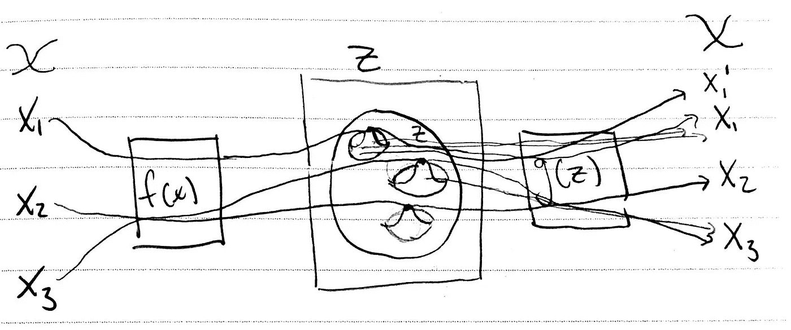
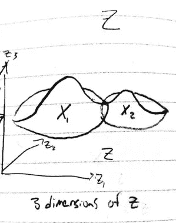
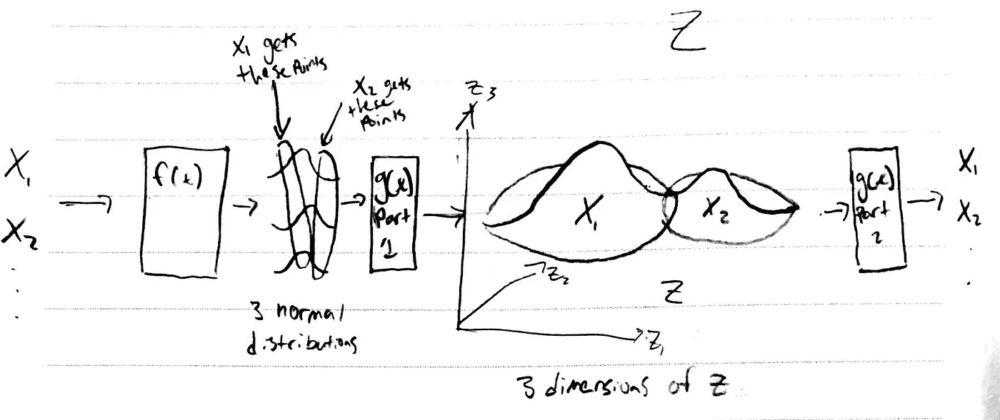
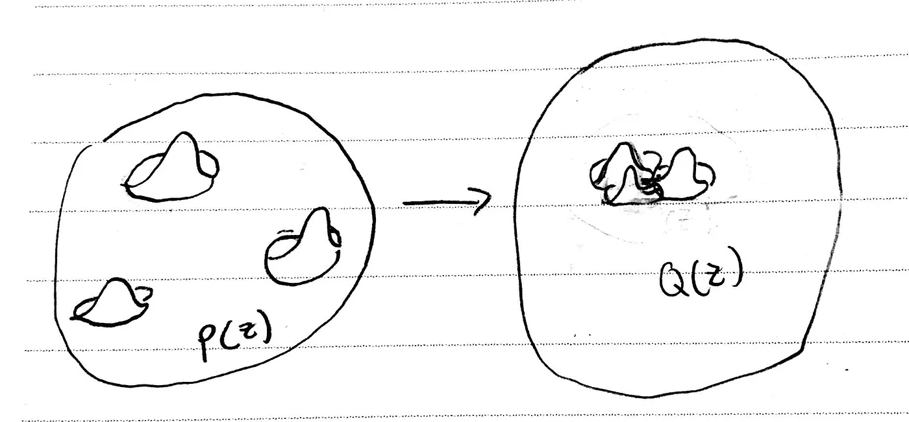
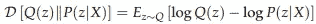
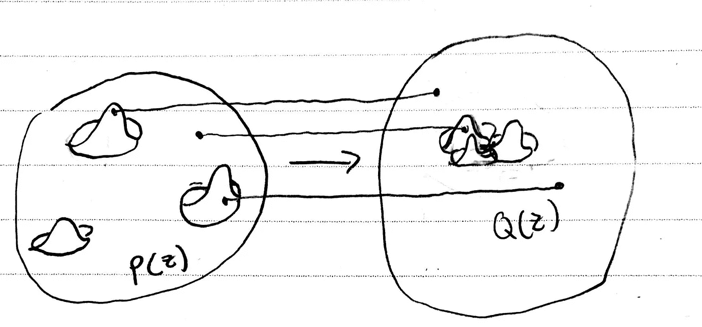
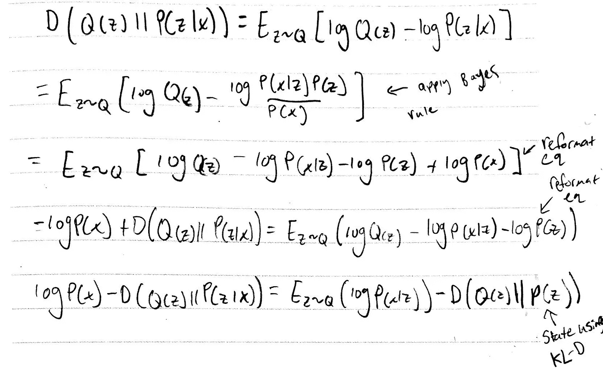
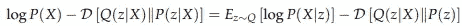
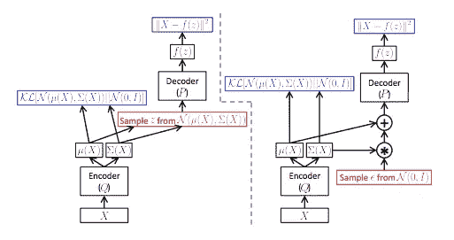
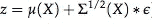

# 可变自动编码器(VAE)

> 原文：<https://medium.datadriveninvestor.com/variational-autoencoder-vae-d1cf436e1e8f?source=collection_archive---------2----------------------->

[这直接](https://mc.ai/variational-autoencoder-vae/)建立在我之前关于潜在变量模型的帖子上，在这里[找到](https://medium.com/datadriveninvestor/latent-variable-models-and-autoencoders-97c44858caa0)。如果你没有读过也不熟悉 VAEs 的基本原理，我推荐你去读一下它或者我正在分解的关于 VAEs 的教程:【https://arxiv.org/pdf/1606.05908.pdf。

**背景**

Desire —从现有数据中生成新的相似数据。

在上一篇文章中，我们留下了一个想法，如何构建我们的潜在空间，以生成我们想要的图像输出，类似于我们的训练示例。下图是我们得出的结果。我们通过函数 f( **X** )输入每个训练示例，该函数映射到潜在空间中的一个点。我们的输出函数 g( **x** )可用于从该点周围采样，以生成我们的输入或类似于输入的东西。

总体目标——找到如何构建我们的编码器和解码器，以生成尽可能类似于我们可以从中采样的 P( **X** )的输出。我们还决定要最大化下面等式的等式:

为此，我们需要找到如何测量积分中的每一项:P( **X|z** )和 P( **z** )。这变得有点棘手。

**实际实施我们的潜在变量模型**

我们首先深入研究如何找到 P( **z** )和 **z** 的维数。回想一下生成人脸的例子， **z** 只有一个维度，它由两个可能的值组成，对应于输出男性或女性人脸。实际上，这种低维潜在空间是没有用的。我们希望我们的网络能够捕捉到一张脸的其他特征，比如它有多圆，或者头发的长度，或者眼睛与鼻子、嘴巴与瞳孔的比例。理想情况下，该模型捕获我们没有明确定义但对重新创建令人信服的输出最有用的特征。这些是我们永远也想不出来的特性和特性之间的关系，因为它们太深奥了。每个特征都存在于一个单独的尺寸 **z** 上，我们可以说 **z** 有 **d** 个尺寸。在我们的模型中，我们在 **z** 中划分出空间，以遵循每个训练示例的正态分布。由于我们希望能够在 **z** 的任何地方进行采样，因此我们希望推动每个训练样本的分布尽可能接近，甚至重叠(我们通过优化函数来实现这一点)。重叠部分扭曲了 **z** 的分布，使其不再具有分散的明确定义的正态分布，而是以我们无法预测的奇怪扭曲形状分布。

See how **X1** and **X2** modify each other so the space is warped in an unusual way

之前我们可以通过为每个训练示例声明平均值和方差来轻松编码 **z** ，现在我们必须确定如何对 **z** 的形状进行编码。似乎 VAEs 使用了正态分布的一个特性/技巧来做到这一点。我们假设没有简单的方法来解释 **d** 维度的 **z** ，但是我们可以使用 **d** 不同的变量，每个变量都遵循通过函数映射的正态分布，从而为我们的训练示例 **X** 生成我们在 **z** 中的空间(我想知道每个变量是否可以遵循任何分布……)。

The inputs are mapped in f(**X**) to **d** normal distributions which then are mapped, using g(**z**) to our desired latent space. This latent space is then used to reconstruct our inputs. I circle parts of 3 normal distributions to exemplify how points could be used to map to the latent space. A real model would have a much more complex mapping.

因此，为了澄清，我在文章中展示的第一张图片并不完全正确，因为所示的 **z** 空间实际上是作为 g( **x** )的一部分生成的，我们的潜在变量是映射到该空间的 **d** 正态分布。

有了这个，我们现在有办法把我们的潜在空间 P( **z** )编码成 **d** 正态分布。同样， **d** 越高，从编码器传递到解码器的特征就越多。

在实现我们的潜在变量模型时，我们遇到了另一个问题:从 z **|X** 周围的任何地方生成 **X** 是极不可能的，因此 P( **X** )最终具有非常低的方差，并且我们在每个训练示例的 **z** 中的分布彼此并不接近。为了解决这个问题，我们引入了一个新的分布 Q( **z** )，这是一个理想的分布，我们在 **z** 中的所有分布都如我们所愿地彼此接近。我认为这是 P( **z** )的某种扭曲/折叠，现在看起来像我们想要的样子。

给定使 P( **z** )类似于 Q( **z** )的目标，我们现在可以创建一个正则化来使它们更接近。用于测量分布之间的差异的流行的正则化技术被称为 KL-Divergence，并且遵循下面的形式。

所以我们找到了 Q( **z** )和 P( **z|X** )之间的 KL 散度。注意，这个等式不是对称的，所以 D[Q(**z**)| | P(**z | X**)]！= D[P(**z | X**)| | Q(**z**)]。为了解释右边，考虑取一个数的 log_2 给出存储该数所需的位数。这对应于对该数字进行编码所需的信息量。本质上，我们是在比较每个分布中相应点的信息/概率。

在上图中，您可以看到两个分布中对应的 **z** 值是如何不相等的。使用 KL-Divergence，我们比较每个对应点，并计算整个 Q( **z** )区域的差异。直观地看，这告诉我们一个分布离另一个分布有多远，最小化这一项会使分布彼此靠近。下面，我按照 VAE 辅导论文中的数学方法，基本上就是使用贝叶斯法则将 P( **X)** 加到等式中，我们希望最大化这个项**。**

我们最终会得到:

从解释左手边开始。我们的目标是最大化 log P( **X** )。我们最大化它的程度决定了 **X** 的输出方差。给定 **X** ，KL 散度项需要最小化我们的 P 和 Q 分布之间的差异。这应该是有意义的，因为我们把 Q 设计成在 **z|X** 匹配 P。右手边我认为可以通过最小化我们的 Q 分布和 P 之间的距离来解释，给定 **z** 。这给出了生成 **X** 的最佳空间。然后我们对这个空间取一个期望值，看看从中产生 **X** 的概率是多少。本质上，这看起来像是我们的最佳编码器解码器，我们可以修改这些散度项来修改 P( **X|z** )。

因为我们让 P( **z|X** )与 Q( **z** | **X** )匹配，所以我们可以选择任何想要与 Q 匹配的分布。显然，正态分布也是一个不错的选择。

为了优化这个函数，我们现在需要能够确定每个分布的值。之后，我们将需要确定方程的梯度，并找到如何优化。

**优化方程式**

让我们从分解如何测量术语开始。

e _ Q[log P(**X | z**)**-**D[Q(**z | X**)| | P(**z**)]——取这个的梯度的时候我们可以把梯度移到期望值里面。然后，我们可以只取 **z** 的单个样本来生成 **X** 。在许多训练示例上这样做给出了我们对 q 的期望。取梯度有一个问题，即我们在 **z** 上的分布是不可微的。具体来说，由于我们每次都从不同的 **z** 采样，我们如何更新与每个 **z** 相关的权重？VAE 的指导论文称之为“网络中的随机单元”。有一个特殊的技巧可以做到这一点，叫做重新参数化技巧。

利用这个技巧，我们假设从 P( **X|z** )的采样可以通过添加一个单独的输入层来进行评估，以解码可微分的正态分布。它本质上声称，给定 Q( **z|X** )的平均值和标准偏差，我们可以通过将平均值与标准偏差乘以正态分布来从分布中取样。这就把一个难处理的分布变成了一个可微函数。

The left network is our theoretical framework for the VAE but we cannot differentiate the red box where we sample. Instead we introduce the equation at the bottom, where we can approximate the distribution using the normal distribution centered at 0 to sample from.

有了这些信息，我们就有足够的信息知道这个网络在理论上是可行的，并且值得尝试实现。我可能会在以后的文章中详细介绍网络的实际实现。

**最终想法**

我认为理解 VAE 的一个令人困惑的地方是，正态分布有四种不同的用法，而不是像快速浏览一个博客会让我们相信的那样只有一种。概括来说，它们是:

1.  当从潜在空间的一个区域采样时，尝试使每个训练样本的概率等于正态分布
2.  使用 **d** 正态分布生成维度 **d** 的潜在空间分布 P( **z**
3.  通过将 Q( **z** )设置为正态分布，将 P( **z** )向 Q( **z** )强制
4.  为我们的解码器 P 生成点，所以 Q 是可微的，我们可以使用反向传播(重新参数化技巧)

对 VAE 有了基本的了解后，在下一篇文章中，我将探索用 KL 背离来交换一种不同的分布差异指标，称为 Wasserstein 距离。