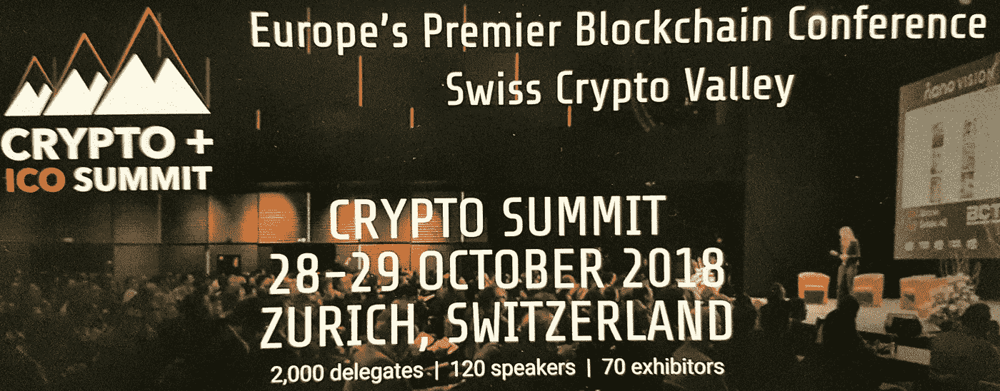
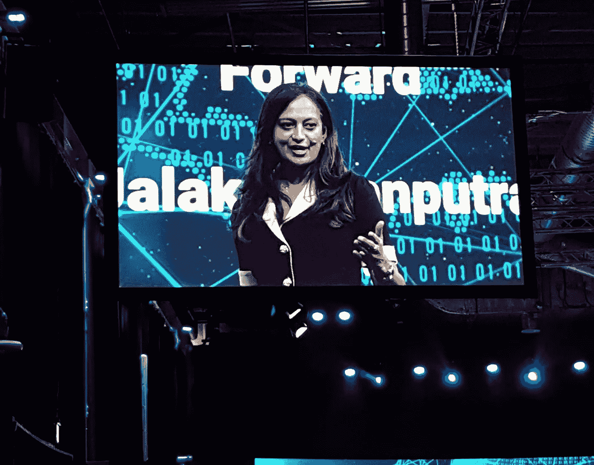
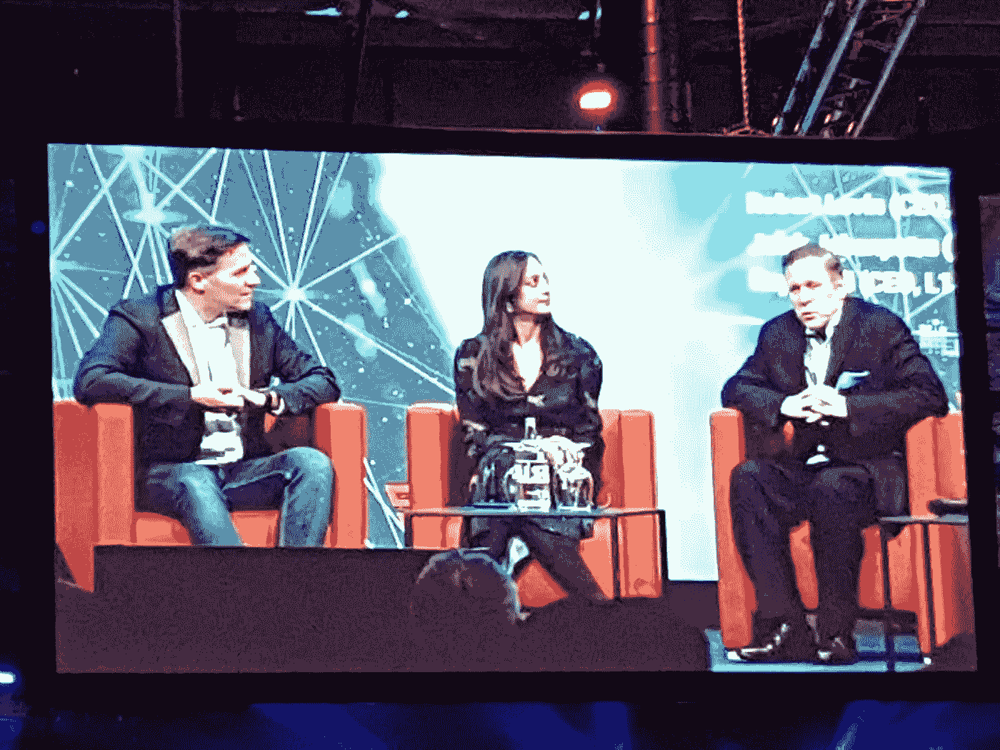
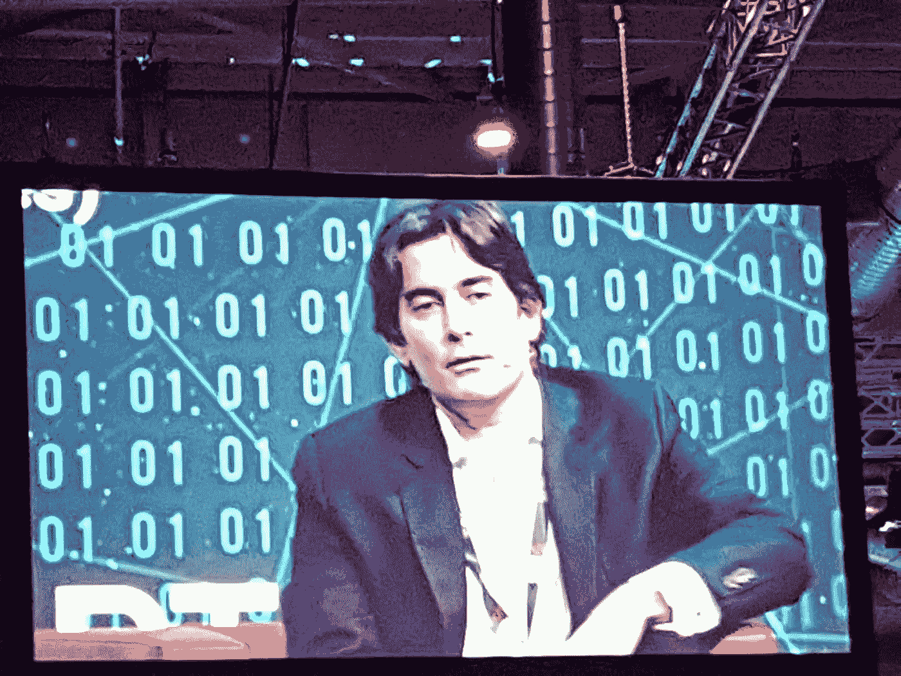
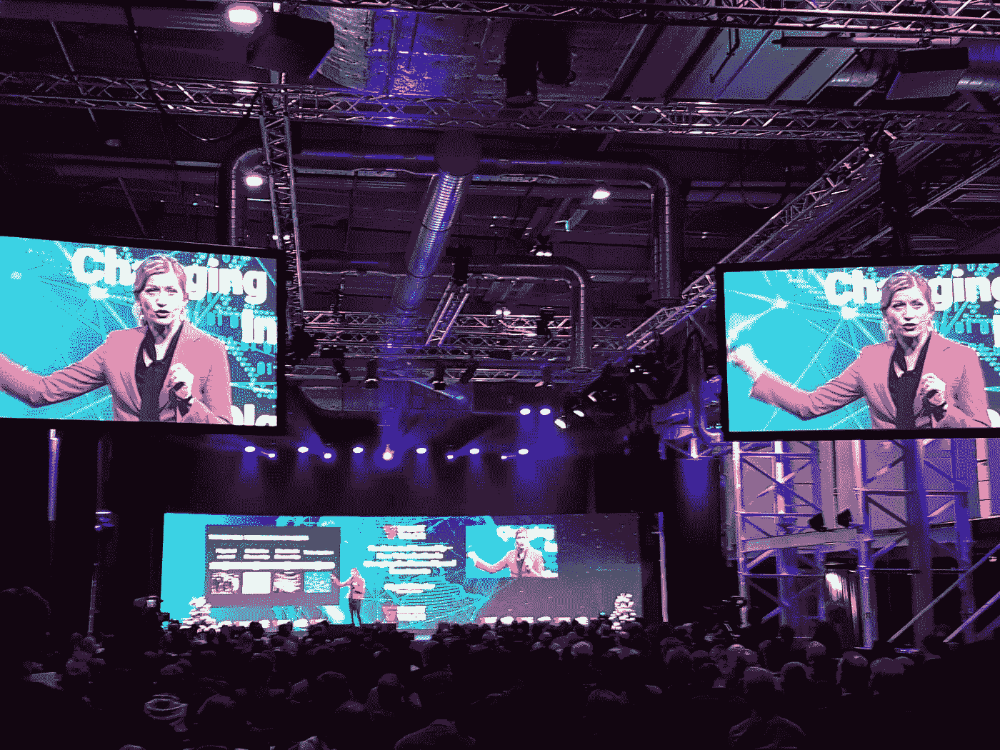
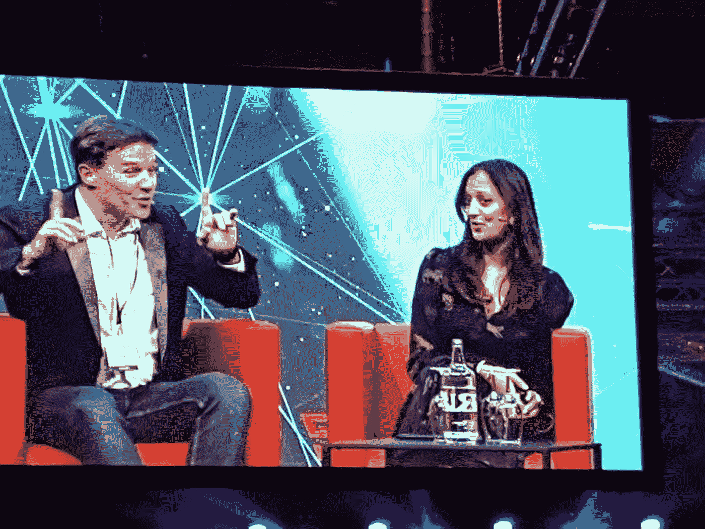

# 区块链的 VC 和 crypto？苏黎世加密峰会快照

> 原文：<https://medium.datadriveninvestor.com/vc-in-blockchain-and-crypto-snapshot-from-the-crypto-summit-in-z%C3%BCrich-5aada0188c64?source=collection_archive---------25----------------------->

**风险投资对区块链技术的看法？**这就对了！本周末，我在苏黎世的 crypto 峰会上做志愿者，并参加了一些非常有趣的关于风投如何与 Crypto 合作的讨论。这对我来说是一个非常有趣的话题，我会给你们一些会议演讲中的亮点。

**投资区块链领域:经验教训和前进方向**

让我给你介绍 Jalak Jobanputra。商界的杰出女性不断向人们展示，女性在风险投资领域可以和男性一样成功，甚至比男性更成功。)这个案例特别有趣，因为 Jalak 感兴趣的领域不是投资者可以选择与之做生意的最容易的领域。

贾拉克是[Future](https://futureperfectventures.com/)[Perfect](https://futureperfectventures.com/)[Ventures](https://futureperfectventures.com/)的创始人兼管理合伙人，这是一家位于纽约的早期风险投资基金，专注于去中心化，包括区块链科技、机器学习、物联网和安全的融合。是的，没错！所有这些技术都很容易被接受并引入市场，但贾拉克和她的团队。FPV 的投资组合包括凯西，区块流，区块链，Bitpesa，公民，令牌，开放花园，Everledger，Fuse Machines。

Jalak 不久前开始对区块链技术感兴趣。2013 年，她参加了自己的第一次比特币大会。正如她所说，这只是一个开始，但当时没有人关心比特币市场。
仅在去年，人们的兴趣才真正开始，而今年密码市场已经经历了许多起伏。但是，有越来越多的人，机构来到市场，并停留更长时间。尽管最初的疑虑和怀疑(摩根大通首席执行官杰米·达蒙说:*‘比特币是一个骗局’*但在伦敦办公室成立适当的加密团队后不久)人们意识到它不会消失，而是会留下来。它已经深入市场，似乎是一个真实的东西。
人们和企业需要在这个空间里赶上市场，他们需要适应，**谨慎而坚定**。

为什么是现在？为什么现在区块链正在革命？
这是因为**我们已经准备好**采用这项技术。我们能够处理以前无法处理的交易。
**可达性**。任何人、任何地方都可以参与。不仅仅是硅谷，楚格，乐高，孟买。现在它是全球性的和开源的。它已经在蒙古的一个小村庄里了。
数据激增。我们在过去两年内制作了大部分数据。发展事物、创造新价值、描述存在、为新发现申请专利的速度比以前快了几百倍。
我们有**速度**和**安全**在这里**体积**不再是问题。数据的安全性需要由区块链来保证。公司被迫升级系统，因为旧技术无法以安全的方式处理如此大量的数据，因此不再高效。
区块链适用于不同的领域。几乎可以适用于每个市场。澳大利亚证券交易所的邮政结算系统将被区块链完全取代。它将取代中后台解决方案。
在制药行业，我们可以将我们的数据转化为资产，选择允许保留我们数据的公司。我们不再需要中间人了。我们可以收回对具有巨大价值的数据资产的管理控制权。
此外，物联网( **IOT** )已经在这里使用。汽车、交通灯、冰箱都采用了这种技术。
**机器学习**将越来越全球化地发展和处理数据。数据可以匿名，然后每个公司都可以访问，不仅是谷歌和它可以用于良好的目的。所有这些技术将协同工作，为人们创造价值。很快，每个人都将拥有装有加密货币的钱包。智能合约将普遍允许实时交易。我们将把我们的资产证券化，公共投资将变得更容易获得。一切可以令牌化的东西都会被令牌化。

**超过 300 家加密基金和风投——科技投资的未来**

另一个小组讨论了区块链的投资基金和风险资本家围绕这个话题的情况。

**扬声器**:

**JALAK JOBANPUTRA** 代表未来完美创投(上文介绍)。

罗伯特·莱文——新兴之星资本有限责任公司首席执行官。过去，他曾在华尔街的家族公司担任交易员，当时该公司在《福布斯》私有公司排行榜上排名第 56 位。他现在是 ICO 策略师和顾问，加密货币投资者，多空股票投资经理。

**雷·欣迪—**L1 数码公司首席执行官。经验丰富的投资专家，在另类投资方面有丰富的经验。现在是 L1 数码公司的首席执行官，该公司通过选择和投资全球最好的密码管理公司，在区块链和数字资产领域积极开展业务。

[*www.cryptosummit.smartvalor.com/speakers*](http://www.cryptosummit.smartvalor.com/speakers)

**主持人:**
Robby Schwertner——CEO&创始人 CryptoRobby

**加密投资基金的未来如何？**
我们要把大部分东西符号化。希望通过 ICO 获得资金的初创公司现在来到了风投那里，这是一个有点晚的融资机会。风投和 crypto world 有合作。他们一起工作是因为彼此需要。

**区块链/加密初创公司应该做些什么才能成功接近风投？**
他们应该已经保管好了谁存放的令牌定义好了。应该有良好的资产负债表。他们一定知道代币的计划是什么。公用事业令牌仍然不知道他们将如何被监管。如果他们被允许用来交换货物。这里仍然是 TBD，但初创公司可以开始建立自己的想法。竞争是存在的，在这个发展中的市场赚钱并不容易。这笔交易必须是好的，有意义的，有清晰的未来愿景。必须有可扩展性的潜力和质量必须令人惊讶地脱颖而出。里程碑需要已经实现。然而，事实是这第一代的 95%的代币将毫无价值。在大多数情况下，什么都没有，投资者需要做出明智的决定。在许多情况下，人们会不假思索地兴奋起来，纯粹是炒作，所以要想买到真正好的东西，这是一门火箭科学。一定有潜在的基本面，而在这里，大多数情况下还不具备。

**增长最快的是什么？**
金融普惠项目。资产从物理世界向数字世界的转移。此外，游戏是今天的一件大事，具有巨大的潜力。据说游戏将会在区块链迅速发展。此外，人工智能市场将在不久的将来发挥重要作用。将会有大规模的数据聚合和去中心化。此外，与可持续发展相关的项目也可以在采用区块链技术的前 5 个行业中进行。那是极其有趣的区域！令人惊讶的是，在创建全球业务的同时，可持续发展正在浮出水面并被纳入考虑范围。因为是的，我们对地球负责，创造新的价值，我们不能破坏另一个东西。这不再是关于业务，而是关于做得好的业务，但在这种方式下，它不会在其他地方造成任何不必要的负担、浪费和伤害。总的来说，去中心化将会影响几乎所有的市场，但是是缓慢的，一步一步的，不会同时涉及所有的领域。

这种加密货币的大规模采用会怎么样？它是如何为财务自由铺平道路的？

*   从 1 亿个钱包到 10 亿个钱包很快就会出现
*   发展中国家的早期采用
*   首先，公司已经采用加密货币支付方式，因此它将覆盖更广泛的市场
*   几年前，没有网上银行，因为互联网似乎不安全，同样的事情发生在区块链。**信任需要时间**
*   亚洲、非洲需要身份和任何支付方式。他们甚至可能是 crypto 的早期采用者。已经发生了。这与发达市场无关，而是发生在像蒙古这样快速发展的国家
*   人们将会使用这项技术，但是他们需要明智地接受教育，并意识到信息技术将会成为新的常态

这些是我在看完、听完所有这些演讲以及与许多与会者交谈后得出的结论。这只是我完全同意和相信的亮点列表。如果遵循这些原则，它们将推动健康的生态系统向好的方向发展。

*总之除了**稳定币**是最有趣的一种。所有风险投资都应该问自己的问题是，如何创造一个合规的市场？所有有限合伙人都要求他们的所有投资从第一天起就是合规的。如果做到了这一点，创始人就有足够的资金和风险投资帮助他们制定和执行战略。

*ICOs 投资正在赶上 VC 投资的价值。一些公司不需要代币来筹集资金，但其中一些公司选择了这个选项，这很好。

*都是关于**创始人**，都是关于**团队**！这是大多数风投的重复声明。技术只是加法。伟大的团队可以从无到有做出惊人的事情，如果他们是梦想家，他们可以将简单的想法发展成独角兽项目。

*泰国和中国正成为有趣的投资地。

*有 200 多家加密货币交易所，因此在不久的将来会有许多合并。市场会自然清理，留下几个成熟合理的实体。

*不要忘记旧的、良好的尽职调查清单。在最初的决策过程中，这非常有价值，非常有帮助。它有助于验证和识别某样东西是潜在的还是只是一个骗局。

*一旦交易所变得更好、更快，交易量就会增加，费用就会降低。市场将变得更加透明和具有流动性。

*令牌应该是网络的组成部分。如果我是这个东西的用户，为什么我应该使用代币而不是普通货币？应该说得通。事情不必完美，但要有意义。

*社区建设是非常重要的背景。诚实是风险投资基金最重要的东西。这很容易测试。你和创始人交谈。你可以通过与人交谈来了解它。你可以看到是否有人在捏造事实，这是自动的**取消资格**。这是核心点！这不是说你是完美的，而是说你有很好的想法，需要一些帮助来变得完美！

*无论你在构建什么，你都需要**非常了解**。如果你在金融领域有所建树，但你不知道金融是如何运作的，你就不会成功。加密也是一样。空间是新的。这个市场上还没有这么多专家。有些聪明人有知识，但专业化需要在业务中多年，通过这样做来学习，因为这是新事物，没有人有机会在业务中经历几十年。考虑一下，不要跳到你不熟悉的领域。更好地专注于你有专长或学习的东西，测试并给自己一些时间在加密方面取得成功。

*现在可以承认，香港非常欢迎区块链和密码人才。对于想在那里生活并从事区块链相关业务或帮助发展现有或刚刚起步的中国公司的人来说，有一个简单的流程。看看这个特殊的市场怎么样？我一定会和你分享一些想法和重要的发现。

**区块链完美体现人性。我们在交流时没有中间人，所以我们也不需要中间人来做人类之间的交易*

**参加 Crypto 峰会的其他有趣的 VC 演讲者:**

mauro case llini——区块链和支付服务提供商负责人，Bank Frick，
罗伯特·博世——合伙人，Digital & Strategy，银行业&Capital Markets bearing point GmbH，
Daniel Gutenberg——早期天使投资人，
David Ellington——创始人&硅谷区块链协会(SVBS)执行主席，
Jeppe R. Stokholm 博士——普通合伙人&风险投资家
黑天鹅风险投资，
Robert Levin——新兴明星资本

活动的完整议程和发言人名单可在[此处](https://cryptosummit.smartvalor.com/speakers)获得。

*最初发布于:*[*https://investingimposition . com/2018/10/30/VC-in-区块链-和-crypto snapshot-form-the-crypto-summit-in-Zurich/*](https://investinginpassion.com/2018/10/30/vc-in-blockchain-and-cryptosnapshot-form-the-crypto-summit-in-zurich/)