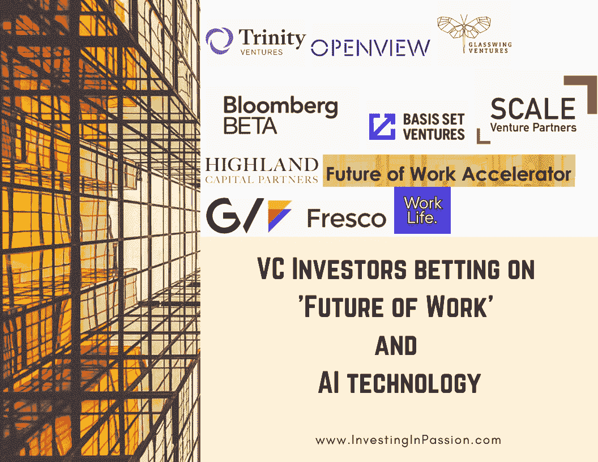

# 风险投资者押注于“工作的未来”和人工智能技术

> 原文：<https://medium.datadriveninvestor.com/vc-investors-betting-on-future-of-work-and-ai-technology-115714d0c9a4?source=collection_archive---------10----------------------->

# 风险投资者押注于“工作的未来”和人工智能技术

我经常在想，以后的工作会是什么样子？我们现在试图想象的，可能是非常正确的，或者看起来与我们一厢情愿的猜测完全不同。然而，可以肯定的是，工作的定义和目前对工作日的看法已经发生了巨大的变化。科学和创新的范围仍有待发现，不时会有我们想不到的解决方案让我们大吃一惊。有很多事情我们还不知道:

*   **自动化**的过程。现有的体力的、基本的、重复性的任务正在被**机器人**所取代。在这里，具有颠覆性的职业的[范围有多大？亚马逊在仓库中使用机器人的事实不再让任何人感到惊讶。](https://medium.com/@cigen_rpa/10-real-world-use-cases-for-robotic-process-automation-rpa-in-retail-bd40cf4fe38c)[更多的公司](https://www.lovemoney.com/gallerylist/61607/companies-already-replacing-humans-with-robots)，如 DHL、CIG、优步、Tesla、Capita、BestBuy、Target、Macy's、Adidas、Walmart、Carrier、Nestle、SNCF、Ocado、JustEat、Marriott Hotels、ING、Nissan、Zara、Fidelity Investment，紧随其后，释放了人的潜力，并更有效地使用它，让机器做“繁重”的工作。

*   **效率**在起作用。**基于软件、AI、ML** 的工具收集数据、分析数据、得出结论，并帮助顾问提出建议，否则他们将无法提出这些建议。最近遇到的 [JetPack Data](https://www.jetpackdata.com/landing) 使数据分析成为我见过的最快的方法，并将不同类型的数据转化为有意义的见解。规划、组织、日程安排已经可以很容易地自动化。会议备忘录已经被机器记录下来了。此外，它还能够识别并吸引在聚会期间没有分享想法的团队成员。它使工作更加高效、数字化，确保全员参与，防止工作环境中的群体思维。随着越来越多的独立工具建立网站，基本的应用程序不需要任何编码技能。全球市场上许多不同的自动机制都发挥了作用。

 [## 风险投资家在给创业公司播种时会考虑什么标准？数据驱动的投资者

### 2017 年，风险投资资金攀升至十年来的最高水平。你的创业公司目前吸引风险投资的机会是…

www.datadriveninvestor.com](https://www.datadriveninvestor.com/2018/04/20/what-criteria-do-venture-capitalists-consider-when-seeding-a-startup/) 

*   **分发** **作品**模型。我们不再需要去办公室，但我们可以在世界的不同地方轻松地工作，完全远程。这一切之所以成为可能，要归功于像 [Zoom](https://zoom.us/Meetings) 这样高质量的视频会议、像 [Airtable](https://airtable.com/) 、 [Asana](https://asana.com/) 、[superman](https://superhuman.com/)这样的团队协作工具，以及在所有其他因素之前，还要归功于成熟可靠的员工，他们珍视雇主越来越慷慨地给予他们的灵活性和信任。它允许探索不同的市场，让公司走向全球，并在不同的国家开展业务，而不会失去与同事的联系和文化认同，如果没有分布式团队，这种情况就会发生。效率和你花在项目上的时间越来越不相关。[公司](https://www.theguardian.com/technology/2019/nov/04/microsoft-japan-four-day-work-week-productivity)引入 4 天工作周或少于 8 小时的工作时间，并且永不回头。当人们能够合理地平衡工作和生活时，他们会看到令人惊讶的更好的结果。
    越来越无障碍的[共同工作](https://investinginpassion.com/2019/08/23/co-working-spaces-and-startup-hubs-in-boston/)空间和[家庭共享](https://www.rentthebackyard.com/)解决方案增加了移动性，阻碍了协作。在不同的环境中，不同的职业、技能和经验水平自然地混合在一起，思想分享、指导、动态思维、创造性工作很容易发生。
*   **招聘**和**人才**留用**人才**。为了拥有这种程度的独立性，人力资源服务、学习、培训、教育需要彻底改变。我们招聘的方式，我们筛选简历时考虑的标准都在变化，允许我们关注更多的人类特征，而不是分数、大学名称、性别、国籍或工作经验。此外，在全球竞争越来越激烈的市场上，留住最优秀的人才是一项挑战，因此确保员工的意见得到倾听和考虑至关重要。让他们感到参与、受尊重和有影响力有助于降低离职率，更好地利用现有资源。

我在结构化、银行、咨询、封闭的办公环境中工作过，经营过自己的公司，做过全职和兼职工作，在一个陡峭的层级模型中有一个老板，在一个没有人监督我工作的扁平结构组织中工作过，我测试了相当多不同的文化、国家、不同的组织管理风格，观察我们生活中这一特定部分的演变成为我最大的热情

幸运的是，越来越多的投资者相信，人们只会专注于不重复、随机、复杂的任务。他们将训练机器，监督生产线，制定战略，达成交易，谈判，创造创新的解决方案并实施所有这些，使工作不像我们今天看到的那样是一项工作。机器不会成为人类劳动力的替代品，它们将成为补充因素，这样它们就可以一起工作了。重新定义我们的生活和工作方式已经成为全球初创企业创始人面临的最大挑战之一，因此我们希望帮助他们，并尽可能利用手头的资金加快这一进程。

**押注于初创公司的风险投资基金关注人工智能和工作的未来**

[三一投资](https://www.trinityventures.com/)，加州门洛帕克

[更好的投资](https://www.better.vc/)，加州奥克兰

[打开视图](https://openviewpartners.com/)，马萨诸塞州波士顿

马萨诸塞州波士顿的 Glasswing Ventures 公司

[工作台](https://www.work-bench.com/)，纽约，纽约州

[加州三藩市彭博贝塔](https://github.com/Bloomberg-Beta/Manual)

[加州旧金山基础投资公司](https://www.basisset.ventures/)

[加州福斯特城的规模风险投资伙伴](https://www.scalevp.com/blog/investing-in-the-future-of-work)

[高地资本合伙人](https://www.hcp.com/) [，](https://www.hcp.com/investment-themes/future-work)马萨诸塞州剑桥

[加速器](https://www.accelerace.io/)和[工作加速器](https://www.accelerace.io/future-of-work-accelerator/)的未来，丹麦哥本哈根

加州旧金山，谷歌风险投资公司

[香港壁画之都](https://fresco.vc/)，香港

[工作生活风险投资](https://www.worklife.vc/)，加州三藩市

**有趣的资源:**

妇女和工作的未来(报告):[https://www.catalyst.org/research/women-future-work-report/](https://www.catalyst.org/research/women-future-work-report/)

[天使名单上的未来工作天使投资人](https://angel.co/future-of-work-1/investors)

麦肯锡的[工作的未来](https://www.mckinsey.com/featured-insights/future-of-work)

麻省理工学院未来工作报告:我们不应该担心工作的数量，而是质量

最初发表于 www.InvestingInPassion.com