# 瑞士的风险投资和创业市场

> 原文：<https://medium.datadriveninvestor.com/vc-startup-market-in-switzerland-93d198d6af60?source=collection_archive---------6----------------------->

如今，瑞士每年有超过 300 家初创公司成立——是 15 年前的 4 倍(根据 [Startup Radar 报告](https://www.startupticker.ch/uploads/File/Attachments/StartupRadar_web.pdf))。苏黎世州是创新的中心，拥有大约三分之一的初创公司，但它们存在于所有 26 个州。医疗技术、工程、电气和金属(MEM)行业以及能源和清洁技术处于领先地位，但在生物技术和金融领域也有相当强的代表性。与其他欧洲国家相比，初创企业的增长相当缓慢，但这是当地创始人努力的方向。

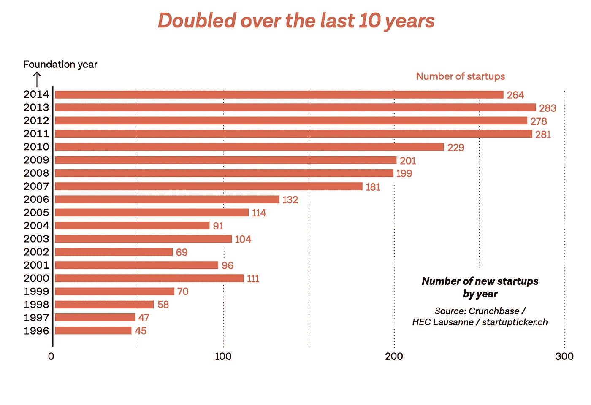

市场上不仅有瑞士倡议。越来越多的法规允许外国创业公司来到瑞士并在这里开展业务。他们可以受益于丰富的知识、辅导、财政支持、指导、发展市场和友好的创业基础设施和网络。瑞士向其他国家敞开大门，但在接受它们之前，要极其谨慎地选择商业理念，例如，当地的加速器。当谈到纯粹的风险投资本身，瑞士是一个相对较小的国家，但它在这一领域有相当严重的球员。有大量的资金可用，但它是经过仔细和理性考虑的，而不是投资于所有可能的计划。在这里你可以找到最有趣的风险投资代表(公司/私人)以及活跃在瑞士市场的本地加速器的列表。他们中的一些人并不知名，但我深入挖掘了市场，发现很少有小的，不是“大声喊出来”的，而是真正成功的，有杰出使命可循的。

**瑞士最受认可的加速器和风投:**

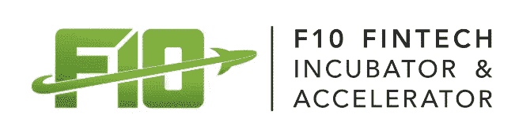

[*https://www.f10.ch/*](https://www.f10.ch/)

[F10 孵化器&加速器](https://www.f10.ch/) F10 支持和引导初创公司将其最初的想法转化为成功的公司，同时促进与国际金融组织的全球合作。该加速器已经在创新、加速和主要针对金融服务的产品创造方面有了良好的记录。他们得到了 SIX、瑞士证券交易所和其他主要金融机构的大力支持。去年，他们将项目扩展到全球，不仅在苏黎世，还在维也纳和新加坡组织了黑客马拉松。F10 将他们的计划分为 3 轮:1。从想法到原型，2。从原型到产品，3。产品推向市场，其中最后一个已经是非常先进的概念水平和特定机构的积极工作创业证明。

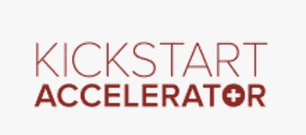

[*https://kickstart-accelerator.com/*](https://kickstart-accelerator.com/)

[Kickstart 加速器](https://kickstart-accelerator.com/)
Kickstart 加速器在初创公司、企业、城市、基金会和大学之间架起了一座桥梁，以加速深度技术创新。他们接受以下垂直领域的创业公司:
ed TECH&LEARNING
fin TECH&CRYPTO
FOOD&RETAIL TECH
SMART CITIES&infra structure
它向开发和应用深度技术、科学和工程驱动的技术(如人工智能、大数据、区块链、机器人等)的国内和国际创业公司开放。在该计划期间，被选中的企业家通常在苏黎世生活和工作 6 周，与合作伙伴一起实施合作项目并扩大他们的业务。他们得到来自瑞士创新生态系统的导师和专家的支持，与投资者取得联系，并参加合作研讨会。此外，每个初创企业可获得高达 10，000 瑞士法郎的项目津贴。 **Kickstart 不收取任何股权和费用。**

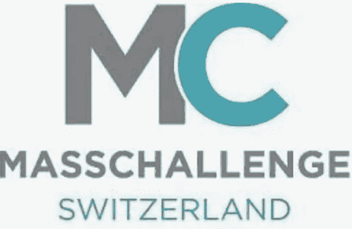

[*www.masschallenge.org/programs-switzerland*](http://www.masschallenge.org/programs-switzerland)

[Mass Challenge](https://masschallenge.org/programs-switzerland)
非常年轻，因为瑞士 Mass Challenge 成立于 2016 年，通过将初创公司与他们成长所需的专家和资源联系起来，它已迅速成为欧洲创新和创业的领先驱动力。该计划从 2 月(申请受理)持续到 6 月—9 月，届时实际的加速计划正在进行，并于 10 月以瑞士大众挑战赛颁奖典礼结束。

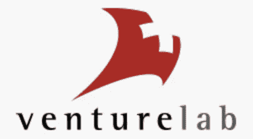

[*https://www.venturelab.ch/*](https://www.venturelab.ch/)

[创业实验室](https://www.venturelab.ch/) 所谓的*世界级创业公司。瑞士制造*。Venturelab 于 2004 年开始这项任务。从那时起，他们已经审查了成千上万的商业想法，并培训了成千上万的初创公司。巨大的成功是，去年有 69 名 Venturelab 校友进入了瑞士 100 强创业公司。它确实能说明创业实验室领导者的专业水平、经验和创业市场知识。

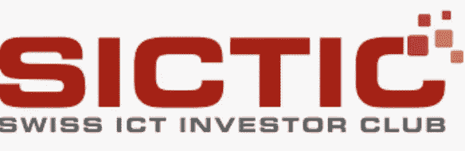

[*https://www.sictic.ch/*](https://www.sictic.ch/)

瑞士信息通信技术投资者俱乐部(SICTIC)是一家成立于 2014 年的非营利性协会，旨在将精明的投资者与瑞士早期科技初创公司联系起来。SICTIC 组织创业公司和投资者的**交易流程**和**配对，**促进**该过程，直到投资轮结束，旨在提高当地种子阶段投资的数量和质量。然而，SICTIC 既不投资自己，也不持有初创公司的股份。它不是一个加速器，而是一个连接创业公司和投资者的伟大社区。它为前期选择的初创公司和寻找投资机会的 SICTIC 成员提供定期的网络平台。**

[*https://www.gobeyondinvesting.com/*](https://www.gobeyondinvesting.com/)

[超越投资](https://www.gobeyondinvesting.com/)
众所周知，天使投资平台将寻找资金的初创公司与网络成员投资者联系起来。他们已经促成了大约 96 笔创业融资交易。创始人可以接触到全球投资者、经验丰富的导师和交易负责人，他们被分配到每一家初创企业。此外，GBI 通过定期的网络研讨会、现场培训会议和新举措，如参与筹资或创建专注于特定市场的新基金，如他们最近的举措 [Rising Tide Europe](http://www.risingtide.eu/) 第三版，让女性投资者通过投资于至少有女性联合创始人的初创公司来学习天使投资，从而提供强大的教育支持。他们选择的投资组合包括:Flyability，Arktis 辐射探测器有限公司，Cellestia 生物技术公司。

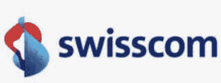

[*www.swisscom.ch/en/ventures.html*](http://www.swisscom.ch/en/ventures.html)

[**Swisscom Ventures**](http://ventures.swisscom.com)
Swisscom Ventures 是瑞士领先电信运营商的企业风险投资部门，投资于新兴商业模式和技术与 Swisscom 核心业务相关的成长型公司。更准确地说，该公司专注于金融科技、软件、云计算、分析、通信、娱乐、大数据、物联网、电信和安全。该公司的金融科技产品组合包括基于云的商业软件 **Bexio** 和发票融资平台 **Advanon** 等。就在这一天，瑞士电信完成了对网络卫士的投资。瑞士电信支持内部创业计划。今年，瑞士电信的员工获得了企业创业峰会的一等奖。他发明了 kickbox，你只需抓住它，就能了解帮助你创业的基本工具。

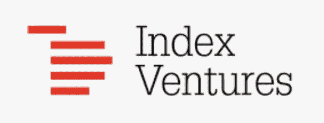

[*https://www.indexventures.com/*](https://www.indexventures.com/)

[**Index Ventures**](https://www.indexventures.com/)
Index Ventures 是一家欧洲风险投资实体(成立于 1996 年)，总部位于日内瓦，在伦敦和三藩市设有办事处。他们正在建立的变革性公司包括:Adyen、Aurora、Bird、Deliveroo、Datadog、Dropbox、Elastic、Farfetch、Funding Circle、King、Sonos、Squarespace、Supercell、Zuora 和许多其他公司。他们在全球范围内发展，已经在 39 个不同的国家拥有了合作过的公司。最近基金:早期基金(指数创投 9) &成长基金(指数成长 4)。

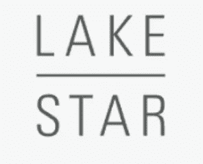

[*https://www.lakestar.com/*](https://www.lakestar.com/)

[湖星](https://www.lakestar.com/)
湖星主要关注并投资科技和数字公司。Lakestar 在柏林、伦敦和苏黎世都有业务，主要在欧洲和美国对由“杰出”企业家推动的科技企业进行早期和成长期投资。
Lakestar 的金融科技投资组合包括，airbnb、Revolut、spotify、ShapeShift。他们在苏黎世、柏林、伦敦、纽约和香港都设有办事处。

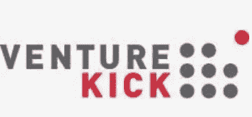

[*https://www.venturekick.ch/*](https://www.venturekick.ch/)

[Venture Kick](https://www.venturekick.ch/)
Venture Kick 成立于 2007 年，其愿景是将瑞士大学的分拆数量增加一倍，加快上市时间，并提高这些年轻公司对专业投资者和行业合作伙伴的吸引力。从瑞士 150 多名领先的创业专家组成的评审团中选出的成员，每月分三次会议评估 20 个不同阶段的创业项目。资助从公司成立前开始，在大约 9 个月的时间内，分 3 个阶段，每个项目的资助金额达到 13 万瑞士法郎。他们的业务范围包括:Web 2.0、媒体、电子商务、企业、软件、移动、游戏、医疗技术、清洁技术、生物技术。

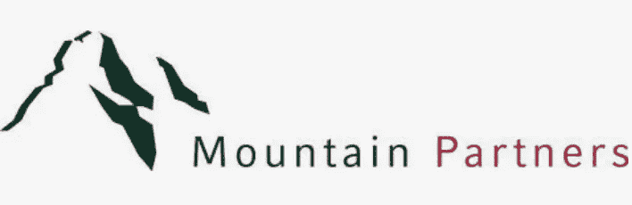

[*https://mountain.partners/en/*](https://mountain.partners/en/)

[Mountain Partners](https://mountain.partners/en/) 该公司管理着 130 多项投资，涉及电子商务&服务、技术&安全、数字支付&金融科技等领域。
凭借战略性地分布在新兴市场地区(拉丁美洲、中东、东南亚)的国际枢纽全球网络，Mountain Partners 为处于早期孵化阶段的公司提供支持和融资，将成熟的商业模式国际化，提供积极的本地管理，并最终将它们推向公开市场。

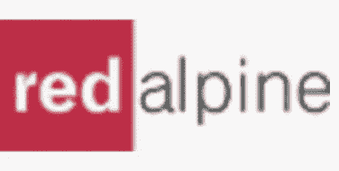

[*https://redalpine.com/*](https://redalpine.com/)

Redalpine
Redalpine 是一家欧洲种子和早期风险投资公司。他们投资于颠覆性技术，重点是高度可扩展的 ICT 和医疗技术模式。Redalpine 的投资组合包括 Zenjob、LemonOne、Finiata、Lunaphore、Bexio 等等。阶段:早期，中期，后期，**调查**

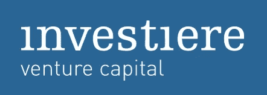

[*https://www.investiere.ch/*](https://www.investiere.ch/)

Investiere 由卢卡斯·韦伯(Lukas Weber)和斯蒂芬·瓦格纳(Steffen Wagner)于 2010 年创立。现在，它得到了 68 位商业天使以及 2016 年夏天收购 investiere 少数股权的当地 Zürcher Kantonalbank 的支持。Investiere 是一个在线投资平台，面向企业家、风险投资人和所有其他对潜在创始人感兴趣的个人。该平台为经认可的私人和机构投资者提供了直接和专业的途径来获得选定的创业投资，并寻求向更广泛的受众开放资产类风险资本。到目前为止，Investiere 的成员已经增加，并在构成瑞士创新景观的不同领域建立了多元化的投资组合。在金融科技领域，Investiere 投资了为银行、保险、医疗保健和政府等受到严格监管的行业服务的网络安全初创公司 Qumram，以及基于网络的电子投票和投资者关系平台 Sherpany。

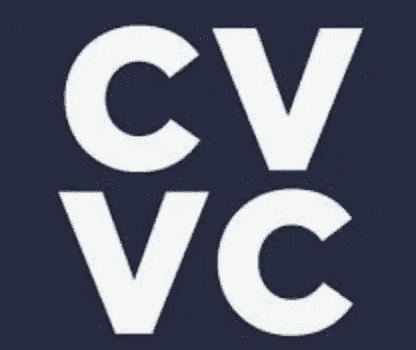

[*https://cvvc.com/*](https://cvvc.com/)

最后，我再补充一个，它是今年成立的，但看起来很有潜力在市场上占有一席之地。 [CVVC](https://cvvc.com/) 专注并独家支持区块链创始人。[CVVC](https://cvvc.com/)——是一家下一代投资公司，在这里，尖端的区块链技术与传统的风险投资相遇。他们投资于区块链发展的所有阶段，从孵化到前 ICO 和后 ICO。CVVC 在市场上非常活跃，并提供了很多机会与志同道合的人交往。他们组织简历竞赛。这是区块链创业公司赢得 10 万美元现金奖励的机会。此外，一年两次的客户价值峰会将聚集区块链社区讨论最近的市场动态。

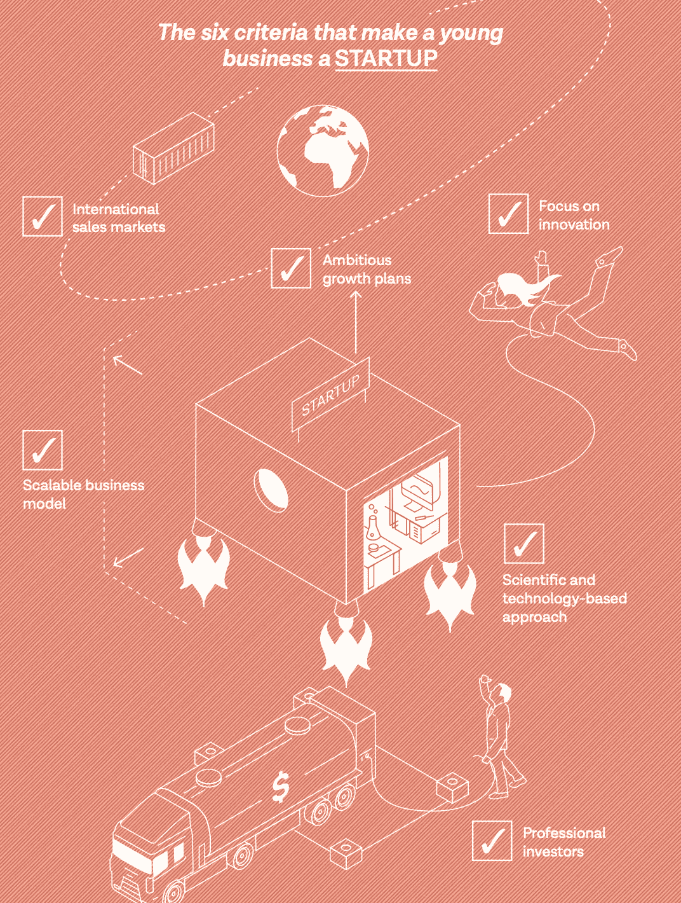

*Source:*http://bit.ly/2BLYPyk

原发布于[https://investinginpassion . com/2018/12/15/VC-startup-market/](https://investinginpassion.com/2018/12/15/vc-startup-market/)