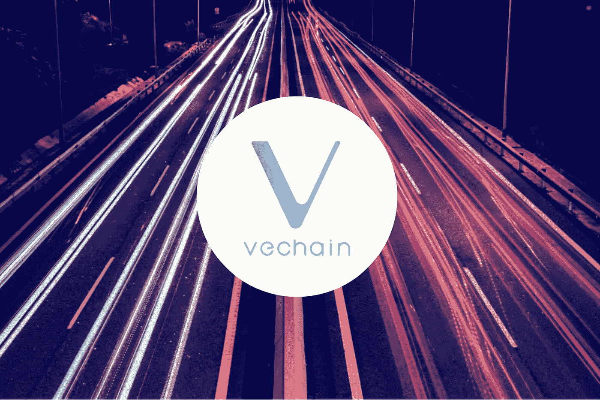

# 2019 年亚马逊网络服务(AWS)北京峰会

> 原文：<https://medium.datadriveninvestor.com/vechain-at-amazon-web-service-aws-beijing-summit-2019-39476add6f6d?source=collection_archive---------5----------------------->

亚马逊网络服务(AWS)北京峰会从 2019 年 7 月 31 日开始。该活动是免费组织的，它是云计算社区聚集在一起建立联系、合作并获得更多关于 AWS 的知识的地方。

有趣的是，来自加密货币市场的 VeChain 也参加了此次峰会，因为它是 AWS 的区块链技术合作伙伴和 AWS 的合作伙伴网络 APN 的成员。此次峰会非常著名，邀请了大约 150 名来自不同公司或企业的演讲嘉宾，如 IBM、小米和德勤的专家。此外，200 名 APN 合伙人出席了会议。峰会非常关注云计算技术及其发明，来自中国各地的约 15，500 名与会者参加了此次峰会。

 [## 信息图:云之旅|数据驱动的投资者

### 聪明的企业领导者了解利用云的价值。随着数据存储需求的增长，他们已经…

www.datadriveninvestor.com](https://www.datadriveninvestor.com/2018/09/22/infographic-journey-to-the-clouds/) 

AWS 和 VeChain 于 2019 年开始合作，今年 2 月，VeChain 宣布引入 AWS 云平台的集成解决方案，以启动 VeChainThor 区块链节点一键式部署。这是 AWS 和 VeChain 在技术、开发和市场战略方面的强有力支持的起点。

车链首席技术官顾先生也作为“主题演讲人”出席了本次峰会首席技术官顾先生在致辞中推出了一站式技术即服务解决方案“VeChain ToolChain”。该工具链有能力吸收 NFC/RFID 芯片、移动设备，以降低获取区块链技术和物联网传感器的门槛。VeChain 工具链还具有其他功能，一个没有技术背景的人也可以制定他们的业务区块链解决方案。

AWS 和 VeChain 的联盟对双方来说都是富有成效的。据顾先生说，

> *“一方面，它允许企业部署快速、安全、合规的区块链应用，这对于推动区块链技术的大规模采用至关重要。除此之外，VeChain 提供的区块链技术可以用来为 AWS 的客户创造价值。更重要的是，VeChainThor 生态系统和 AWS 生态系统之间的互动和交流正在产生新的商业模式和应用场景，这为两者带来了机遇。”*

基于 VeChain 工具链的区块链解决方案已成功融入不同行业和不同领域，包括快速消费品、葡萄酒、食品和饮料、奢侈品、医疗保健、汽车等。工具链的解决方案是数字碳生态系统、消费者信心指数和液化天然气解决方案。使用这些解决方案的企业过得非常愉快，他们享受着工作流程、更好的透明度、更高的安全性和更好的可追溯性。

**新闻来源:**the confirpublic