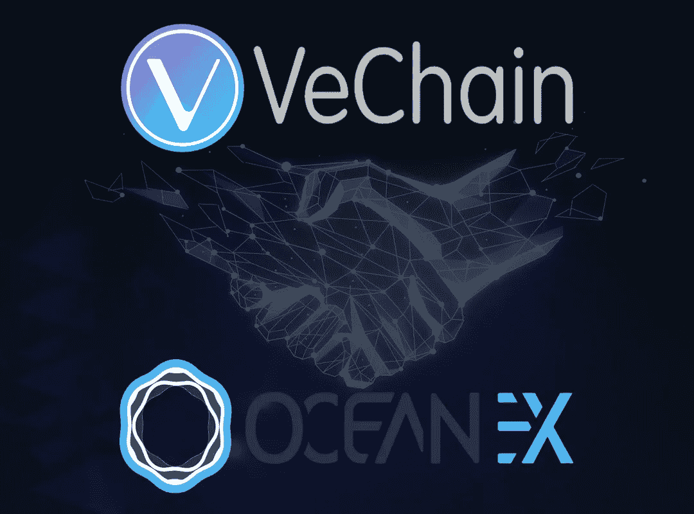

# VeChain 可能会被 OceanEx 列入最近的令牌清单

> 原文：<https://medium.datadriveninvestor.com/vechain-might-make-it-to-the-recent-token-listings-by-oceanex-ad49b5153846?source=collection_archive---------5----------------------->

与比特币和以太网非常相似的是， [VeChain](https://www.thecoinrepublic.com/with-vechainthors-authenticating-system-for-luxury-wines-illicit-wine-trade-might-come-to-an-end/) 最近在市场上也有一些接触阶段。

截至目前，该密码的交易价格约为 0.00507830 美元，投资回报率为-66.79%。VeChain 的其他因素如市值约为 276，999，765 美元，而 24 小时交易量约为 27，419，440 美元。

 [## 创新提醒:区块链 3.0、Terra 协议、ICO 门户和更多|数据驱动的投资者

### 尽管过去几个月加密货币的价格波动很小，但这项技术并没有停止发展…

www.datadriveninvestor.com](https://www.datadriveninvestor.com/2019/03/16/innovation-alert-blockchain-3-0-terra-protocol-an-ico-portal-more/) 

就 7 天的高/低而言，根据最近的动态，它是 0.005547 美元/ 0.004790 美元。

# 简要看一下维查因目前的情况

如果我们观察一下 VeChain 自本月初以来的走势，就会发现它确实很不稳定。截至 8 月 5 日，价格约为 0.005480 美元。然而，8 月 6 日却大幅下跌了 13.35%。8 月 7 日，股价不知何故在当天收盘时上涨了 19.48%。

成本在 8 月 8 日又下降了 16.44%，汇率估计为 0.004736 美元。大约在同一时间 21:25 UTC，价值从该点略微扩大了 8.86%，兑换为 0.005151 美元。

该值在 8 月 9 日再次下跌 5.88%，兑换值变为 0.004848 美元，目前从今天开始有所扩大。

# 对 Vechain 用户来说是个好消息

无论目前的情况有多糟糕，VeChain 恢复其地位的希望还是比较大的。

这是因为 [OceanEx](https://twitter.com/OceanexOfficial) 最近宣布代币上市。

根据上市计划，VeChain 也有望成为其中一员。

不言而喻，如果这种情况以某种方式发生，那么不可否认的事实是，用户将再次见证一些真正有效的交易机会。

# 让我们寻找预言

嗯，现在可以明确地说，VeChain 市场完全看跌。

然而，不可否认的是，新用户正在充分利用它，并乐于成为它的一部分。

此外，如果令牌列表被证明是真的，密码可能能够再次恢复。

在那之前，避免任何损失的最聪明的方法是谨慎行事。为此，没有比更安全的出价更有效的选择了。

**新闻来源** : [公开](https://www.thecoinrepublic.com/vechain-might-make-it-to-the-recent-token-listings-by-oceanex/)