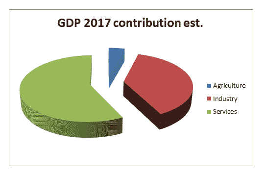
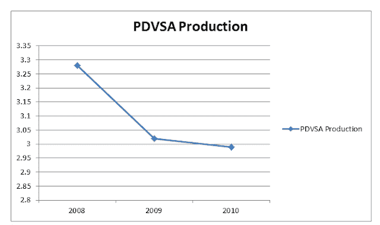
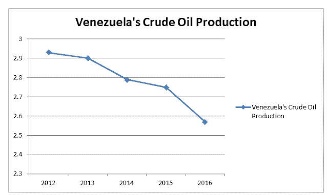
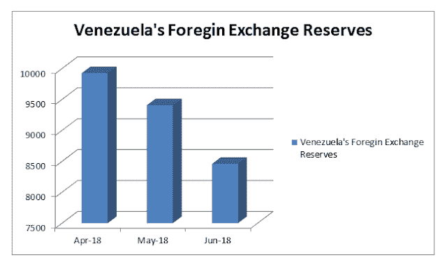
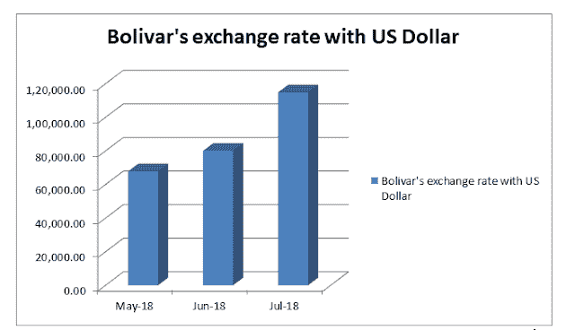

# 委内瑞拉的恶性通货膨胀

> 原文：<https://medium.datadriveninvestor.com/venezuelas-hyperinflation-52556846681?source=collection_archive---------13----------------------->

这是世界上最热门的话题之一，像[委内瑞拉](https://onkarjadhavv.blogspot.com/2018/08/venezuelas-hyperinflation.html)这样据说拥有世界上最重要的石油资源的国家都有这种情况，而且你已经知道石油在经济中的重要性，为什么呢？像这样的国家正在经历恶性通货膨胀，我们将讨论这个问题。

# 所以在我们开始之前，让我们看看什么是恶性通货膨胀。

根据牛津词典

*“货币通胀率非常高。”*

[恶性通货膨胀](https://onkarjadhavv.blogspot.com/2018/08/venezuelas-hyperinflation.html)是指货币快速且往往无法控制地贬值，导致商品和服务价格在短时间内飞速上涨。

 [## 为什么包容性财富指数比 GDP 更能衡量社会进步？-数据驱动…

### 你不需要成为一个经济奇才或金融大师就能知道 GDP 的定义。即使你从未拿过 ECON 奖…

www.datadriveninvestor.com](https://www.datadriveninvestor.com/2019/03/08/why-inclusive-wealth-index-is-a-better-measure-of-societal-progress-than-gdp/) 

简单来说，就是商品和服务价格一个月上涨超过 50%的情况，委内瑞拉的通货膨胀在 2018 年 5 月已经越过了 25000%。

那么委内瑞拉是如何陷入这种困境的呢？

在我看来，主要问题是委内瑞拉的经济开始依赖石油出口，随着 2014 年油价开始下跌，这开始给他们带来问题。

让我们看看委内瑞拉的经济。

正如我之前所说，委内瑞拉的经济过度依赖于石油行业，因为制造业在 2009 年仅贡献了约 15%的国内生产总值，而农业部门贡献了 3%的国内生产总值。因此，由于这些因素，该国的收入来源主要是石油部门，这种情况是危险的，因为如果这一特定部门崩溃，该国的经济也将崩溃，这种情况已经发生在委内瑞拉，目前仍在继续。

当你谈到一个国家面临这个问题时，不可能只有一个原因，比如经济。有许多因素，我只提到其中的几个。

Petróleos de Venezuela S.A .是委内瑞拉的国有石油和天然气公司，自 1976 年 1 月 1 日开始运营，不久后成为世界第五大石油出口公司。在他的巅峰时期，该公司在 1998 年每天生产 350 万桶石油，而在 2013 年，产量下降了 100 万桶，至每天 250 万桶，目前大约有 100 万桶。900 亿美元的债务。

Paraguaná炼油厂是世界上第三大炼油厂，据说其产能只有 15%。

一位工厂经理说‘没有维护；他们在没有投资的情况下从 PDVSA 榨干了一切，没有什么可榨的了

他们还雇佣了没有技能和没有经验的人，导致了公司的衰败。

# 2.石油产量下降-

当你是一个以石油为中心的经济体时，你应该对石油生产的小贩保持压力，但在委内瑞拉情况似乎相反。石油产量有所下降，估计为每天 180 万桶，比开始生产时减少了一半。

正如你在上面的图表中看到的，石油产量持续下降，这成为委内瑞拉恶性通货膨胀的一个重要因素。

# 3.国际关系-

当你是一个以石油为基础的经济体时，与其他国家的良好关系是必不可少的，因为关系会影响商品的需求和供应，而且有许多联盟和国家集团，如果任何国家与该国关系不好，整个集团都可以取消从该国购买商品。例如，委内瑞拉与美国的关系在过去 20 年的大部分时间里一直存在争议，因此，当委内瑞拉以低于市场价格 30%的折扣向印度提供石油时，印度也要三思(不接受这一点有很多原因，但你不能忽视美国的方面。)

# 4.外汇储备减少，玻利瓦尔贬值

外汇储备对任何国家都很重要，因为它们可以影响汇率等。所以在国家的中央银行有外汇储备对国家是有益的，但委内瑞拉在这方面也有所欠缺。许多经济学家表示，委内瑞拉的外汇储备已经下降了 100 亿美元。

这直接影响到一种货币的价值，并显示出对玻利瓦尔数额的直接影响。价值日益下降，与其他外币相比，它现在很脆弱。

与美元的平均汇率

# 5.印钞、货币崩溃和债务问题

委内瑞拉政府对抗货币贬值。开始印刷钞票，这产生了更多的问题，流动性货币在火中充当汽油，通货膨胀变成了恶性通货膨胀，委内瑞拉中央银行在 12 月 15 日发行了 6 张新钞票，价值在 500 到 2000 玻利瓦尔之间，比最重要的 100 玻利瓦尔高出 200 倍。

根据国际货币基金组织的数据，由于这一原因，委内瑞拉的通货膨胀率预计今年将达到近 500%，2017 年将达到 1660%。现在据说未来会达到 10.00.000%。

为了了解更多，让我们看看它是如何影响委内瑞拉的常规价格的

1 升牛奶 Bs 1，63，069

事情还没完，委内瑞拉有债务问题，还有大约 600 亿美元(460 亿英镑)的未偿债券。这包括委内瑞拉政府发行的债务，以及国有石油公司 PDVSA 等公司发行的债券。

但这并不是委内瑞拉所欠的全部。据信，其外债总额高达 1400 亿美元，其中还包括来自俄罗斯和中国等国的贷款。

由于危机，许多公司和国家开始要求偿还债务，这是委内瑞拉面临另一个问题。

以上是导致委内瑞拉恶性通货膨胀的一些关键因素。因此，委内瑞拉必须照顾他们，但问题不仅仅是这些，委内瑞拉还面临着各种各样的问题，如下所述

加拉加斯是委内瑞拉的首都，谋杀率高，是世界上第二危险的城市。

上述问题也是委内瑞拉政府必须面对的。

为了应对这种情况，委内瑞拉政府。使用名为 Petro 的加密货币来增加对他们经济的投资，他们用 1 桶石油支持 1 Petro，但特朗普在他的国家禁止了这种货币，委内瑞拉反对派宣布这是非法的。许多欧洲国家也批评了这种货币。大多数经济学家说，这是一个陷阱，是委内瑞拉政府采取的最后一步。再坚持几天。

# 结论-

委内瑞拉正深陷困境，因为这种恶性通货膨胀比以往任何时候都需要更多的救助计划，但由于国际关系疲软，这似乎很难，根据我的预测，它将需要 5 年多的时间来完全消除这种影响，并使其经济正规化，这一时期可能会比我预期的要长。但正如你所知，没有什么是不可能的，委内瑞拉可以反击，如果他们利用好自己的资源，并采取适当的决定。如果你想了解更多关于这个话题的信息，请阅读我的书。
委内瑞拉的恶性通货膨胀&如何应对&Petro 能成为游戏规则的改变者吗

[https://www . Amazon . com/Venezuelas-Hyperinflation-counter-become-changer/DP/109544204 x/ref = Sr _ 1 _ fkmrnull _ 2？关键词=委内瑞拉% 27s+恶性通货膨胀&qid = 1556178246&s = gateway&Sr = 8-2-fkmrnull](https://www.amazon.com/Venezuelas-Hyperinflation-counter-become-changer/dp/109544204X/ref=sr_1_fkmrnull_2?keywords=Venezuela%27s+hyperinflation&qid=1556178246&s=gateway&sr=8-2-fkmrnull)

电子书 https://www.amazon.com/gp/product/B07R1S2WMC?
T5pf _ rd _ p = 2d 1 ab 404-3b 11-4c 97-b3db-48081 e 145 e 35&pf _ rd _ r = cpez 66 nvxsnt 37 pty 8 ym

*最初发表于*[*https://onkarjadhavv.blogspot.com*](https://onkarjadhavv.blogspot.com/2018/08/venezuelas-hyperinflation.html)*。*