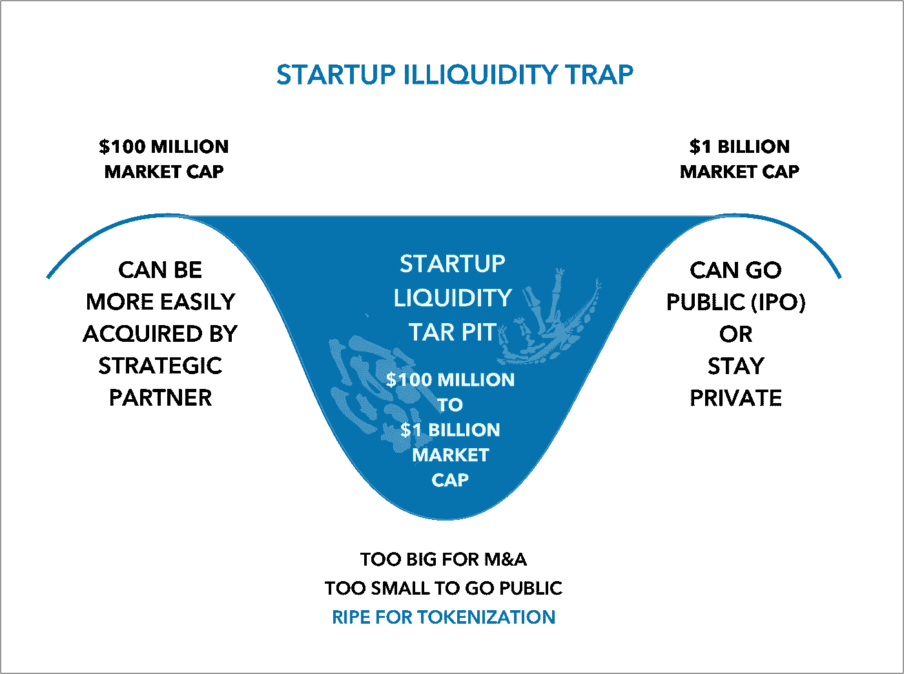
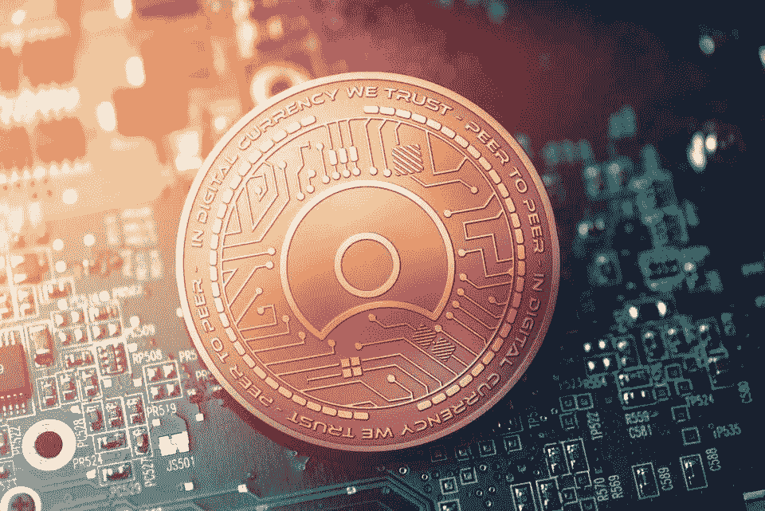

# 风险投资资助的科技创业公司可能是 sto 的下一个大市场

> 原文：<https://medium.datadriveninvestor.com/venture-funded-technology-startups-could-be-the-next-big-market-for-stos-73ac3ec842a5?source=collection_archive---------11----------------------->

Break on through to the token side

希望是永恒的。每年都有一批新的公司得到风险资本和私人股本的投资。但是，根据风险投资和私募股权融资交易的权威来源 [Pitchbook](https://pitchbook.com/) 的数据，被收购的初创公司越来越少，上市的就更少了。

大多数风险投资的私人科技初创公司很少有机会进行首次公开募股(IPO)或被更大的公司收购。许多后 B 轮创业公司以一种财务炼狱的形式存在(有些仍在增长)；偶尔通过摊薄股权销售筹集资金，削减成本以提高运营利润率，足以吸引战略买家，或尝试合并。

全球风投支持的退出数量在 2014 年达到峰值，然后在 2015 年、2016 年和 2017 年下降至约 1400 次。这种下降趋势似乎一直持续到 2018 年，越来越少的风险投资公司找到了 M&A 或 IPO 出口。在 2014 年达到 200 宗 IPO 的峰值后，随后几年的水平已降至两位数。2017 年，在不到 100 宗 IPO 上市的一年里，风投在 19，000 宗交易中投入了 1480 亿美元。

那些成功上市的公司需要更长的时间。根据 Pitchbook 的数据，2006 年通过 IPO 退出的公司平均耗时 4.9 年。到 2016 年，上市时间平均为 8.3 年。这意味着早期投资者通常要等 10 年才能退出头寸，这个时间比大多数基金都长。

如果越来越多的初创公司获得风险投资，但通过 M&A 退出的公司越来越少，而且少数几家公司通过 IPO 退出的时间更长，那么对于被遗忘的科技公司的创始人和早期投资者来说，还有什么其他退出选择呢？

获得流动性的新途径，也是风险投资资助的初创公司的一种退出形式，是资产支持证券代币发行(STO)。

**是的，区块链来救援了。**

sto 旨在成为合规产品(不同于 ico)，通常在标准豁免(即 Reg D)下，将基础资产(创业公司的收入和知识产权)的所有权授予买方。这与传统的股权或债务交易完全一样，只是以智能合约管理的代币形式执行。

为什么风投资助的科技创业公司是 sto 的理想选择？因为经历过多轮融资的初创公司都有可量化和可比的业绩记录。

在初始融资五年或七年后，风险投资的初创公司有了客户、收入、产品和财务历史作为估值的基础，也就是所谓的公平市场估值。C 轮创业公司——通常是正在扩大规模的成熟企业——拥有成熟的团队、支持者和一批投资者，一些人可能愿意或渴望在以低得多的价格早期投资后出售他们的股份。

经过几轮融资后，科技创业公司经过了反复的尽职调查和审计，并获得了适当的估值。很少有私人公司比获得 C 轮或 D 轮融资的科技初创公司更容易估值。

将一家风险投资的初创公司标记化，解决了流动性事件的主要障碍:估值范围。

当考虑为你的风险投资创业公司提供代币时，什么是合适的估值范围？

Startup Illiquidity Market is Massive

对风投资助的初创企业进行表征的可接受范围之广令人惊讶。它从大约 1 亿美元开始——这里仍然有购买的选择——一直涨到大约 10 亿美元。在这两种结果之间还有其他选择，包括(1)利用 SEC 的 Reg D 豁免的任何规模的半私人代币发行，可以出售给(主要)合格的投资者，以及(2)利用更近的《就业法案》众筹 Reg A+豁免的半公开发行，每年限制为 5000 万美元，但可以广告和出售给非合格的投资者。

**风投公司为什么要调查令牌化？**

因为科技创始人、早期投资者和早期员工都被金手铐卡住了，而这些手铐往往会阻碍企业实现其全部潜力。

美国税法不鼓励行使股票期权(行使期权需要根据当前估值对升值部分纳税)，而且，由于几乎不存在受限制的风险投资资助的私人股份的二级市场，许多早期员工面临几个不太好的选择:

a)留下来，希望公司被卖掉，

b)离开并丧失潜在有价值的股票期权，或者——风险最大的——

c)行使股票期权，希望公司在行使一年零一天后以合适的价格出售。

又不是风投对二次销售有意见。根据 PitchBook 的数据，2018 年二次销售有所增加。二次销售产生许多结果，但重要的是，它们可以帮助后期公司更准确地为其股票定价。这也是开放的证券市场可以做到的。

通过将风险投资的初创公司令牌化，有机会释放人才和资本的海啸，重振科技初创公司生态系统。

财务状况良好(且估值合理)的科技初创公司已经成熟，可以进行象征性上市。利用资产支持的证券代币，科技创业公司可以将创始人、早期投资者和员工提交的股票转换为代币，这些代币可以出售给后期投资者、养老基金、“战略家”或回售给公司。如果一家公司向公众开放股票购买(不是通过注册豁免)，董事会可以选择在经纪交易商的 ATS 或交易所如 [tZero](https://www.tzero.com/) 或 [Open Finance](https://openfinance.io/) 以象征性的形式发行股票。

**为什么私营科技公司的投资者和董事会应该支持代币销售？**

减轻创始人低价出售并继续增长的压力是一个强有力的激励。多年来薪酬一直偏低的创始人不应该因为接受低价报价以获得流动性而受到指责。通过允许创始人在基于代币的二级交易所出售部分股份，该公司减少了向第一个出现的收购者出售股份的紧迫性。

#tokenizetheworld

象征性的发行让风投资助的公司也能更新一些员工和支持者。通过允许早期员工和投资者出售他们的职位，该公司可以为新血腾出空间，以取代那些负担不起购买股票的税收的休息和授权员工。不仅限于创始人和早期员工，令牌化驱动的二次发行也可能允许天使和种子投资者出售——让他们宣布胜利，并将资金重新部署到其他有创业精神的企业家身上。

ICOs 可能是非稀释性资本形成的一场革命。但是大多数 ico 并没有成功地产生任何一般的商业利益。

s to 可以释放潜在的财富，振兴奄奄一息的公司，让中型风险投资公司重塑自我，同时让企业家和早期风险投资公司解决新问题。是时候# token ize 这个世界了——风险投资创业公司。