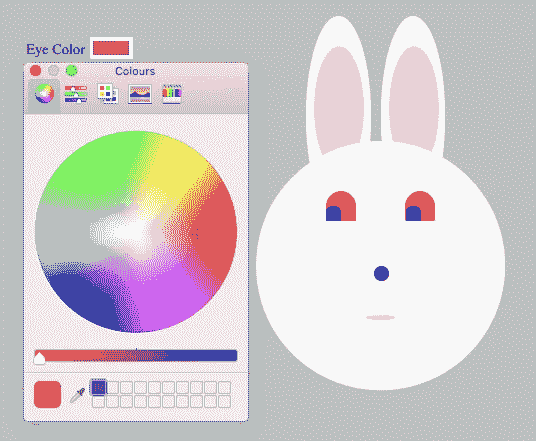
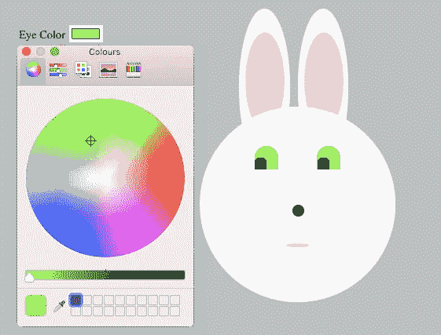

# 冒险进入 JS

> 原文：<https://medium.datadriveninvestor.com/venturing-into-js-6b3b77050ca?source=collection_archive---------19----------------------->

经过几个月专门用 HTML 和 CSS 编写代码，创造了艺术瑰宝，如 [BulgeEyedBunny13](https://medium.com/datadriveninvestor/my-coding-journey-week-9-grad-ient-school-abba35149290) 、 [ExplodingRabbitHead3.6](https://medium.com/datadriveninvestor/my-coding-journey-week-6-a-css-revelation-46a549d756f2) ，当然还有一个带有相当不听话的[页脚的兔子普查网页](https://medium.com/datadriveninvestor/my-coding-journey-week-8-putting-my-foot-down-kind-of-74e9b77d85a6)，我觉得下一个合乎逻辑的步骤是创建一个用户可以控制轨道速度的太阳系工作图。这很有意义。几个小时后(几天？)，我到目前为止:

就太阳系而言，它运行得相当好。行星绕着太阳转(好的开始！)并且有 4 种不同的轨道速度选项。基本上，我完成了我最初的任务。

然后我决定，如果没有一个计数器来显示行星开始转动以来已经过了多少地球年，我的太阳系将是不完整的。毕竟，如果无法用人类的术语来描述，观察一个代表海王星的蓝色小球围绕一个代表太阳的黄色大球旋转又有什么意义呢？几杯(上百杯)咖啡后，我做到了:

好消息是太阳系现在有了一个地球年计数器。坏消息是，它只能按照最慢的速度设置来计算地球年数(这意味着你必须等待 91320 毫秒才能看到它)，并且当轨道停止时，它不会停止计数。正是在这一点上，我最终被迫接受，我需要知道我在 JS 前线到底在做什么。

所以我上了韦斯·博斯的 JS30 课程。

在第 1 天和第 2 天之后，我已经感觉到我对 JS 的理解有了很大的提高(嗯，至少从完全没有提高到稍微超过完全没有)，但是当我发现第 3 天完全是关于 CSS 变量时，我的耳朵真的竖了起来。Wes 告诉我如何设置 CSS 变量并编写一个函数来应用它们。然后，我决定看看我是否能把这个令人敬畏的东西用在我自己的一个项目上。事实证明我可以，变色兔子诞生了:

变色兔子由一个简单的兔子头和一个颜色选择器组成，用户可以通过它改变兔子眼睛和耳朵的颜色。选项几乎是无穷无尽的:

Golden eye!

Demonic red eye!

Radioactive green eye!

You get the picture.

现在我已经把这项工作做好了，我将看看我还能在哪里应用这项技术，当然继续 JS30，希望有一天，我能最终解决我的太阳系地球年计数器的问题。

后续更新。

