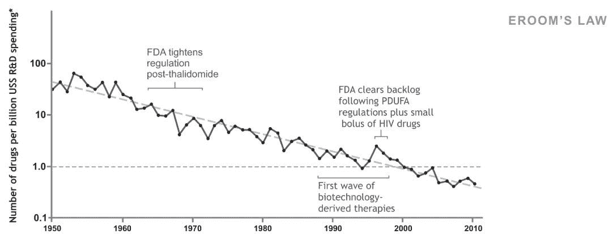
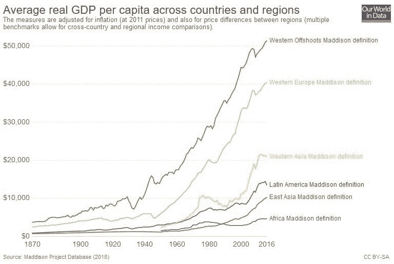

# 非常增强现实

> 原文：<https://medium.datadriveninvestor.com/very-augmented-reality-e365d349b3f?source=collection_archive---------19----------------------->

# 科技真的发展这么快吗？

现在，在一天结束的时候，你不可能不读到或听到技术本身不断地向它所能达到的所有方向扩展。但是技术进步真的超过了社会的承受能力吗？有没有我们不在的另一个平行世界？

人类感知和经济学有效地平滑了“戏剧性增长”的高峰。只有很小的空间给那些只是幻想的技术，甚至是拯救世界的技术。无人机现在可以从商店运送货物，就像飞机在近一个世纪前可以做到的那样。但是你愿意为此付出代价吗？网络泡沫是经济如何重塑梦想的一个很好的例子。

你可能多次听说过摩尔定律。但是你听说过 Eroom 的测量吗？Eroom 定律是这样的观察:尽管技术不断进步，但随着时间的推移，药物发现的速度越来越慢，成本也越来越高。新型抗微生物药物的开发正在下降。生物技术实验室更像是一个炼金术士的工作室——我们仍然不太了解人体，将不同的混合物混合在一起，希望它们会有正确的效果。

另一个原因是商业。抗生素的投资回报率很低，因为它们的服用时间很短，只能治愈目标疾病。相比之下，治疗高血压等慢性疾病的药物在患者的余生中每天都要服用。利润比所有其他因素更能推动进步。

# 先进的技术=人人共享繁荣？

你多久听说一次科技会给每个人带来繁荣？技术并不能使生活水平平等。如果他们建立一个市场，所有的穷人会在里面买他们需要的东西吗？地球村已经变成了全球触角。技术的发展主要是服务于它的拥有者和进取者。你是否拥有最现代的智能手机并不重要——真正重要的是你使用的是谁的应用程序。互联网提供了获取资源的途径，但进一步加强了中介的地位。少数科技公司能够主导市场。

互联网导致了全世界学术中心和技术中心的发展。然而，什么也没发生。物理位置变得越来越重要。好人想和好人一起工作。

美国和贫穷国家的实际人均 DDP 差距已经扩大。不平等甚至在硅谷也在发生:除了收入最高的 10%以外，所有人的工资都在下降。

# 一切照旧。

技术帮助社会进步。然而我们做的任何事情都需要能量。中国、非洲或亚洲不可能达到美国的水平，按照美国的方式发展。他们拥有的资源，如自然或燃料，根本不会让他们这样做。他们必须选择自己的方式。他们能处理好吗？他们能直接进入恒星文明吗？

任何足够先进的技术都等同于魔法。我们对自己不理解的事物有一种天生的钦佩。机器和计算机比发明轮子的时代发展得更快，这并不奇怪。但是世界变化真的像宣称的那么快吗？十年的车和现在的差别不大。智能手机速度更快，但用户的手指仍未小型化。MS Excel 仍然是最受欢迎的公司工具。2018 年最受欢迎的交流方式是…发短信。这是相当平常的事情。

# 和一丝希望。

利润激励推动着技术变革。发明很难做到，但创新通常会带来重大变化。然而，市场不是通过改进获得的，而是通过比现有产品更好的产品获得的。使用当前可用的技术可以交付价值，并成为通向创新和未来可盈利技术的桥梁。进步所需要的知识现在变得更加公益。更多的是关于你如何放置拼图，而不是拼图的可及性。

**想法最重要**。因为它的人民和缺乏远见。即使像美国这样发达的国家也需要一个新的理念来振兴国家。特朗普的太空政策指令 1(“重返月球”)就是给人插上翅膀的好例子。清晰、简单但雄心勃勃的目标。技术本身并不能提高所有人的生活水平。技术给了我们一个寻找自我的机会。