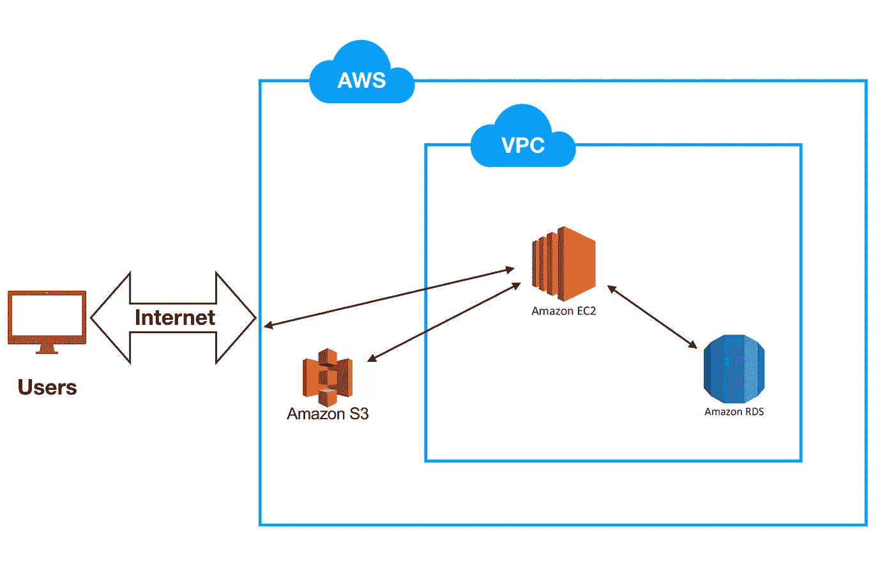
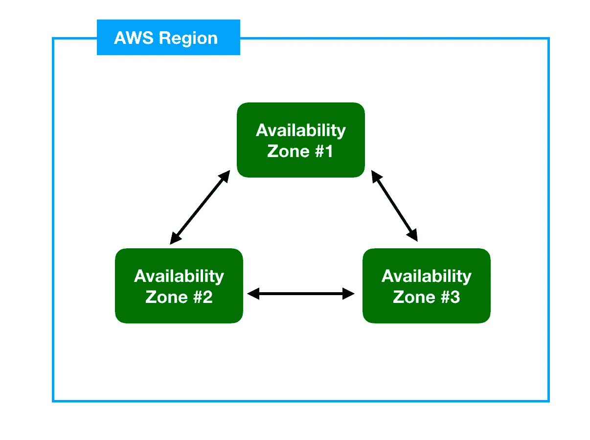

# 云服务和 AWS 的基础知识

> 原文：<https://medium.datadriveninvestor.com/very-basics-of-cloud-services-and-aws-4bfa0cad6daa?source=collection_archive---------8----------------------->

云服务，尤其是 AWS，越来越受欢迎。所以，“云是什么？”是理解我们在项目中是否需要它的一个重要问题。在本文中，我将尝试简要解释我在 Linux Academy 的 [AWS 概念课程中所理解的内容。我强烈建议参加这个短期课程(总共约 1 小时),学习云计算服务和 AWS 基础知识。如果你愿意，你可以继续同一位讲师的](https://www.udemy.com/aws-concepts) [AWS 基础](https://www.udemy.com/aws-essentials)课程。

云系统的优势:

1.  **高可用性**:您的文件随时可以在任何设备上使用。
2.  容错:如果出现一些问题，有一个可用的备份。
3.  **可扩展性**:根据系统需求增加处理器能力、存储和数据库。
4.  **弹性**:根据您系统的需求降低您的处理器功率、存储、数据库。

**亚马逊网络服务(AWS)**

Basic structure of Amazon Web Service

让我们来谈谈这些基本的 AWS 元素:

**EC2** :主要用于其计算能力的虚拟计算机。你可以把它想象成一台基本的计算机，包括 CPU、内存、防火墙、操作系统等。它通常用作系统的虚拟主机部分。

**RDS** :自动气象站数据库。你可以在那里储存信息，如库存目录或客户信息。

S3:这是一个巨大的存储桶。它通常用于存储图像、视频等媒体文件。

VPC :虚拟私有云是你在 AWS 上的私人空间，你可以允许/限制对它的访问。

Availability Region & Zone

**可用区**:亚马逊数据中心的物理位置。它们在地理上也在每个 AWS 区域中分离。

**AWS 区域**:包括 AWS 可用区域的地理区域，如东京、都柏林。它有助于减少由于地理距离造成的延迟。

通常，在一个 AWS 区域中有多个可用性区域，以便提供我们上面提到的“高可用性”和“容错”。例如，如果一个可用性区域发生灾难或停电，您可以连接另一个可用性区域。

因此，这些是云服务，尤其是亚马逊网络服务的基础。如果你想深入了解这个话题，我强烈建议你学习我在引言中提到的课程。