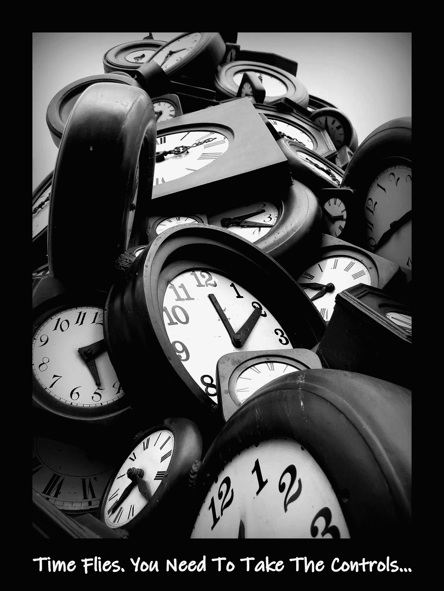

# 受害者还是胜利者…你来决定。

> 原文：<https://medium.datadriveninvestor.com/victim-or-victor-you-decide-13724be26619?source=collection_archive---------9----------------------->

他们说我不能。

他们说我不会。

我照做了。

说他们不相信我。

说因为我的情况我不能。

说我不能因为我的过去。

说以前没做过。

我说:那又怎么样。

你可以找借口，抱怨人们的态度，永远停留在原地。或者你可以承诺自己，努力成为一个没人认为你可以成为的人。在生活中取得成功的人，当他们去寻找可能性时，会把借口留在身后。

你可能过得很艰难。

可能仍然比大多数人更艰难。

我不能答应你太多，但我可以保证:当你坐在那里等着生活变得更容易、更简单时，生活不会变得更容易、更简单。

我总是看到它。

生活经历几乎完全相同的人。

痛苦悲惨的生活。

一个人被困在了他们最终到达的地方。

他们认为他们没有选择。

因为他们的过去，或者因为环境生活不能改变。

他们变得不知所措。

他们被困住了。

他们是动不了还是不愿意动都不重要。他们不动。

选择忍受他们所知道的痛苦，而不是去冒他们更害怕的风险。

重复的行为进一步证明他们永远不会成功，永远不会成功。

事情永远不会改变。

另一个人用痛苦作为他们必须改变的理由。

他们用痛苦给自己力量去奋起。

把不相信他们的人当做他们的喷气燃料。

不断奋斗，超越自我的动力。

“不能”这个词不在他们的字典里。

生活不会如他们所愿。

他们没说为什么是我？他们说试试我。

事情不会按照他们的方式发展…

他们清理了足够的垃圾来开辟一条新的道路。

一只脚在另一只前面，永远不要后退，永远向前，永远向前。

他们一直在移动。

失败过几次。那又怎样…重新开始。

没能上大学。那又怎样……学另一种方式。

朋友对不起你。那又怎样…交新朋友。

太多人认为生活与他们作对。

太少人明白生活充满挑战；这很难。

但仅此而已——一个艰难的挑战。

我接受挑战。

我打算赢。

但是我不只是想赢得一天，一场战斗—

我想赢得所有的战斗…我想赢得每一天。

所以我在自己身上下功夫。

我研究新信息。

我学习新技能。

我接触新的资源。

当这个项目结束时，我开始下一个项目。

信息，技能，资源。重复一遍。

信息。技能。资源。重复一遍。

信息。技能。资源。重复一遍。

你说“人”不相信我？那又怎样？

我不需要他们相信我。

我相信我自己。

这才是最重要的。

不是吗？

他们没有开发愿景，是我在开发。

他们不是在为梦想而战，而是我。

他们不是为目标而工作，而是我。

不是他们在做这项工作，而是我在做。

他们不能定义我的成功，但我可以。

借口。

我们都有很多。

没有人会有完美的人生。

我们都面临挑战。

我们都背负着一个十字架。

你没看到，不代表它不存在。

这就是生活。

你可以成为受害者，也可以成为胜利者。

是时候选择了…

选择…

然后拥有你的选择。

JerzeyCate，2018