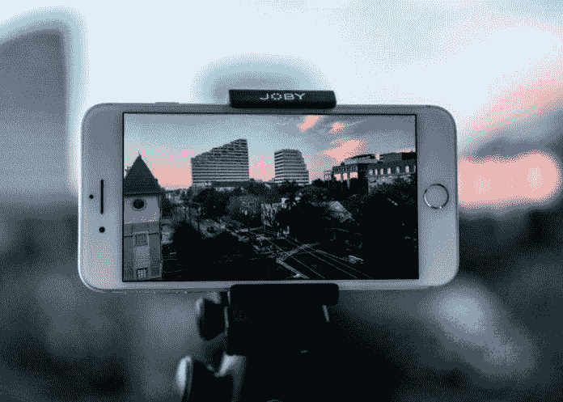

# 视频创造了令人感动的差异

> 原文：<https://medium.datadriveninvestor.com/video-creates-a-moving-difference-ec43f8dd16f9?source=collection_archive---------11----------------------->

## 如果吸引人且切中要害，图像会给人留下不可磨灭的印象

Photo by by Thomas Russell on Unsplash

对电影来说，直接转向视频是一个不好的信号，但它可以引发商业营销活动。视频比印刷文字更有助于品牌故事的讲述，从而吸引潜在客户。

Twitter 是一个巨大的尚未开发的视频平台，这是 [Lindo Myeni](https://twitter.com/LindoMyeni) 想要改变的。这位屡获殊荣的影响者、内容创作者、社交媒体战略家和演讲者在[非洲推特聊天](https://twitter.com/AfricaTweetChat)期间解释了视频营销和推特如何联合起来取得成功。

“考虑到在 Twitter 上，消费者在移动中滚动以发现世界上正在发生的事情，这一点非常重要，”他说。“简短有趣的视频就可以了。”

如果像谚语说的，一张图胜过千言万语，一个视频就能爆一个品牌。

 [## 视频快照-完美的图片内容

### 客户有了另一种了解、喜欢和信任你的方式

medium.com](https://medium.com/datadriveninvestor/video-snaps-picture-perfect-content-38284ac0da52) 

“作为一个数字营销者，视频营销意味着一切，如果不是十亿，”Myeni 说。“如果视频消费者觉得有趣，他们会通过*转发*与粉丝分享。

他说:“根据 HubSpot 的调查，64%的视频消费者在看过相关视频后更有可能在线购买产品。”。

# 制作商业案例

通过正确的策略，企业家可以最大限度地利用 Twitter 上的视频为自己的企业服务。

“视频是 Twitter 增长最快的广告选择，”Myeni 说。“根据 Twitter 上的统计数据，79%的消费者更愿意通过观看视频来了解产品，而不是阅读文字。品牌应该记住这一点，尤其是在推出新产品的时候。”

另一个选项允许将整个推文复制到视频。

“这是一个伟大的功能，”米尼说。“它把所有的观看量都推给了视频的所有者，并作为你从哪里获得它的参考。”

随着对短视频压缩内容的高需求，企业主需要熟悉加强 Twitter 营销的方法。

“保持你的推文简短。有多短？真的很短，”迈尔尼说。“此外，保持你的短视频在参与度和完成率方面的高分。根据 Twitter 的数据，最小化的 tweet 副本的品牌和消息召回率要高 13%。

“永远要有明确的行动号召，”他说。“作为数字营销人员，我们在撰写推动后续行动的文案方面受过技术训练。在 Twitter 广告方面，视频网站卡产生了更好的参与度。与移动视频广告基准相比，你会看到两倍的点击率。”

 [## 不断的满足需要每天的磨砺

### 在录制第一个场景之前要有一个策略

medium.com](https://medium.com/datadriveninvestor/constant-content-demands-a-daily-grind-498b2a9353b1) 

Myeni 建议商家在视频的开头展示他们的品牌或标志。在一个视频完成率很慢的世界里，这是一个很大的帮助。

更深入地说，他描述了品牌可以通过营销活动整合的 Twitter 营销策略。

“总是垂直拍摄，”米尼说。“Twitter 上 93%的视频观看发生在移动设备上。因此，在制作视频时考虑移动观看非常重要。使用了封闭式字幕，以防观众关掉声音观看。”

# 钱的问题

就投资回报而言，Twitter 直播可以促进内容货币化。

Myeni 说:“Twitter 直播视频让你的观众实时了解重要时刻，了解产品准备或新产品发布前的幕后情况。”“品牌可以去现场*为你的新系列或产品的发布做准备。*

“在西南偏南会议上，Twitter 推出了一个新的摄像头功能，”他说。“我们可以称之为‘Twitter Stories’，只需像在 Instagram 上一样在时间轴上向左滑动，但方向相反。”

 [## 对于视频，关注你的业务

### 企业家做生意是为了赚钱。无论他们从事什么样的投资，他们都希望获得投资回报。

contentgrind.com](https://contentgrind.com/for-video-focus-on-your-business-c3e9385ed63b) 

如果视频营销听起来令人生畏，Myeni 说它相对容易开始，产生很大的好处。

“视频是 Twitter 上最吸引人的内容之一，这不是什么秘密，”他说。“好消息是，你不必拥有 DSLR 相机或昂贵的设备来为你的 Twitter 内容创建一个迷人的、专业的视频。你只需要你的手机。

“推特上的视频参与度令人惊讶，”迈尔尼说。"还要考虑到你将接触到更多的观众，并获得品牌知名度."

他指出，虽然几乎所有的社交媒体平台都支持视频营销，但 Twitter、脸书和 Instagram 在视频方面做得很好。

“实验非常重要，”迈尔尼说。"了解什么适合你的品牌或你的追随者."

**关于作者**

吉姆·卡扎曼是[拉戈金融服务公司](http://largofinancialservices.com)的经理，曾在空军和联邦政府的公共事务部门工作。你可以在[推特](https://twitter.com/JKatzaman)、[脸书](https://www.facebook.com/jim.katzaman)和 [LinkedIn](https://www.linkedin.com/in/jim-katzaman-33641b21/) 上和他联系。

*原载于 2019 年 5 月 8 日 https://www.datadriveninvestor.com***。**