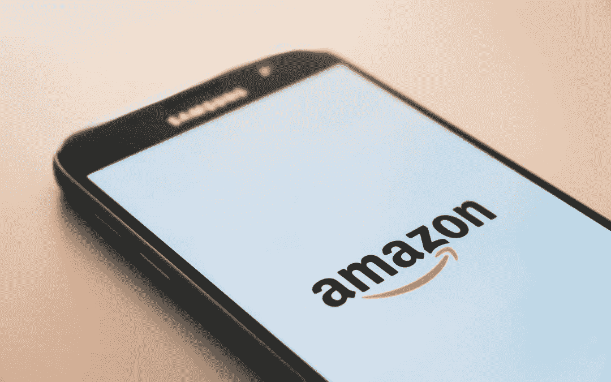

# 亚马逊上的视频说服:畅销书作家杰森·博伊斯讲述视频如何给卖家带来竞争优势

> 原文：<https://medium.datadriveninvestor.com/video-persuasion-on-amazon-top-seller-jason-boyce-on-how-video-gives-sellers-the-competitive-edge-da4ca4a427ad?source=collection_archive---------8----------------------->

亚马逊无处不在。它正在迅速成为美国最大的零售商，超过沃尔玛，其平台上列有超过 5.5 亿件产品。简单地说，如果你不在亚马逊上销售，你就错过了。但是，亚马逊平台上列出了 5 亿种产品，你如何让你的产品脱颖而出呢？

# 利用视频建立你的品牌

在我的新书《视频劝说》中，我采访了杰森·博伊斯，他是第七大道媒体公司的创始人兼首席执行官，也是亚马逊的畅销书作家。杰森 16 年前就开始在亚马逊上卖篮球框了，那时候亚马逊零售还没有在亚马逊上卖篮球框！几年来，杰森和我每周都聚在一起喝咖啡，分享 D2C 在亚马逊网上和网下的营销策略。我相信杰森拓展了我对亚马逊工作方式的理解，并认识到视频在 Amazon.com 平台上取得成功的关键作用。本月早些时候，我采访了 Jason，捕捉到了我们关于在亚马逊上销售优势的咖啡谈话中的一些亮点。

# 采访亚马逊畅销书作家杰森·博伊斯

里克:杰森，你是亚马逊运动和户外类的前 50 名卖家，也是整个平台的前 200 名卖家。有超过 250 万个活跃的亚马逊卖家。你是如何保持领先的？

JASON:老实说，Rick，我和我的兄弟们是在亚马逊创业的时候加入的，所以我们非常熟悉他们市场平台的文化和期望。我们从犯错误中学到了很多东西，并且作为经验教训的结果，我们建立了一些可重复的过程。

RICK:你认为自 2003 年开始运营以来，亚马逊最大的变化是什么？

杰森:那很简单。仅仅列出一个产品已经不够了。今天，要想从数百万其他卖家中脱颖而出，你必须在亚马逊上(和亚马逊外)建立自己的品牌。人们喜欢与他们了解和信任的品牌做生意，亚马逊奖励外部来源给平台带来的流量。

里克:这是你我发现品牌有多重要的地方。你告诉我，品牌建设是亚马逊成功的关键，我花了 30 年时间利用直接回应视频营销建立大品牌。有趣的是，有时旧的营销和品牌战略在新的高科技世界中发挥作用。

杰森:完全正确。30 年前对你非常有效的东西——让你成为直接回应电视营销的先驱的东西——现在重新成为亚马逊最重要的销售驱动力之一。事实上，亚马逊有一个新项目，你可以在亚马逊应用程序上为你的视频做广告，它取得了巨大的成功。

RICK:在我使用视频的过去三十年里，技术确实发生了变化，但人们购买的动机丝毫没有改变，视频仍然是吸引人们的最有效方式。这就是为什么它对建立你的品牌如此重要。Jason，你对那些正在考虑将视频添加到他们的亚马逊列表和营销中的人有什么建议？

杰森:这是个很好的问题，里克。我想我首先要说的是，亚马逊已经成为一个产品演示视频平台。如果你目前没有在亚马逊上使用视频，那么现在就开始吧。你会看到高达 20%的转化率增加，这是巨大的！以下是一些入门提示:

1.在亚马逊上注册品牌注册。如果你在亚马逊上注册了品牌，你可以上传视频。

2.使用高质量视频。这将有助于有机搜索和转化率。

3.使用增强型品牌内容(EBC)页面宣传您的品牌故事——您的起源故事。

4.将流量从你的视频转移到其他营销渠道，这将产生将消费者推回亚马逊的回旋镖效应。

里克:这是你教给我的另一个重要的教训，杰森——亚马逊的算法真的很喜欢亚马逊的流量。

杰森:哦，是的。毫无疑问。当它到来时，他们知道它，他们给以积极方式这样做的卖家优惠的房地产和排名。我遇到过——我知道你也经历过——客户在一天之内销售一空，因为他们的亚马逊下架活动太激烈了。我们刚刚看到，与没有视频的列表相比，有视频的列表有如此多的正面指标。真的很关键。

瑞克:杰森，这真是个好消息。我将用一些更有趣的事实来结束这次谈话，这些事实说明为什么视频在今天的虚拟市场中如此重要。

# 你知道吗？

*   每秒将产生近 17000 小时的新视频。《福布斯》报道称，过去 30 天制作的视频比电视网过去 30 年制作的视频还多。
*   研究表明，近 80%的互联网流量将由视频组成。
*   在电子邮件中使用视频会使点击率增加 200-300%
*   在登录页面上包含视频可以提高 80%的转化率
*   百分之六十四(64%)的消费者在观看品牌社交视频后购买(Tubular Insights)

最初发表于[里克·塞萨里](https://rickcesari.com/video-persuasion-on-amazon-top-seller-jason-boyce-on-how-video-gives-sellers-the-competitive-edge/)

Rick Cesari 自 1994 年以来一直从事直接回应和视频营销行业，自 1999 年以来一直从事咨询工作。他的热情是继续这项工作，并与组织分享这方面的知识。你可以在 RickCesari.com 的[上关注他的最新消息。](https://rickcesari.com/)