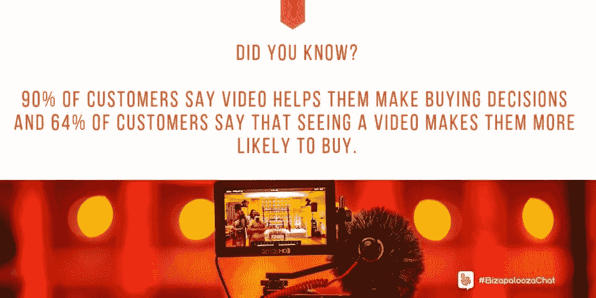
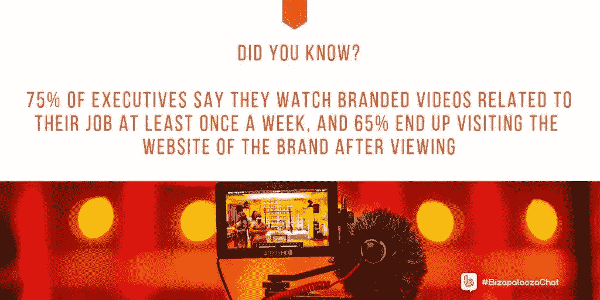

# 视频推动营销

> 原文：<https://medium.datadriveninvestor.com/video-sets-marketing-in-motion-1a83a3fb89e9?source=collection_archive---------46----------------------->

当话题转向创意视频时，人们会把营销二人组[安德鲁和皮特](https://twitter.com/AndrewAndPete)推到一个角落。他们悠闲的滑稽动作掩盖了他们的经验和专业知识。

在社交媒体领域，[他们以 YouTubers】，播客和作者而闻名。](https://medium.com/@JKatzaman/want-engagement-try-andrew-and-pete-3b9f427211d)

他们说:“[我们制作内容](https://www.andrewandpete.com/)——主要是视频——来帮助小企业主和企业家用内容营销在网上推销他们的公司。”。

安德鲁和皮特与[伊万娜·泰勒](https://twitter.com/DIYMarketers)和[伊瓦·伊尼亚托维奇](https://twitter.com/IvaIgnjatovic%22%20%5Ct%20%22_blank)一起谈论视频营销的想法。

Ignjatovic 是一名营销、战略、领导力和商业顾问。她与泰勒密切合作，泰勒拥有 DIYMarketers，这是一家“致力于帮助小企业主摆脱困境”的公司

与书面内容相比，视频更容易消费，因为它是被动的，这有助于解释几十年前电视的兴起。

“这取决于谁在创建博客，”安德鲁和皮特说。“你愿意读一篇好的博客，而不是看一个糟糕的视频吗？浏览一个糟糕的博客也比浏览一个糟糕的视频容易。但是我们会在任何一天拍摄一个好的视频，而不是一个好的博客。试着把那本书读快一点。”

泰勒更喜欢短信，她承认自己可能是少数。

“似乎每个人都喜欢视频，”她说。“这就是为什么探索更多视频对我来说很重要。”

虽然 Ignjatovic 也喜欢文本——给她安静地阅读和重读的自由——但数字却不是这样。根据 OptinMonster 的调查，视频营销人员每年能多获得 66%的合格线索。他们的品牌认知度提高了 54%。

泰勒犹豫是否要做更多的视频作为她的营销的一部分。

“是内容，”她说。“我从来不觉得舒服。我感觉自己没有坚定的观点。”

Andrew 和 Pete 有很多观点，但并不觉得有必要一次全部公布。

“有人建议我们应该每周做更多的视频，但时间是一个因素，”他们说。“我们宁愿每周花更多的时间创作和推广一个很棒的视频，而不是两三个差强人意的视频。”

他们不是不断推出新内容，而是利用旧的东西，让它变得年轻。

安德鲁和皮特说:“试着把一篇旧的博客文章转换成视频，并嵌入到文章中，让它焕然一新。”“时间是一个很大的因素。外包我们的编辑和周边任务帮助我们做得更多。”

在 [*“无聊公司的创意营销创意”，*](https://www.andrewandpete.com/creative-marketing/) 中，他们解释了“如何变得有创意，想出非凡的内容创意，而不仅仅是愚蠢和愚蠢来吸引注意力。”

Ignjatovic 每周在 YouTube 上看几次视频，而 Taylor 只在她需要学习的时候看——很少是为了娱乐。正如所料，安德鲁和皮特定期观看。

“每周，如果不是每天，”他们说。"不可否认，爱莉安娜·格兰德的新歌中包含了一些这样的观点."

即使对他们来说，技术也是一种挑战。

“这可能会让人不知所措，但简单的设置通常足以让你开始行动，”他们说。"现在，甚至大多数最新的手机都有超级好的摄像头."

这可以为进入企业界打开一扇大门，75%的高管表示，他们每周至少观看一次与工作相关的品牌视频。视频平台 [Vidyard](https://twitter.com/vidyard) 称，65%的领导者在浏览后会访问某个品牌的网站。

“YouTube 是一个搜索引擎，”泰勒说。“如果你的视频内容回答了特定的问题，你真的可以为你的网站带来大量的流量。”

Ignjatovic 指出，YouTube 不仅仅是直播视频。

“你也可以做音频和演示，”她说。“即使你个人不喜欢*出现在视频上*，你也可以利用视频进行营销。”

虽然看起来不像印刷品那样永久，安德鲁和皮特说视频有持久的力量。

“YouTube 从你的视频努力中获得了最大的回报，”他们说。“内容其实*持续*在那里。它不像其他社交网络那样昙花一现。YouTube 的搜索功能意味着你的内容可以有很长的寿命。

“这也是一种传递你的商业个性和品牌的神奇方式，”合伙人说。"这也能让你比大公司的博客更有竞争力."

DIY 营销网站通过博客 [*“推动流量的 4 种视频内容”对此进行了更深入的探讨*](https://diymarketers.com/drive-traffic-video-content/)

“我喜欢人们在视频中加入幽默，”泰勒说。“这无疑让他们更有魅力。”

安德鲁和皮特通过磨练他们的作品来获得奖励。

“投资编辑——要么自己学习如何做得更好，要么外包，”他们说。“*留存率*是 YouTube 的关键。剪辑不当的视频会*扼杀*你的收视率。”

虽然每个人都专注于技术，但 Ignjatovic 认为“最好是制作具有坚实大纲和实用建议的好内容。”

[Vimeo Livestream](https://twitter.com/Livestream) 发现 67%的观众认为整体质量是直播视频流最重要的组成部分。

大小不应该恐吓。小企业可以通过视频内容建立品牌认知度和权威。就像一般的社交媒体一样，视频的成功不取决于制作者的规模，而是取决于他们联系和解决观众痛点的方式。

正如 Ignjatovic 所说，“回答客户在视频上最常见的问题。”

泰勒补充说，第一步是创建一个品牌权威视频，分享品牌的故事和它为客户提供的好处。

“以你设定的频率出现，”安德鲁和皮特说。“不要让你的观众失望。旨在提供信息、娱乐或激励。不要忘记在 YouTube 之外推广您的视频，以获得额外的品牌知名度。”

其他 DIY 营销人员发布详细信息[小企业视频营销技巧](https://diymarketers.com/try-these-video-marketing-tips-for-small-business/)。

泰勒主要将 YouTube 用作视频库，而安德鲁和皮特则拥有完整的 YouTube 商业战略:

*   建立我们的 YouTube 观众群。
*   建立我们的电子邮件列表。
*   将我们的名单发回 YouTube，建立可信度。
*   通过电子邮件销售我们的产品和服务。

《福布斯》发现 90%的顾客说视频帮助他们做出购买决定。此外，64%的顾客表示，观看视频会让他们更有可能购买。

与此同时，YouTube 并不是唯一的游戏。泰勒说，Wistia 拥有“出色的分析能力”Ignjatovic 指着 Vimeo 进行产品演示。安德鲁和皮特给出了他们的选择:

*   脸书视频:因为你可以重新定位到观众。
*   LinkedIn 视频:如果你的观众已经在上面了。
*   使用 Vimeo 或 Wistia 等工具将视频直接嵌入您的博客。

“我们仍然认为 YouTube 是最好的网站，”两人说。

一个 DIY 营销者博客讨论了关于视频营销需要知道的 30 件最重要的事情。

小型企业需要时间、金钱和人力来制作视频和其他内容。他们需要知道如何在小预算下工作。

“YouTube 上的小企业面临的最大挑战是确定发布什么类型的内容，”泰勒说。

Ignjatovic 说，这包括有时间和资源来管理他们的 YouTube 频道。

还有一个情感因素，一段痛苦的时期，安德鲁和皮特称之为“*彻底的畏缩*”

“每个人都有这种感觉，”他们说。“你必须努力度过难关。*你会好起来的*

他们添加了一段他们[嘲笑他们旧视频](https://www.youtube.com/watch?v=qVaQYXmHDKQ)的视频。

泰勒说:“我喜欢包含大量有用内容的视频，我可以自己做，并提供学习更多内容的选项。”Ignjatovic 还在 YouTube 上看到人们要求订阅他们的频道，这产生了积极参与的观众。

安德鲁和皮特说:“YouTube 上的每个视频都不应该以增加你的名单为目的。“不断把人送走会惹恼 YouTube 的算法。”

虽然 YouTube 上的销售视频“并不热门”，但合作伙伴还是提供了“几个你可以在相关视频中提到的很棒的线索磁铁”。它们是你快速进行摇滚内容营销所需要的一切，不需要太多的工作。

**关于作者**

吉姆·卡扎曼是拉戈金融服务公司的经理，曾在空军和联邦政府的公共事务部门工作。你可以在[推特](https://twitter.com/JKatzaman)、[脸书](https://www.facebook.com/jim.katzaman)和 [LinkedIn](https://www.linkedin.com/in/jim-katzaman-33641b21/) 上和他联系。

*原载于 2019 年 1 月 23 日 www.datadriveninvestor.com**[*。*](http://bit.ly/2MsQ1kD)*