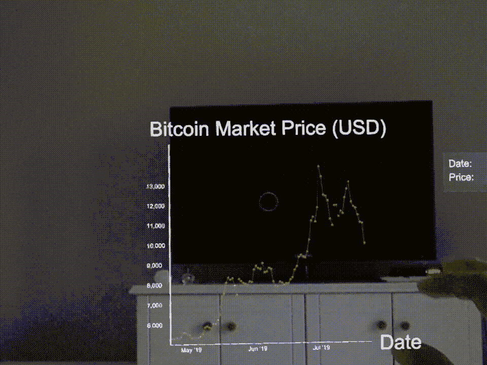
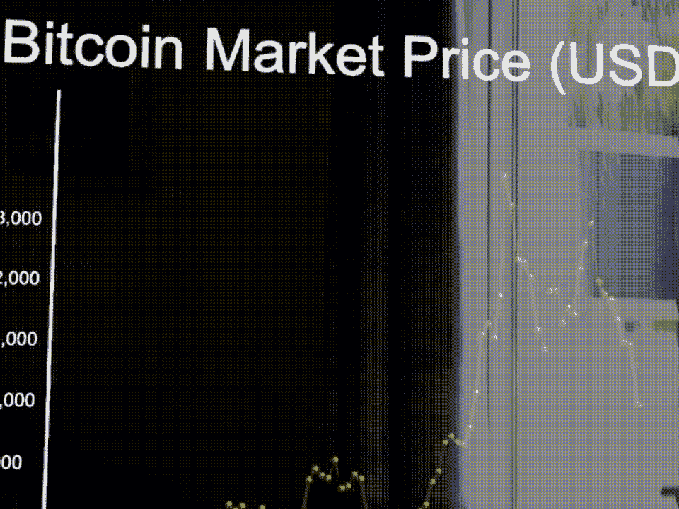
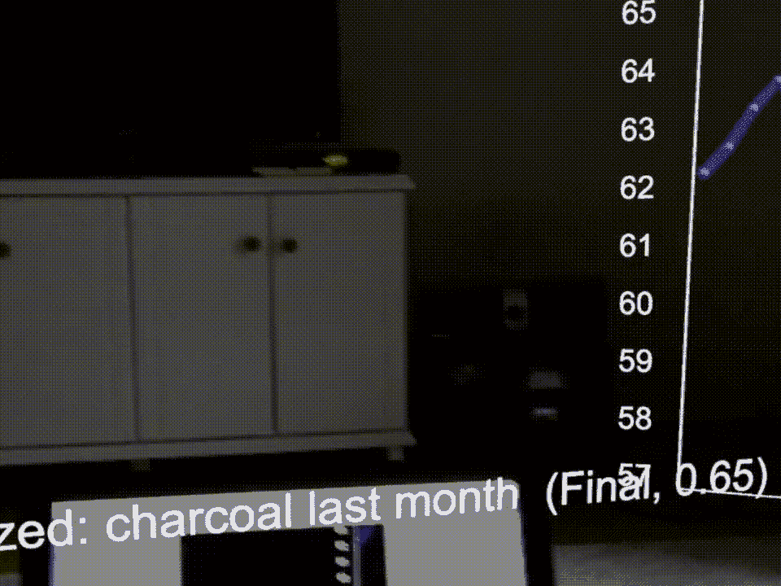
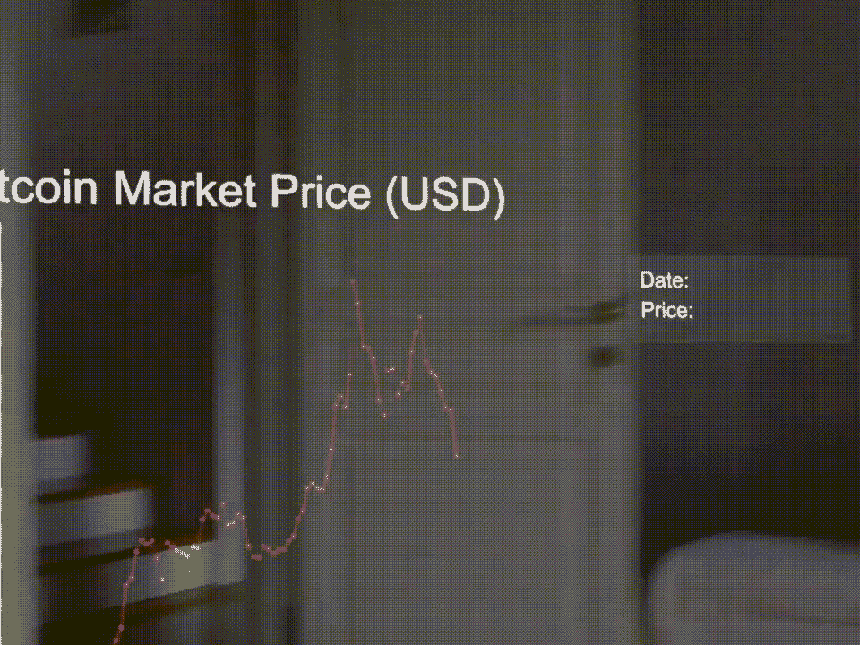
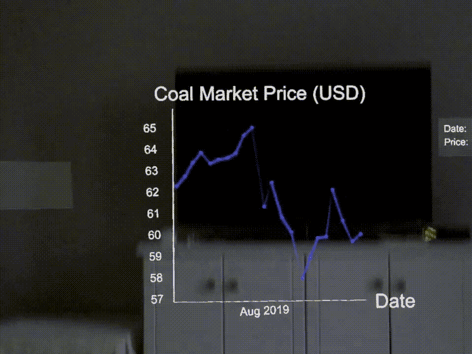

# videre——商品交易者的增强现实工具(最低可行产品)

> 原文：<https://medium.datadriveninvestor.com/videre-augmented-reality-tool-for-commodities-traders-minimum-viable-product-c18eaf79db94?source=collection_archive---------8----------------------->

**使用的技术:** Magic Leap One、鲁珉 SDK、Unity 游戏引擎、C#、彭博终端、NodeJS、IBM Watson API、AWS 服务器

技术进步不断改变着我们运营和维护业务的方式。最近，交易者可以获得更多的金融数据来推动决策。随着大数据工具的兴起，数据分析和可视化方法在深入挖掘海量信息方面获得了价值，并帮助交易者做出明智的数据驱动型决策。目前的数据可视化工具，如 Tableau 和 Microsoft Excel，仅限于在二维屏幕和环境中呈现数据，然而，增强现实将三维对象置于现实世界之上，为交易者提供了额外的维度和交互式体验，不仅可以观察数据，还可以与数据互动。

 [## 人工智能和虚拟现实的融合-你能期待什么|数据驱动的投资者

### 在技术领域，融合是合乎逻辑的一步。就在几十年前，你可能需要一个专门的…

www.datadriveninvestor.com](https://www.datadriveninvestor.com/2018/08/30/the-convergence-of-ai-rv-what-you-can-expect/) 

在 Vitus Commodities，我们探索了增强现实数据可视化的优势和挑战，并展示了我们对潜在软件的愿景，该软件将帮助交易者比当前可用的工具更好地检测数据模式。

Screen Recording of Using Vitere with showing all the features

# **背景**

数据科学家是经验丰富的程序员，他们通过使用包括 matplotlib 在内的库，用 Python 和 R 等高级编程语言编写脚本来可视化数据。另一方面，像 Microsoft Excel 这样的工具允许非程序员为各种目的创建快速的数据可视化。虽然脚本和数据可视化软件都有助于指导交易者，但它们都生成数据可视化，要么是平凡的二维图像，要么是不自然的三维图形，难以在二维显示器上探索。另一方面，增强现实在空间计算的帮助下，通过三维图形实现了相同的任务，这些图形交互自然，观看简单。

然而，增强现实有可能取代当前的二维显示器，并通过有趣的动画和内容吸引观众，关于数据可视化如何受益于这项技术的研究太少。增强现实对于数据可视化最明显的优势是与数据交互的可能性。在二维显示器中，与数据的交互是用 1968 年发明的老掉牙的鼠标方式进行的。相反，与数据的交互可以在空间上发生。用户可以在数据中走来走去，用手势检查数据，并更深入地观察感兴趣的点，从中发现模式。尽管如此，随着增强现实硬件变得更加便宜和强大，毫无疑问，可以发现更多处理数据的方式。

我们将数据可视化从二维屏幕转换到三维空间的目的是让交易者参与数据，以便交易者能够理解数据中的模式，从而在买卖股票时做出明智的决策。目前，交易者通过查看多个屏幕来跟踪股票市场的趋势。随着股票市场的大量更新，交易者很难专注于一个感兴趣的点。此外，我们可以通过模式识别和人工智能将交易者的注意力集中到数据的特定区域。

由于时间限制和 Vitus Commodities 缺乏增强现实方面的人才，我们只构建了一个渲染 2D 图形的应用程序。在我的整个实习期间，我是唯一一个从事这个复杂应用程序的人，这给了我一个增长开发技能的机会。

# 产品概述

我们使用鲁珉 SDK 在 Unity 游戏引擎上构建了 Videre。鲁珉 SDK 是 Magic Leap 的一个文档丰富的库。他们在库中提供了非常好的例子，帮助我们学习如何使用空间映射、手势、语音捕捉等等。

Videre 通过内置的 Magic Leap One 麦克风听取语音命令，并通过 IBM Watson API 将语音融入上下文。正确识别的语音命令然后被转换成 C#脚本中的字符串格式，并用于向运行在 AWS 上的 NodeJS 服务器发出 GET 请求。我们的 NodeJS 服务器响应价格和日期数据，这些数据是从 Bloomberg 终端检索的。例如，如果交易者说“天然气三个月”，那么服务器用天然气资产价格和日期信息来响应。当数据被检索时，Videre 创建一个新的可视化，交易者可以与之交互。

# 特征

Use the green cursor and “ok” hand gesture to select a graph.

Use “hand” gesture to scale a selected graph.

Use speech recognition to create a graph from Bloomberg Terminal.

Use “pinch” gesture to draw a line on the graph.

Use “ok” gesture to deselect a previously selected graph.

# 它要去哪里？

Videre 的目标是建立一个最小可行的产品来展示我们在 Vitus Commodities 的愿景。随着增强现实技术变得越来越普遍，我们认为需要更多的可视化工具来帮助用户与可视化进行交互。

我们知道维德雷的缺点。首先，Videre 的设计需要巨大的改进(你甚至可以在 GIF 中看到我用来跟踪手的球体，并且没有加载 GIF 来让用户知道图形正在下载！).如果我们决定建立一个团队来让 Videre 为用户做好准备，我们相信我们需要招募在增强现实方面有经验的有才华的 UI/UX 设计师，并花更多的时间来考虑设计一些看起来很漂亮的东西！

目前，交易员只能看到单个资产的时间序列图。最终，我们希望渲染 3D 图形，使交易者能够随着时间的推移可视化两种资产，这可以为商品交易者带来洞察力。为了实现这一点，必须在语音识别、可视化和后端脚本方面做更多的工作。

你对这个项目感兴趣并愿意合作吗？发邮件给我[*【altutar@davidson.edu】*](http://altutar@davidson.edu)