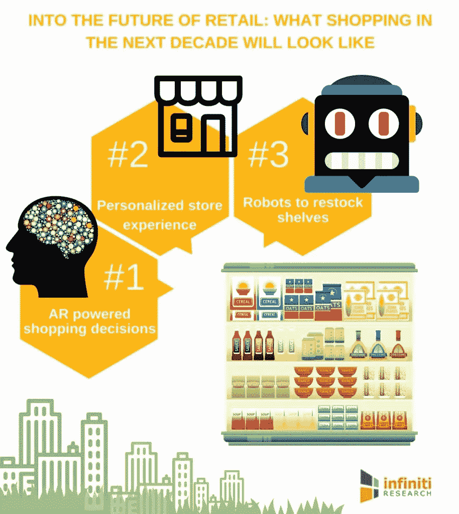
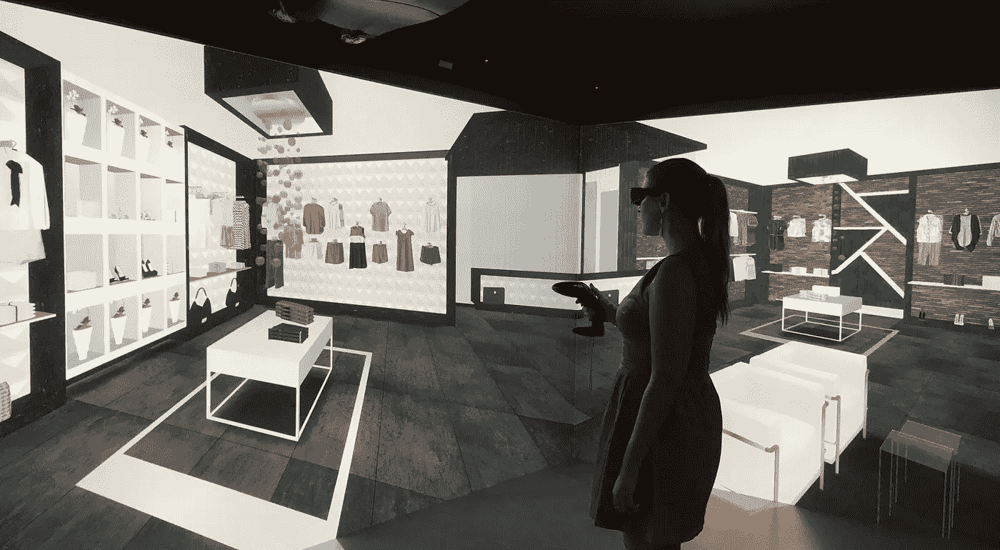

# 虚拟和增强的购物未来

> 原文：<https://medium.datadriveninvestor.com/virtual-and-augmented-future-of-shopping-e5c797e4a3ef?source=collection_archive---------10----------------------->

## 沉浸式技术能否帮助苦苦挣扎的实体零售商创造新的购物体验，并在与亚马逊等公司的竞争中获得优势？

随着数字和移动技术的长足进步，便捷的电子商务平台以前所未有的速度在全球范围内起飞。千禧一代占据了相当大一部分消费支出，但他们的消费方式与前几代人不同。千禧一代重视经历胜过财富，重视意义胜过金钱。随着越来越多的人转向网上购物，这导致了传统商店的急剧下滑。

如今，零售的重点已经从地点转移到体验和不可重复的时刻，现场音乐会、体育比赛和奢侈品购物的日益流行证实了这一点。随着人工智能革命的到来，虚拟现实(VR)和增强现实(AR)将通过用既能提供信息又能娱乐的迷人互动体验来取代痛点，从而改变整个购物体验。这些身临其境的技术有可能弥合实体零售和在线零售之间的差距，并将数字和物理世界的精华融合在一起。

## 什么是虚拟现实？

虚拟现实指的是一种现实仿真，其中使用交互式硬件和软件的混合来创建逼真的 3D 人工环境。虚拟现实通过使用技术创建一个身临其境的交互式 3D 环境，使用户置身其中，用户可以在其中操纵对象或执行一系列动作。

 [## 从虚拟现实的过去中寻找未来的线索——数据驱动的投资者

### 到 2020 年，距离现在不到两年，预计全球三分之一的消费者将使用 VR。从长远来看…

www.datadriveninvestor.com](https://www.datadriveninvestor.com/2018/10/02/looking-toward-virtual-realitys-past-for-clues-about-its-future/) 

这比听起来要困难得多，因为我们的感官和大脑已经进化到能为我们提供一种非常同步和协调的体验。实现这种“存在感”的关键是通过模拟尽可能多的感官，如视觉、听觉、触觉甚至嗅觉，实现硬件、软件和感官同步性的最佳组合。为此使用了多种系统，如耳机、全方位跑步机和特殊手套。这些实际上是用来共同刺激我们的感官，以创造现实的幻觉。

## 什么是增强现实？

增强现实是一种让数字数据覆盖在物理世界视图上的技术，并且是实时交互的，因此增强了人们对现实的当前感知。AR 通过在真实图像和周围环境上添加图形、声音和触摸反馈来创建增强的用户体验。

AR 在行动中的最好例子之一是非常受欢迎的 Pokemon Go 游戏，该游戏允许用户通过智能手机摄像头观看他们周围的世界，同时投影游戏项目，包括屏幕上的图标、分数和永远难以捉摸的 Pokemon 生物，作为叠加，使他们看起来好像这些项目就在你的现实生活中。另一个众所周知的 AR 应用程序是谷歌天空地图，当你将智能手机摄像头对准天空时，它会覆盖星座、行星等信息。零售业的最佳应用是 IKEA Place 应用程序，它为所需空间提供新家具的覆盖，有助于可视化整体外观，并确保购买前合适。

虚拟现实和增强现实是一个硬币的两面。AR 模拟真实环境中的人造物体，而 VR 则创造一个人造环境来居住。两者结合使用，将为从家居装饰到汽车的各种产品开启便捷、迷人的“先试后买”数字体验之门，并为消费者提供无尽的个性化产品通道和众多选择。购物者与镜子或屏幕互动，帮助他们想象一件家具放在家里会是什么样子，或者衣服穿在身上会是什么样子，而不必试穿。为了让顾客的商店体验更加个性化，零售商将越来越多地使用信标、物联网(IoT)设备和移动应用。这将提高客户忠诚度和满意度，因为购物者可以轻松找到最符合他们口味和需求的产品。