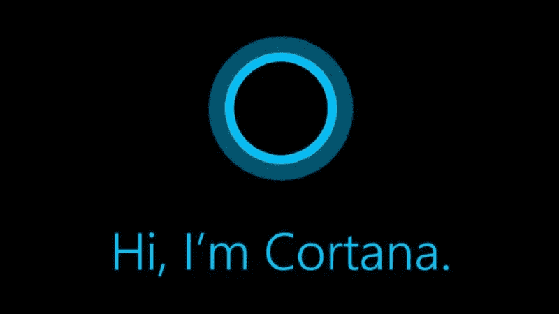
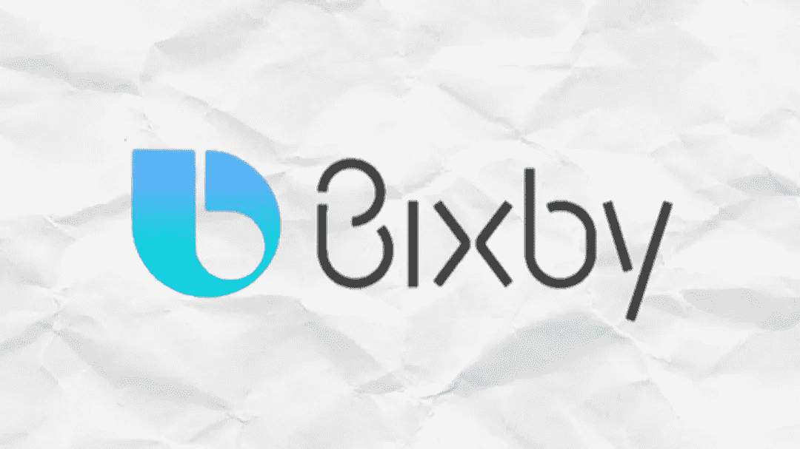
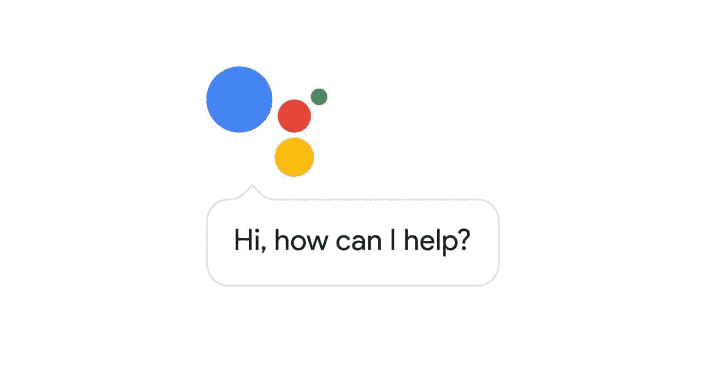
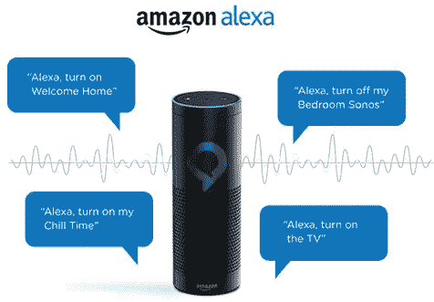
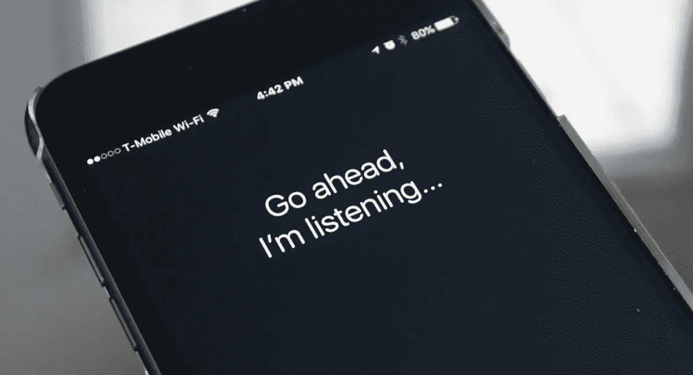

# 虚拟助手排名从最差到最好

> 原文：<https://medium.datadriveninvestor.com/virtual-assistants-ranked-from-worst-to-best-e44b54357374?source=collection_archive---------4----------------------->

我发现虚拟助手是一种奢侈品，而不是必需品，随着我们指尖上过多的服务，我不认为人工智能的自动回复会有任何好处或使事情变得更容易，尽管我们不能破坏程序员为改善他们的虚拟助手而付出的努力。

在下面的列表中，我将比较苹果、谷歌和三星等公司的 5 款主要虚拟助手，因此开源聊天机器人和不太出名的人工智能将不在列表中。这并不妨碍他们与本文中列出的那些人一样胜任，他们没有被提及/比较，因为我没有广泛的知识，也没有足够地使用他们来指出他们的优缺点或在列表中排列他们。

所以我只会提到谷歌的 Google Assistant，苹果的 Siri，微软的 Cortana，Bixby，以及三星和亚马逊分别开发的 Alexa。所以从最坏的开始:—

科尔塔纳

Cortana 很烦人，不要误会我的意思，我真的很喜欢微软和他们的产品，但 Cortana 是一个彻底的失望，当他们第一次宣布时，我很兴奋，但花了 10 分钟真的 10 分钟就厌倦了智能助手，如果你想这么说的话。

它可以执行一些基本的任务，如设置闹钟或检查邮件，但任何轻微的异常都会导致相同的自动“无法执行此操作”回复。还有一件事让我很反感，那就是当你让 Cortana 搜索网页时，默认情况下它会通过微软的搜索引擎 Bing 搜索内容，众所周知 Bing 与谷歌的搜索引擎相差甚远。

你可以强迫 Cortana 使用谷歌，因为你需要安装第三方谷歌 Chrome 扩展，并将谷歌 Chrome 设置为默认浏览器，在 Cortana 上启用谷歌搜索的分步指南可以在这里找到。

再说一次，我并不讨厌微软和他们的开发者，但是 Cortana 需要一些调整，老实说，很多调整都是需要的。

比克斯比

Bixby 是这份名单中最新的助手，但不幸的是不是最好的，它首次出现在三星 Galaxy S8 和 S8 plus 上，从推出的那一刻起就引发了争议。三星在音量摇杆下增加了一个 Bixby 按钮，人们不喜欢它，主要问题是最轻微的误点击都会触发 Bixby，观看视频或听音乐的整个体验都会被中断。

三星后来解决了这个问题，并试图解决它，他们没有删除按钮，但一个小的软件更新现在可以帮助你禁用它的功能。谈到助手本身，它不是非常先进的一些事情，如记住一些东西，检查天气，要求搜索工作还不错，但 Bixby 与其他同行不在同一水平上。

谷歌助手

谷歌助手在过去几年里有了很大的改进，并与亚马逊的 Alexa 和 Siri 展开了激烈的竞争，它是谷歌的产品这一事实赋予了它更多的可信度和更广泛的功能，有什么事情是你希望有人记得而你又懒得写出来的吗？不用担心，谷歌会帮你搞定，打开应用程序只需简单的“谷歌打开‘应用程序名称’”。她机智的回答和侵入性的界面增加了一个真正有趣的体验。

谷歌助手预装在 Android 手机中，一旦你配置好它，就可以通过说“好的谷歌”或按住 home 键来触发，谷歌眼镜的引入也被证明在许多方面是有用的，谷歌现在可以跟踪你关注的所有事情，天气，你的待办事项，日历等。也是一个受欢迎的功能。总而言之，谷歌助手是接近完成的软件包，也是第一个可以被称为“智能”的虚拟助手。

亚历克莎

亚马逊的 Alexa 是去年的亮点，它可以做普通虚拟助理所做的一切，甚至更多。一些智能功能包括创建一个列表，给某人打电话，问答，快速找到购物中心，餐馆，银行等地方，最重要的是它可以播放“Despacito”，我知道但忍不住提到它。

撇开迷因不谈，Alexa 比其竞争对手的虚拟助手更聪明，更有意识，无论你问什么，它都不会失败。一件相当令人担忧的事情被曝光，该事件称亚马逊保留了你在唤醒词后所说的任何内容的数字副本。

除此之外，Alexa 的记录一直没有污点，我希望它继续这样做。

**SIRI**

完美。

我的意思是你还能说什么是苹果。Siri 是 2010 年发布的榜单中最老的虚拟助手，并且一直占据最智能虚拟助手的榜首。

无论你是否是苹果粉丝， ***我怀疑你会否认苹果和 Siri 一起彻底改变了我们与手机互动的方式，并使它们成为“智能手机”***

你有每个人的虚拟助手排名，从最差到最好，你同意还是不同意，有我错过的主要助手吗？请在评论中告诉我。我非常乐意听听你的意见。感谢您的阅读。