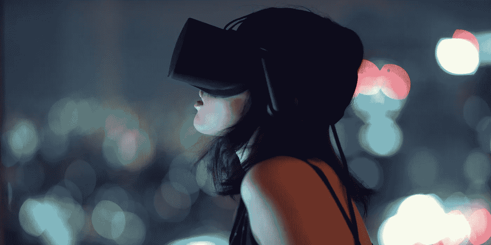
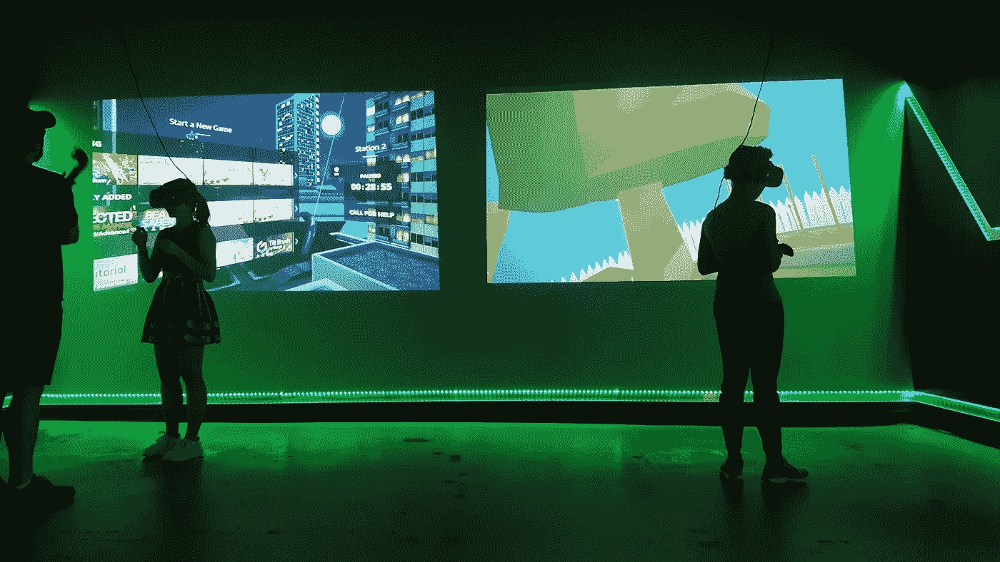
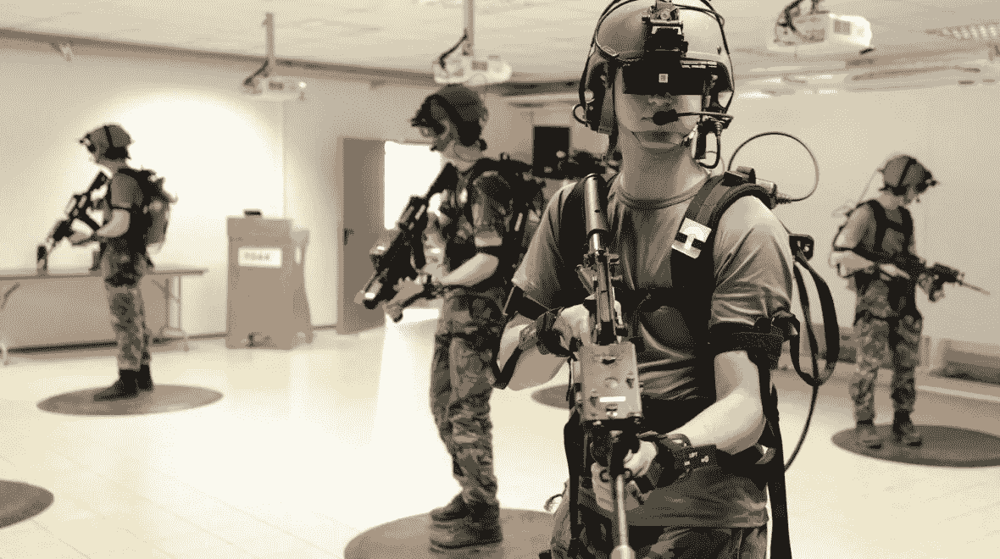

# 虚拟现实。

> 原文：<https://medium.datadriveninvestor.com/virtual-reality-ada916959d2f?source=collection_archive---------40----------------------->

(Credits: Avex Designs)

> 这是一个矛盾的流行词，已经流传了很久了…那么这个“现实”到底有什么“虚拟”的呢？

今年夏天，范德比尔特大学招生处高级助理主任朱莉·查普曼来到我的祖国蒙古，进行了一次校园虚拟现实之旅。尽管它没有真正的交易那么好，但它确实达到了足够高的质量，可以同时娱乐和提供信息。

我最近一次虚拟现实的冒险就发生在纳什维尔的校园外，这很合适。昨天，我们和我的朋友们一起参观了当地的虚拟现实和密室逃脱游戏。这是非常有趣和值得的“实地调查”

Me and my friends at the Rabbit Hole VR, going through the tutorials.

在半个小时的时间里，我们得以逃离即将到来的最后期限和期中考试的严酷现实，沉浸在基于节奏的游戏和多人射击的幻想世界中。作为一个超级星战和音乐迷，[击败军刀](http://beatsaber.com/)对我来说是必须的。当你玩这个游戏的时候，从另一个人的角度来看，你有点像这样。

(Trust me, it’s way harder than it looks. Yoda would’ve been disappointed with me for this one…)

从你的角度来看，你就是那个配合音乐节拍砍杀街区的绝地武士。

(Credits: Jaroslav Beck, the author of the original soundtrack of Beat Saber)

在最后的几分钟里，我们都加入了一个游说团，在一个有传送点和磁球射手的游戏中一决雌雄。力量，团队合作，狡猾的战术，机动——你可以在那里做所有的事情。虚拟现实游戏只是几年前的一个概念。现在，多家公司和开发商正在用疯狂的想法和可能性推进这个新的蛮荒西部的前沿。在最前沿， [Oculus](https://www.oculus.com/) 刚刚发布了其最新旗舰产品之一: [Rift](https://www.oculus.com/rift/#oui-csl-rift-games=mages-tale) 。

(Credits: Oculus)

包括覆盖在你眼睛周围的耳机，每只眼睛都有单独的图像，立体声耳机，两个带运动跟踪传感器的控制器，VR 设备允许你进入另一个领域，即使是在家里。

但是虚拟现实不仅仅意味着游戏和书呆子。从来都不是。

进入 Hermes Pardini 实验室。他们压制了孩子们害怕接种疫苗的震耳欲聋的声音(孩子们，我能感受到你们的痛苦)。

(Credits: StarterDaily)

带着两个虚拟现实耳机和一部智能手机，他们能够将小时候最恐怖的时刻变成一次相当愉快的经历，因为他们变成了故事的主角，而忘记了拍摄的整个磨难。

除了游戏玩家和孩子，虚拟现实也已经进入了军事战场。模拟飞行，车辆驾驶和紧急情况被重新制定，以训练士兵在各个领域。

(Credits: Wareable)

不仅如此，它还能有效缓解那些受创伤后应激障碍(PTSD)影响的人。在一个“安全”的环境中暴露于他们的触发条件下，患者逐渐学会适应他们的触发时刻，并能够应对他们的恐惧。

回到书呆子身边！虚拟现实不仅已经达到了天空，但它刚刚进入太空探索。(请原谅我的双关语……)

(Credits: Orbital Views)

我绝对可以看到 VR 以巧妙的解决方案和娱乐事务接管其他各种领域。

抛开宣传不谈，长时间使用虚拟现实耳机和设备可能是危险的。曾经发生过用户在使用 VR 头戴式耳机时被绊倒或摔倒并受伤的事件。用户应该能够在舒适宽敞的地方使用设备，否则可能会有一些愚蠢或严重的损坏。

Safety guidelines for Oculus Go (Credits: Oculus)

另一个明显要提的是对视力和听力的损害。当完全沉浸在另一个世界时，在眼睛附近佩戴立体耳机并播放音乐，可能会导致近视和听力障碍。

还有另一种可能性，虚拟现实的用户实际上可能会在沉浸式世界的强度下度过一段非常糟糕的时光。假设，在心脏病发作时玩恐怖游戏可能是你最后一次戴上耳机。

但是恐怖游戏并不是你唯一的选择。从玩虚拟现实中的老派手机游戏水果忍者到给病人做虚拟手术，这一新兴领域的应用层出不穷。如果你还没有机会尝试，我强烈建议你走出去，沉浸在其中。只是不要连续使用六个小时！我们都需要回到现实，对吗？