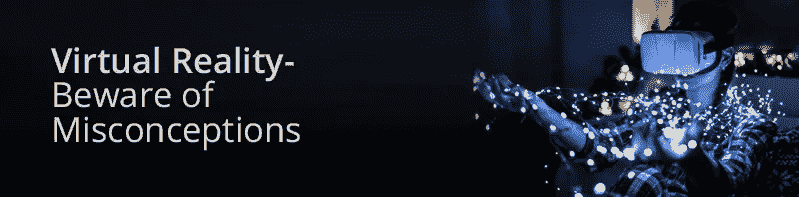

# 虚拟现实——小心误解

> 原文：<https://medium.datadriveninvestor.com/virtual-reality-beware-of-misconceptions-6f491ee50902?source=collection_archive---------13----------------------->

[**虚拟现实技术**](http://24framesdigital.com/What-we-do/360-Videos-and-VR.php) 的冲击浪潮在科技文化中获得了重要地位，从而改变了营销观念。虚拟现实是一种沉浸式技术。虚拟现实已经显示出其吸引目标受众将他们转化为购买者的巨大潜力。因此，当我们谈论虚拟现实的概念时，它与消费者行为有很大关系。选择正确类型的工具和技术来推广和营销业务可以让你受益匪浅。虚拟现实，视听营销的基本形式之一；消除所有关于它的实现、结构或其他方面的误解是很重要的。下面列出了几个这样的错误:

**>虚拟现实是一项全新的技术发明——**这听起来是一个令人捧腹的说法。自 1800 年后的持续时间以来，可以找到虚拟现实技术的痕迹。1962 年，伊凡·苏泽兰第一次用自己制作的传感器展示了虚拟现实。头戴式显示器和 3D 技术也在那个时候得到了应用，还有环绕声、吹气、定制香味等等。试图营造一种氛围。早在很久以前，人们就开始尝试和计划开发虚拟现实。

虚拟现实只适合游戏玩家- 这可能是你经常听到的最常见的神话。这是因为仍然在许多国家，人们看到戴着耳机玩多媒体游戏，享受虚拟的气氛。但是，许多在线资源致力于传播对虚拟现实多种工业用途的认识。使用这种营销方法所涉及的技术细节和策略具有广阔的前景，可以刺激你的产品或服务的销售。简言之，虚拟现实将成为医疗保健、建筑、教育、安全和商业等领域最重要的工具之一。VR 很可能会抓住营销实践的领导权。

**>用户在一段时间后感到内部不适-** 佩戴耳机的虚拟现实用户感到不舒服是由于人为制造的与人类感官相关的隐含效果，这完全是一种误解。然而，一些科学类型的调查和研究表明，虚拟现实技术对人体或心灵没有这种负面影响。对虚拟现实用户的情绪水平或行为模式没有改变或不良影响。此外，它不会导致任何疾病。提供虚拟现实服务的知名供应商总是拥有经过科学测试并被批准可以安全用于人类的耳机和设备。

**> VR 看起来像现实-** VR 从来不像我们通过眼睛看到的现实。尽管如此，当我们谈论让虚拟现实更接近现实时，还有很大的发展空间。随着 4k 电视机的发明，高分辨率或高清概念达到了一个新的优势水平。大多数 VR 开发者面临的当代问题是 VR 电影技术的位尺寸；然而，这也被认为会很快得到解决。真实感图形与现实的匹配是使虚拟现实看起来像现实的必要条件。

**> VR 价格高-** 当你讨论虚拟现实应用所涉及的成本计算时，这也是一种误导性的说法。今天，大多数人使用的智能手机或平板电脑与其他先进设备具有广泛的兼容性。你需要一部智能手机和一个耳机来体验虚拟现实。如果你已经有了一台智能设备，你所需要的只是一个虚拟现实耳机，以获得完全沉浸式的体验。市场上很少有一体式解决方案，这是享受虚拟现实体验的另一种经济有效的方式。这些耳机通过板载操作系统使用 HDMI 电缆从连接到它们的其他设备上运行。对于游戏控制台，您可以享受高清视听效果，拥有最好的显卡和高性能处理器，价格几乎与高端台式机系统相似。

**>虚拟现实只是一种时尚-** 从根本上说，技术的成功取决于时间的考验，因为它被证明对广泛的用户有益。已经发明了几种计算平台，并且它们通过所需的升级增加了进一步发明的范围。虚拟现实也许有巨大的潜力成为现实。我们想象的任何东西，我们都可以在虚拟现实中模拟出来。预计会有更多的发明出现，让虚拟现实更上一层楼。

总的来说，虚拟现实方法正在以惊人的速度发展，它很可能会融入人类生活。这一特定领域的技术进步正在持续发生，这将使全球市场受益。社交媒体与这些营销技术的整合正在推动全球的数字化转型。