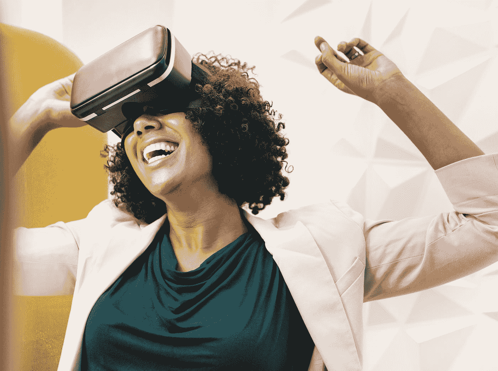
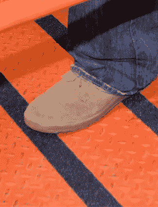

# 虚拟现实有助于避免真正的跌倒

> 原文：<https://medium.datadriveninvestor.com/virtual-reality-helping-to-avert-real-falls-3457863096ec?source=collection_archive---------25----------------------->

By [rawpixel](https://unsplash.com/@rawpixel?utm_source=medium&utm_medium=referral) on [Unsplash](https://unsplash.com?utm_source=medium&utm_medium=referral)

为了获得在陌生和不寻常的环境中行走的感觉，萨凡纳河补救公司正在对其员工进行安全培训。液体废物承包商希望工人能够感受到在各种环境中行走的感觉，因为使用虚拟现实有助于防止滑倒、绊倒和跌倒(STFs)。绊倒和滑倒的危险在任何行业都很常见，有一些措施可以防止这些伤害，对年轻和年长的工人都有好处。

# 危险的现实

STFs 可能在任何时候发生在任何工人身上，并可能导致残疾或死亡。根据职业安全与健康管理局的数据，在一般行业中，STFs 导致了 15%的意外死亡。大多数跌倒通常发生在同一立足点上，由滑倒和绊倒引起。根据[劳动统计局](https://www.bls.gov/opub/ted/2017/5190-fatal-work-injuries-in-the-united-states-during-2016.htm)的数据，2016 年有 849 人因滑倒、绊倒和跌倒受伤。这些伤害是由于不正确使用[梯子](https://www.graphicproducts.com/infographics/workplace-ladder-safety/)和[在规则或光滑表面上行走](https://www.graphicproducts.com/articles/osha-s-standard-for-walking-working-surfaces/)以及其他工作场所危险造成的。

萨凡纳河环境安全与健康主管帕特里夏·艾伦说:“事实上，所有的摔倒事故都发生在走路的时候，不管我们的职称是什么，我们都会摔倒。”。“在 Savannah River Remediation，我们有一句口头禅‘行走就是工作’，而这种虚拟现实培训正在支持这一真理。”

在 Savannah River 的虚拟现实培训中，用户戴上一个带有护目镜、脚部和腰带传感器的头盔，手持控制器，在陌生和不寻常的模拟中“行走”，其中包括一个农场的坦克区和一个行政区停车场。然后，工作人员虚拟地浏览这些场景，以避免安全危险，如地面上的管道或低悬的基础设施。参加该培训的工人可以识别危险材料，并选择如何保护安全和健康。艾伦说，使用虚拟现实系统的工人因消除危险而获得积分。

“最重要的是，员工们甚至在踏进我们真正的设施之前，就开始学习如何穿越我们危险的工作环境，”她说。艾伦还表示，萨凡纳河正在考虑扩大其虚拟现实计划，以培训工人在其他工作任务安全，如起重机操作。

Floor tape with a tread helps keep workers upright on slippery surfaces.

# 在训练中找到平衡

预防 STFs 的一个重要关键是采用多因素[可视化管理](https://www.graphicproducts.com/guides/visual-workplace-visual-management/)领导来处理安全问题，鼓励工人控制自己的安全。安全经理可以制定计划，通过进行[设施安全审计](https://www.graphicproducts.com/guides/facility-safety-audit/)，防止室内和室外环境以及可能频繁变化的区域出现一系列 STF。雇主可以通过[滑倒、绊倒和跌倒缓解技术](https://www.graphicproducts.com/guides/preventing-slips-trips-and-falls/)来使用简单且成本有效的环境改造。提醒工人注意常见的 STF 危害，以提高员工对潜在危险情况的识别和意识。