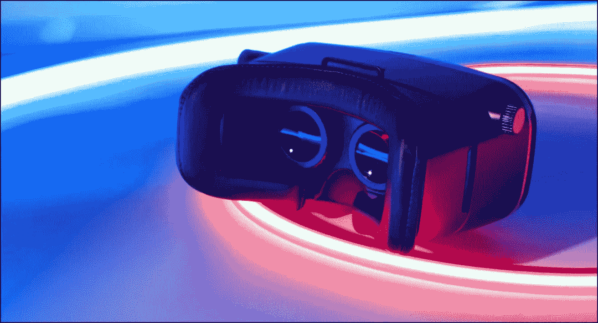

# 虚拟现实(VR):如果有机会，你会进入哪个交替宇宙？

> 原文：<https://medium.datadriveninvestor.com/virtual-reality-vr-and-how-it-can-make-a-difference-in-our-world-297e9e1761da?source=collection_archive---------21----------------------->

如果做得好，一部动画电影或视频游戏会让观众或玩家希望他们能把这种体验变成现实。数字媒体的发展带来了极大程度的真实感，改变了我们看待媒体和与媒体互动的方式。从老式投影仪电影到多维电影的飞跃只是该行业快速发展的一个例子，该行业正在努力将人类体验提升到下一个水平，这是虚拟现实的精确目标。

虚拟现实，或称 VR，利用计算机技术的进步向世界呈现一个虚拟环境，用户可以“进入”并与之互动，就像在现实生活中一样。这怎么可能实现呢？

与物质世界的互动主要集中在我们的感官上。每当身体感知到外部刺激时，感官信息就会进入大脑，并在大脑中得到解释，从而对我们周围的物理环境有更深入的了解。虚拟现实使用复杂的图形向人眼呈现虚拟环境的三维视图，欺骗他或她的感官，使其认为自己实际上就在该环境中。

在这个过程中使用了许多设备，如耳机和手套，以确保用户能够实际探索虚拟现实。以对用户有意义的方式这样做允许沉浸，或者允许用户感觉他或她已经离开了他或她实际生活的物理环境，并且进入了通过耳机显示的虚拟环境。虚拟现实耳机使用两个屏幕，每只眼睛一个，来显示看起来像真人大小的 3D 图像。除了实际的显示，他们的主要焦点是检测用户视野的变化。虚拟现实头戴设备使用激光笔和红外灯来跟踪头部和眼睛的运动，以便该技术可以在显示中进行适当的移动，以增强用户不在他或她的直接物理环境中的错觉。

延迟以及与虚拟世界的无缝交互是成功的虚拟现实体验的关键。对延迟(即用户操作和系统响应之间的滞后时间)进行优先级排序，可以防止用户意识到他们实际上并不在呈现给他们的虚拟环境中。

虚拟现实可以应用于游戏以外的行业:

*   房地产开发商可以向潜在买家提供房源的虚拟视图。
*   **增强体验-** 博物馆可以为游客提供一张虚拟地图，让他们在虚拟世界中参观不同的展品，以补充实际的参观。
*   **医学培训**——传统培训项目中的外科医生转向塑料模型进行实践。虚拟现实帮助受训者在模拟真实生活紧急情况的虚拟模型上学习和练习。
*   **太空** **探索**——在外太空安装相机后，科学家们无需离开地球就能探索其他星球。
*   教育-虚拟现实可以融入到从历史到科学的任何主题的课程中。学生们在学习他们居住地以外的环境时，可以传送到那个环境，以获得更具交互性的外观。例如，如果需要的话，其他了解过去战争的人可以一瞥那段时间和战争中的生活。
*   **残障辅助设备-** 虚拟现实让残障人士能够体验他们无法体验的活动。例如，坐在轮椅上的人可以尝试爬一座虚拟的山。虚拟现实甚至可以通过向没有残疾的用户展示与一个残疾人生活在一起会是什么样子来揭示残疾。

随着虚拟现实背后的技术进步，更多创造性的应用将开始出现。在那之前，我们可以继续探索虚拟现实打开的另一个世界，在自己舒适安全的家中过着冒险的生活。如果有机会，你会进入哪个平行宇宙？