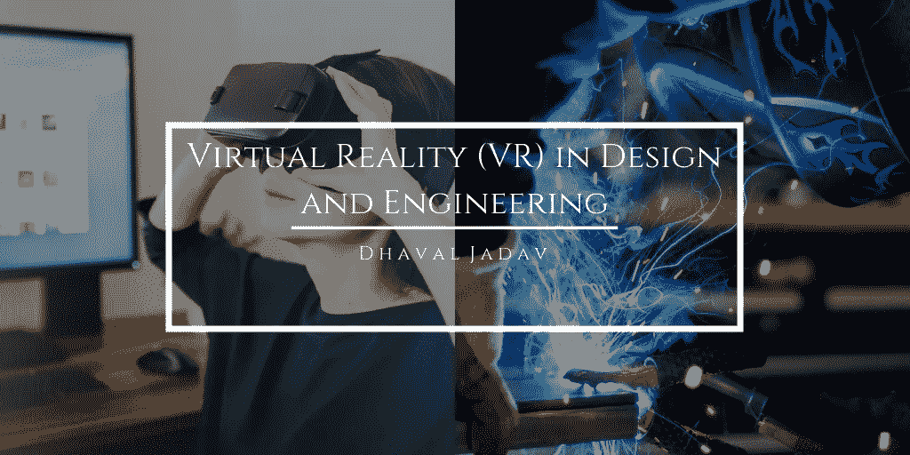

# 设计和工程中的虚拟现实

> 原文：<https://medium.datadriveninvestor.com/virtual-reality-vr-in-design-and-engineering-2779d85f3d57?source=collection_archive---------26----------------------->

技术的新发展正在彻底改变整个行业。从人工智能(AI)和机器学习到虚拟现实(VR)，这些技术发展正在改变和改善行业专业人士完成日常工作的方式。受人工智能和虚拟现实等技术影响的常见行业包括制造业、医疗保健和农业，以及设计、建筑和工程等各个领域。在工程和设计领域，虚拟现实等技术让专业人士能够比以往任何时候都更准确、更高效地设计、创造和分享他们的工作。这里有几个 VR 不仅改变了而且改进了的方面，[工程行业](https://gineersnow.com/industries/how-virtual-reality-changes-construction-industry)。

**提高设计能力**

设计过程已经从传统的图纸和蓝图发展到使用虚拟现实功能，这种功能可以将专业人员从最初设计概念的开始阶段一直带到实施和构建阶段。虚拟现实使工程专业人员能够[实际可视化他们的概念](https://www.ingenia.org.uk/Ingenia/Articles/46eb0338-dee8-4322-adae-97f339e0118a)，并在项目构建之前为他们提供“真实生活”体验。设计工程师可以使用虚拟现实与项目进行互动，进行更改，并在构建物理原型之前识别任何设计问题；这不仅提高了时间和效率，还减少了制造误差，最终降低了成本和费用。

**沉浸式 3D 建模**

多年来，3D 建模一直是设计和工程领域使用的工具。然而，由于虚拟现实技术，3D 建模已经取得了巨大的进步，为设计专业人员及其客户提供了完全沉浸在模型中并可视化典型 3D 模型可能无法提供的小细节的能力。这种交互式 3D 体验使得从概念到构造的设计过程更加高效。

**改善客户之间的协作&工程师**

部分由于 VR 对 3D 建模的改进，设计师、工程师和他们的客户之间的合作现在是无缝的，并且非常有帮助。客户通常很难想象他们的项目仅仅基于图纸和蓝图的最终结果。如果他们自己没有设计的眼光，他们可能很难理解设计和建造过程将如何结束。幸运的是，虚拟现实使设计和工程专业人员能够与他们的客户互动，并为他们的客户提供了一种从概念到设计和原型的项目可视化方法。这不仅有助于客户理解过程是如何工作的，而且将他们项目的概念放到了现实生活的角度。此外，如果客户有不同的观点、看法和问题，或者希望对项目进行修正，他们可以很容易地与设计师沟通，避免项目完成后出现任何问题。

.

.

*本文原载于*[*【dhavaljadavalliantgroup.com】*](http://dhavaljadavalliantgroup.com/virtual-reality-vr-in-design-and-engineering/)