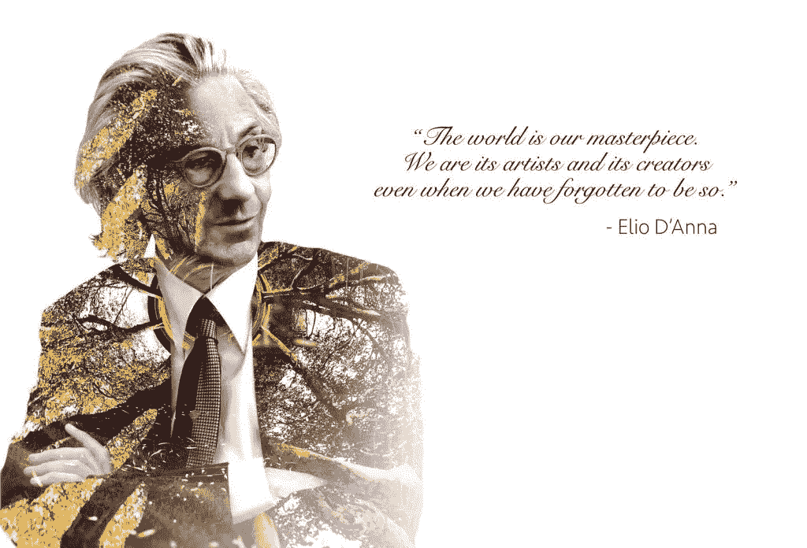

# visibilia ex Invisibilibus—Elio D ' Anna |与梦者对话

> 原文：<https://medium.datadriveninvestor.com/visibilia-ex-invisibilibus-elio-danna-dialogue-with-the-dreamer-a83baa221ad5?source=collection_archive---------14----------------------->

# 可见性源于不可见性。我们被隐形包围了。

文明的历史显然是对做更多事情的探索，人类不断尝试超越自我，获得更大的生产、交流、旅行和毁灭的能力。

与此同时，在更高的层面上，在无形的观念世界中，存在的发展也在进行着。

每一个可见的发现，每一个能力的增加总是以对存在的征服为先导，是人类能力的延伸，没有它任何具体的表现都是不可能的。

## 可见的东西是不可见的东西的投影，它依赖于不可见的东西，就像影子依赖于它所投影的物体的形状和尺寸一样。我们所看到的、感觉到的、触摸到的和听到的一切，物质的物体和生命的全部事务，只不过是一个我们感官看不见的世界的投影，这构成了它的原因。

即使在一个人身上，他所能建造的一切都源于他的无形，他的“梦想”,它外在地表现在他的生活质量和发生在他身上的事件的性质上。

一个人可以意外地建立一个帝国，积累财富、土地和财产，但他的“梦想”中最小的裂缝也会让他失败。

Visibilia ex Invisibilibus，[学校的](https://www.ese.ac.uk/)校训，意味着内在的责任，意味着外在只能揭示一些已经发生在思想、事业、创造力的世界里，在‘梦想’的世界里。

有形之物诞生于无形之物。

声音从寂静中诞生。

运动产生于静止。

> 所谓现实的平面存在一个垂直维度，它是不可见的世界。不可见的事物。

只是自本世纪初以来，量子物理学揭示了物质基本粒子之间存在的巨大空洞，迫使我们接受这样一个悖论，即整个宇宙本质上是由空虚构成的，而“几乎没有”是现实的核心。

科学知识的加速和指数级进化挑战我们的概念模式，与来自日常“现实”的经验相矛盾，以至于我们开始认真考虑物质对象和整个现实只不过是一种虚幻的戏剧表演的可能性，因此我们开始质疑可见世界之外的东西。

我们所看到的、感觉到的、触摸到的和听到的一切，现实在整体上只不过是一个我们感官看不见的世界的投影，它存在于我们的世界之上，并确立了它的原因。

在每一个时代，智力气候的转变，如更复杂的仪器的使用，不断地改变着界限，使得无形世界的巨大部分重新成为当今科学研究的合法主题。

## 我们被隐形包围了。

这是一个我们比人类任何其他时期都更能觉察到它的时刻。越来越多昨天看不见的部分正在进入我们的生活，成为我们感官世界的一部分。我们不得不相信和接受许多我们看不到或听不到的最具体的东西。我们机械地接受它，却没有得出它所暗示的结论。

我们很少意识到我们生活在一个无形的世界里，而我们自己也是无形的。我们所有的思想、情感、幻想、梦想都是看不见的，所有属于我们的希望、抱负、秘密、恐惧、怀疑、困惑、不确定性以及我们所有的感觉、欲望、吸引力、厌恶、喜欢和厌恶都是看不见的。一切对人类重要的东西都是看不见的。

# 经济和商业有一个纵向维度。这意味着经济事实依赖于源自上级命令的原因。

古代的活动受到宗教主题的启发，以至于工作变成了一种神圣的礼拜仪式，一种重复的机制，一种文具和本质上稳定的社会的保证。

时至今日，以仪式和经济停滞表现出来的不发达状况与沉浸在陈旧道德价值观体系中的经济联系在一起。

> 它们只是一个问题的另一面，这个问题在发达经济体表现为病理学和社会疾病。

同样，只有考虑到加尔文主义带来的革命，才能理解西方世界的现代资本主义。前苏联仍在进行的经济转型是该国价值体系发生巨大变化的结果。戈尔巴乔夫总统在罗马欧洲经济学院做客时，向我们的学生发表了讲话，他清晰地表达了诸如:高贵、道德、善良甚至仁慈等词语。此外，在 1989 年 12 月 1 日对西方世界大国发表的一次历史性演讲中，他已经谈到了“生命的精神化”和“人类永恒的价值”等革命性的词语。

这些话仅仅在几个月前是不可能说出口的，但实际上却宣布了经济和政治的革命性变化，以及 URSS 共产主义的终结和柏林墙的倒塌。它们是一种无形的变化的影响，这种变化已经在这个国家的感情和思维方式上发生了，甚至在他们存在之前就已经发生了。如同社会一样，经济事件和科学领域的划时代变化总是由看不见的思想、哲学和语言来准备和预测的。

> 看似突然的事情总是需要长时间的准备。

现实已经发出了它转变的信号，但是只有极少数人能够察觉到它们并做好准备。只有那些更加关注和意识到价值观对经济的影响的人，才知道经济事实是一种效果，并且总是跟在后面。他们像影子；它们是更高层次现实的投影。没有具备这种准备的人，没有意识到伦理、道德价值、哲学、宗教、思想和经济之间的深刻关系，我们作为一个文明、国家和组织将会落后。

一些国家的富裕和另一些国家的不发达不能用经济学来解释。在一个国家、一个组织、一个人的不可见性中，在他们的项目的根本中，有一些东西，这解释了我们可以在他们的生活中观察到什么。

# 看得见的东西是由看不见的东西产生的。因为蓝图先于物质结构。他们经济的富裕，制度的成熟，以及公民和政治生活的和谐都无法用经济学来解释。

## 没有伦理维度的经济就像一间没有窗户的黑屋子。

进入思想的世界就像打开了一扇窗户。它让光进来，但不是光的来源。源头是思想的世界，它就像一个太阳，即使窗户一直关着，它也会继续发光。在时空变化的伦理背后，是不变的存在的太阳。要进入这个思想的世界，就必须抛弃根植于我们童年的二手信仰和偏见。

进入解决方案的世界，进入“梦想”的世界，需要摆脱怀疑、恐惧、不愉快的情绪、过时的概念、机械的行为。

大学和经济学院已经忘记了繁荣的法则，致富的途径，他们不再知道如何培养务实的远见卓识者，能够创造富足并维持富足的人。经济学家忘记了，在一个人的遗产背后，在一个国家的财富背后，在一个文明背后，总有一种思想，一种思维方式，一种解释它的哲学。

> 变得富有总是繁荣良心的结果。

所有经济学大学的经典经济学家仍然认为资源是有限的，这是一个自我实现的预言，也是贫困的根源。事实上，并不是资源受到限制，而是人类的心理受到了教育，认识到了这些限制。

宇宙有丰富的资源，它是一个聚宝盆，充满了你内心所希望的一切，物质上的、精神上的、情感上的和精神上的。我们需要或想要的一切都已经在这里了。你只需要真诚地渴望，真诚地想要并相信它，最后接受它。

那些认为世界并不富足的人会滋生贫穷不可避免的旧偏见。

> 我们只能拥有我们有责任的东西。

一个人类无限的责任感将会支配无限的资源。

梦想的艺术，也就是相信和创造的艺术，是将我们的存在提升到更高层次的可能性。这是一种将明显的对立和逆境协调成更高层次事件的艺术。

在 ESE 的学年(1997-1998)开幕式上，主讲人和嘉宾是经济学家约翰·福布斯·纳什，他是诺贝尔奖获得者和我们时代的数学天才之一，请柬的开头宣布:

"大学必须提供一个重要的思想体系，能够解释世界，并提供一个人类状况及其可能进化的总体框架"。

ESE 相信个人，并以培养新一代企业家和经理为荣，他们是完美的领导者，拥有完整而成熟的心理学，能够协调前所未有的明显对立:经济和道德，行动和思考，金融权力和爱。他们被赋予第六感:直觉和第七感:“梦”。

*原载于 2019 年 12 月 30 日*[*【https://elio-danna.com】*](https://elio-danna.com/visibilia-ex-invisibilibus-2/)*。*