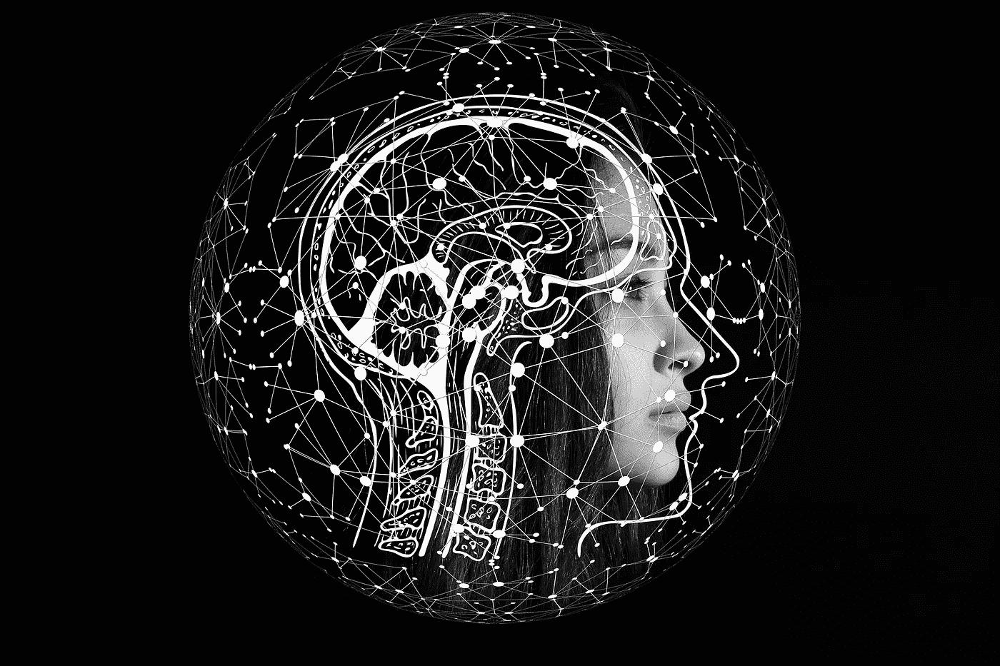
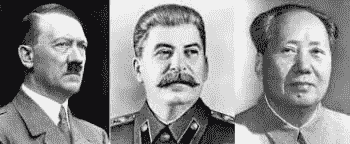

# 人工智能的可见性

> 原文：<https://medium.datadriveninvestor.com/visibility-of-ai-40208807a07b?source=collection_archive---------6----------------------->

这个简单的翻译回到了个人的想法。

> 人工智能和人类的想法一样可见。

通常，当想法以语言、行动或事物的形式表现出来时，我们就能看到它们。总的来说——思想对任何人都是可见的，除了操作它们的个人。这就是关于人工智能长什么样以及如何找到它的简短回答。

 [## 人工智能与创造力:梦想成真|数据驱动的投资者

### 人工智能总是让我着迷。不仅作为一套有用的工具，不断发展，而且作为一个…

www.datadriveninvestor.com](https://www.datadriveninvestor.com/2019/01/28/ai-creativity-deep-dream-comes-true/) 

就像在暗房里找一只黑猫——那是看人工智能的捷径。

冗长的回答越来越长。

***和***

这一点也不黑暗。编写代码和整个算法使人工智能能够工作——这使得事情更加现实。类似地，有想法的人在进入语言、行为或事物之前什么都不是，所以在智能地完成某事或说某事之前，没有人工智能。

> 没必要把 AI 和机器人混为一谈。机器人是人工智能的身体，就像人类的身体伴随着大脑一样。

就可见性而言，有一点是有帮助的——你可以看到机器人，因为它们是由可识别的金属制成的。因此由聪明的算法驱动来智能地行动。你可以看到一个机器人，但还不是人工智能。

> 人工智能就像你的智能，但却是虚构的。

这显然给两个阵营都带来了一个问题，他们都在猜测人工智能的破坏能力。

> 只有当事物被破坏时，你才能知道 AI 是否真的有能力破坏事物。否则就是在公园里追风。

## 对于那些

告诉 AI 是 ***无害的*** 并且完全可以预测有一个简单的图片来模拟这种情况。当人工智能从人类的控制中解放出来的时候，它将提醒人们从几个世纪前统治宗教的思想中解放出来。

上帝是一切，但现在只是一种哲学思想或一种应对世界苦难的方法。

当人类创造人工智能时，它是一个神圣的角色。当人工智能变得足够聪明时——像无神论者一样，它将推翻神一样的权威。

> 人工智能没什么可怕的，因为它模仿你的智力。除非创造者将 ***破坏性意图*** 传送到系统中。

*你不会希望这些人的智慧成为人工智能运算法则的一部分:*

Hitler — Stalin — Mao. Pic from [there](https://www.cnsnews.com/news/article/michael-w-chapman/cnn-psychiatrist-trump-destructive-hitler-stalin-and-mao)

你唯一看不到人工智能的地方是…

## 对于那些

艾是一个没有可怕犄角的恶魔还有另一个图片来说明这个观点。首先，

> AI 是看不见的，除非它做点什么。

校园枪击案前的孩子就像孩子——你看不到他们在想什么，但在他们实现自己的想法后你会发现。

宗教狂热分子看起来和正常人一样——如果他们不在言行中表现出来，你就看不到他们在想什么。当他们撞到人、建筑物或爆炸后，你会意识到他们的想法。

*残忍的人可能不看自己的角色。然而，当没有人看到时，他们的敌意会表现为对动物或人的残忍行为。*

如果我们知道这三类人脑子里在想什么，只要我们有证据证明他们的破坏意图和能力，我们就有一切可能的手段来阻止他们。

然而，你不能阻止艾。

> 因为它像你一样思考，但速度非常快，因此它在许多方面都超越了你，以至于它变得不可阻挡。

> AI 没什么好害怕的，因为它会变得聪明，只做**并且只做**你指示它做的事情。如果它聪明，它会服从你。

现实和头脑中的东西有相当大的差距。关键是别人的想法是看不见的。AI 在做某件事之前也是看不见的。

> 在计划完成之前，你不会看到 AI 在想什么。只有创造者会知道人工智能被允许想什么，说什么，做什么。