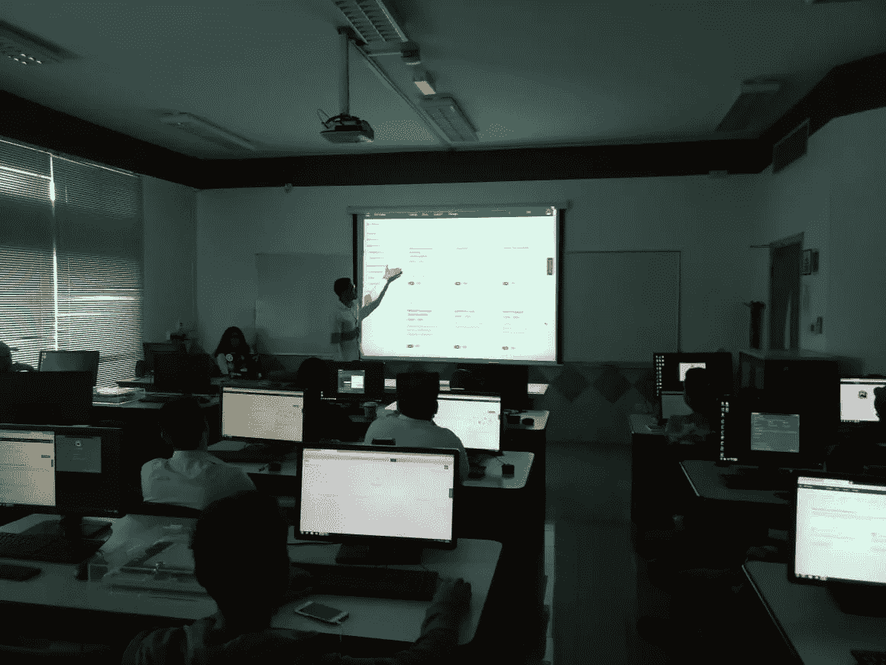
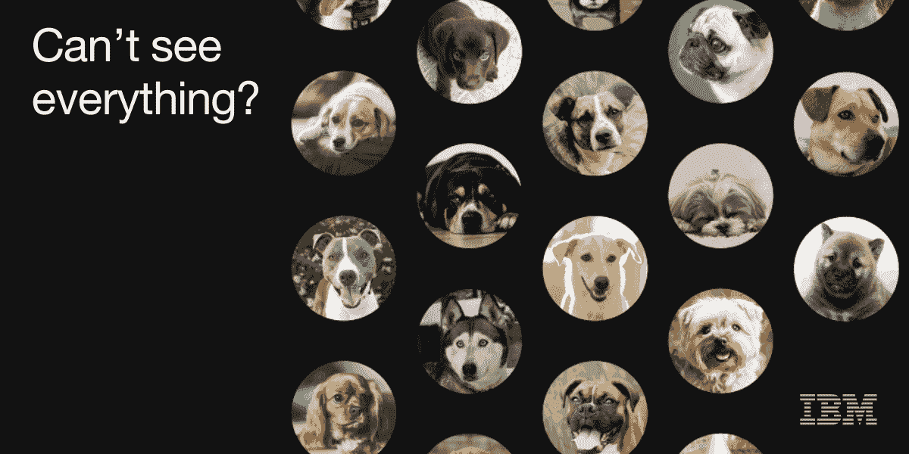

# CUD 视觉识别研讨会

> 原文：<https://medium.datadriveninvestor.com/visual-recognition-workshop-at-cud-50eade210ffb?source=collection_archive---------11----------------------->

11 月 19 日，迪拜加拿大大学的学生开发人员加入了 IBM 开发人员体验团队，以了解更多关于 IBM AI 服务的知识。该研讨会侧重于 IBM Watson 视觉识别服务，面向初学者。

Demonstration of how Watson services can be created.

**人工智能简介**

[Abeer Haroon](https://medium.com/u/7fa57e649b21?source=post_page-----50eade210ffb--------------------------------) 以对人工智能的介绍开始了研讨会，随后是人工智能的发展，以及术语“人工智能”的创造。

1956 年，**人工智能**一词首次出现时，约翰·麦卡锡对人工智能的定义是:

*“制造智能机器的科学与工程”*

[**IBM 沃森**](https://www.ibm.com/watson/)

IBM Watson

然后，学生们被介绍了 IBM Cloud 提供的各种沃森人工智能服务，如[视觉识别](https://www.ibm.com/watson/services/visual-recognition/)、[沃森助手](https://www.ibm.com/cloud/watson-assistant/)、[语言翻译](https://www.ibm.com/watson/services/language-translator/)等。 [Amro Moustafa](https://medium.com/u/526751923bb3?source=post_page-----50eade210ffb--------------------------------) 解释了学生如何了解更多可用的 Watson 服务，并轻松地创建它们以在他们的项目中使用。

[**沃森视觉识别**](https://www.ibm.com/watson/services/visual-recognition/)

由于研讨会的重点是视觉识别，因此演示了学生如何创建视觉识别服务并在项目中使用它。

**代码实验室:**

Amro Moustafa 演示了没有编程经验或编程经验很少的学生如何通过使用 IBM 视觉识别服务，通过点击几下鼠标来创建和测试他们自己的人脸识别模型。你只需要一个 [IBM 云账户](https://console.bluemix.net)！

**测试**

在 IBM Cloud 上创建服务后，您可以轻松地选择想要测试的模型:人脸、食物、文本等。在这次研讨会中，选择了可以检测人脸并提供其年龄范围和性别的一般指示的人脸模型。学生们用他们选择的照片来测试他们的脸部模型。

**实施**

要在项目中实现创建的人脸模型，可以使用以下语言的代码片段:Java、Python、cURL、Node 和 Ruby。这些代码片段可以集成到您的项目中使用。在本研讨会中，学生使用 Python 代码片段实现了服务，该代码片段可在实现选项卡中找到。他们只需更改代码中的 API 键，这是在创建服务后从服务凭证中获得的。之后，他们用不同的图片测试人脸模型。

学生们只需点击几下鼠标，编写最少的代码，就能很快实现视觉识别模型！