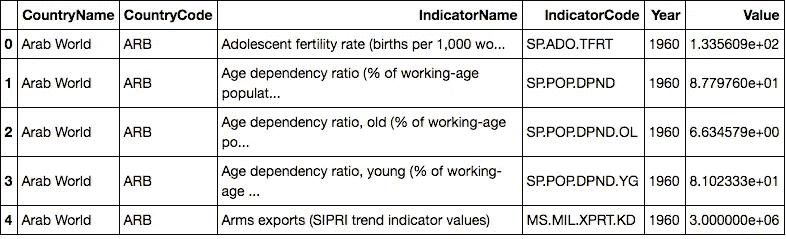
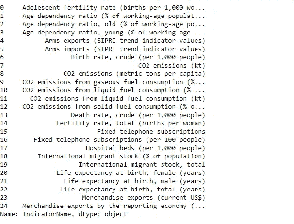
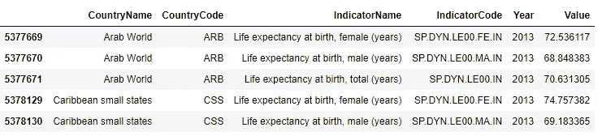
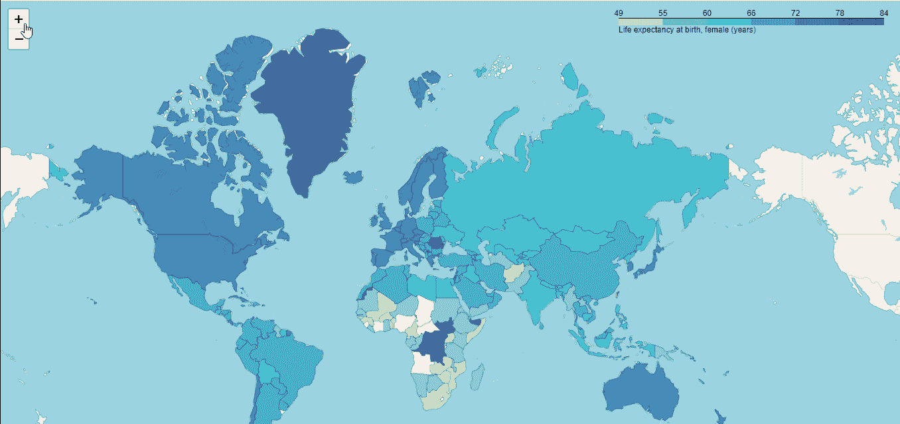

# 用 Python 可视化地理空间数据

> 原文：<https://medium.datadriveninvestor.com/visualising-geospatial-data-with-python-d3b1c519f31?source=collection_archive---------3----------------------->

## 用于可视化地理空间数据的 follow 库概述


source: Unsplash

> *最初发表于 KDnuggets。阅读原文* [*此处*](https://www.kdnuggets.com/2018/09/visualising-geospatial-data-python-folium.html) *。*

数据可视化是一个更宽泛的术语，它描述了通过将数据置于可视化的环境中来帮助人们理解数据重要性的努力。模式、趋势和相关性可以很容易地直观显示出来，否则在文本数据中可能会被忽略。这是数据科学家工具箱的基本组成部分。创建可视化很容易，但是创建好的可视化要困难得多。它需要对细节的洞察力和大量的专业知识来创建简单而有效的可视化效果。如今，强大的可视化工具和库已经重新定义了可视化的含义。

使用 Python 的美妙之处在于它为每一个数据可视化需求提供了库。一个这样的库是**follow**，它可以方便地可视化地理数据( **Geodata)。** **地理数据**科学是数据科学的一个子集，处理基于位置的数据，即对象及其空间关系的描述。

> 在本教程中，我们将开始与叶地理数据科学。我们将通过分析和可视化世界女性人口的预期寿命来开展工作。

# 先决条件

本教程假设读者对 Python 和 Jupyter 笔记本以及 P 和 as 库有基本的了解。

# 内容

*   **叶子介绍**
*   **数据集**
*   **入门**

# 叶子介绍

Folium 是一个强大的 Python 数据可视化库，主要用于帮助人们可视化地理空间数据。有了 leav，只要知道纬度和经度值，就可以创建世界上任何位置的地图。此外，由叶创建的地图本质上是交互式的，因此可以在地图渲染后放大和缩小，这是一个超级有用的功能。

follow 构建在 Python 生态系统的数据优势和 fleet . js 库的映射优势之上。数据在 Python 中处理，然后通过 follow 可视化在传单地图中。

## 装置

在能够使用 leav 之前，用户可能需要通过以下两种方法中的任何一种将其安装在系统上:

`$ pip install folium`

或者

`$ conda install -c conda-forge folium`

在这里阅读**文档**。

# **数据集**

## 下载数据集

我们将使用 [**世界发展指标数据集**](https://www.kaggle.com/worldbank/world-development-indicators) ，这是 Kaggle 上的一个开放数据集。我们将使用数据集中的' **indicators.csv** '文件。因此，下载数据集并将其放在适当的文件夹中。在这里，我将数据放在了 **world_indicators** 文件夹中

此外，由于我们正在处理地理空间地图，我们还需要国家坐标来绘图。下载**。从[到这里](https://github.com/python-visualization/folium/blob/master/examples/data/world-countries.json)的 json 文件**，并把它放在与上面相同的文件夹中。文件也可以从我的 [Github repo 下载。](https://github.com/parulnith/Visualising-Geospatial-data-with-Python/blob/master/world-countries.json)

## 探索数据

世界发展指标数据集只是对世界银行实际提供的数据集稍加修改的版本。它包含了从 1960 年到 2015 年全球约 247 个国家的一千多个年度经济发展指标。一些指标是:

```
1\. Adolescent fertility rate (births per 1,000 women)
2\. CO2 emissions (metric tons per capita)
3\. Merchandise exports by the reporting economy
4\. Time required to build a warehouse (days)
5\. Total tax rate (% of commercial profits)
6\. Life expectancy at birth, female (years)
```

# 入门指南

跳到 Jupyter 笔记本并导入所需的库。为了方便起见，请确保在数据所在的文件夹中创建 jupyter 笔记本。

```
import folium
import pandas as pd
```

*   **设置国家坐标**

```
country_geo = 'world_development_indicators/world-countries.json'
```

*   **读取数据库**

```
data = pd.read_csv('world-development-indicators/Indicators.csv')
data.shape(5656458, 6)
```

这似乎是一个非常大的数据库。

*   **探索数据库**

```
data.head()
```



似乎不同国家的指标数据集有不同的指标，指标的年份和值也不同。让我们检查一下所提供的国家和指标的数量。

```
countries = data['CountryName'].unique().tolist()
indicators = data['IndicatorName'].unique().tolist()print(len(countries))
print(len(indicators))247
1344
```

因此，总共有 247 个国家有 1344 个独特的指标水平。让我们检查前 25 个指标

```
data['IndicatorName'][:25]
```



**女性出生时预期寿命(岁)**似乎是一个很好的调查指标。让我们拿出 2013 年所有国家的预期寿命数据。我们只是随机选择年份。

```
 hist_indicator =  'Life expectancy at birth'
hist_year = 2013mask1 = data['IndicatorName'].str.contains(hist_indicator) 
mask2 = data['Year'].isin([hist_year])# apply our mask
stage = data[mask1 & mask2]
stage.head()
```



看起来我们得到了我们想要的指标。因此，让我们通过只保留国家代码和我们绘制的值来设置绘制数据。

```
data_to_plot = stage[['CountryCode','Value']]
data_to_plot.head()
```


我们还想提取指示器的名称作为图中的图例。

```
hist_indicator = stage.iloc[0]['IndicatorName']
```

## 创建叶子交互式地图

现在我们实际上要创建一个交互地图。我们将创建一个缩放比例相当高的地图。接下来，我们将使用名为 **choropleth** 的内置方法来附加国家的地理 JSON 和地块数据。

```
map = folium.Map(location=[100, 0], zoom_start=1.5)map.choropleth(geo_data=country_geo, data=data_to_plot,
             columns=['CountryCode', 'Value'],
             key_on='feature.id',
             fill_color='YlGnBu', fill_opacity=0.7, line_opacity=0.2,
             legend_name=hist_indicator)
```

我们还需要指定相关的参数。“key on”参数指的是 JSON 对象中的标签，该标签将国家代码作为附加到每个国家边界信息的特征 ID。这是我们需要在数据中建立的联系。数据框中的国家代码应该与 JSON 对象中的要素 ID 相匹配。

接下来，我们指定一些美学，如配色方案，不透明度，然后我们标签的图例。

这个图的输出将被保存为一个实际上是交互式的 HTML 文件。因此，我们需要做的是保存它，并将其读回笔记本，以便在地图上与它进行交互。

```
# Create Folium plot
map.save('plot_data.html')# Import the Folium interactive html file
from IPython.display import HTML
HTML('<iframe src=plot_data.html width=700 height=450></iframe>')
```

我们将获得一张如下图所示的地图。因为不可能显示交互性，所以我添加了一个 gif 文件来显示它。



现在我们有了地图。首先请注意，深色意味着女性的预期寿命更长。显然，美国和大部分欧洲国家的女性预期寿命更长。

这是一个如何进行地理叠加的例子。这也是一个如何使用额外的可视化库以及它们如何根据我们的可视化需求变得强大的例子。

见下面的完整代码或访问 [**Github repo**](https://github.com/parulnith/Visualising-Geospatial-data-with-Python) **获得完整的笔记本和地图。**

这是使用熊猫数据帧和叶子进入 choropleth 地图世界的非常简单的第一步。您可以在官方文档页面上探索更多关于 leav 及其交互性的内容。