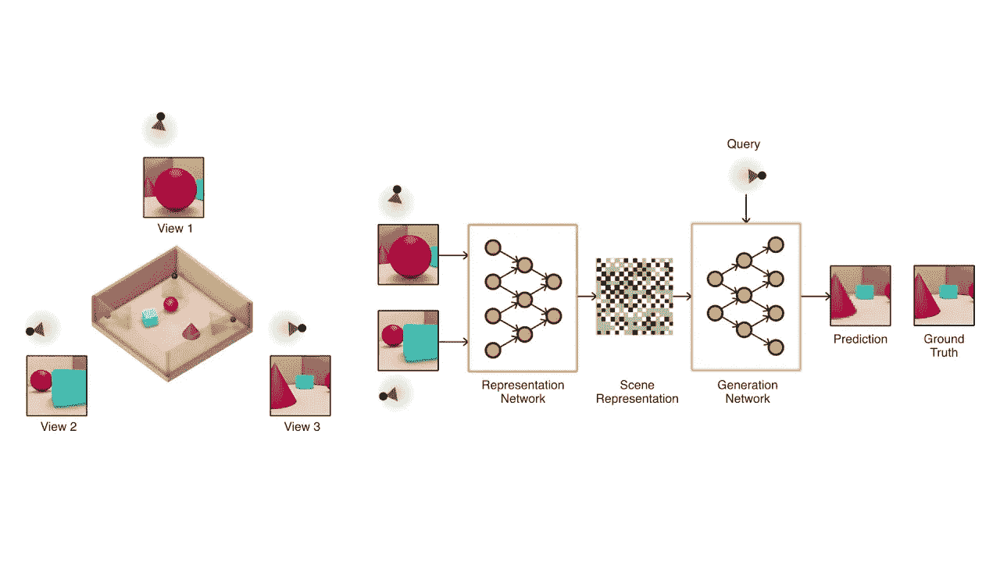

# 从 2D 图像中可视化 3D 空间:深度学习在计算机视觉中的最新技术

> 原文：<https://medium.datadriveninvestor.com/visualizing-3d-spaces-from-2d-images-deep-learnings-newest-technique-in-computer-vision-68c8892397ba?source=collection_archive---------1----------------------->

你有没有看过一张让你着迷的照片或一幅画，发现自己在那个空间里想象着自己？我们以一幅山水画为例。你可以推理和理解树木、岩石、动物和河流的位置，并对它们之间的关系做出逻辑假设。你知道，如果你从一边看到一只松鼠爬树，你将无法从另一边看到它，也许不同的角度会改变你对松鼠的看法。

基于我们对世界的理解，我们可以使用 2D 图像来可视化 3D 环境。现在，[谷歌的 DeepMind 发表了一篇论文](https://deepmind.com/documents/211/Neural_Scene_Representation_and_Rendering_preprint.pdf)表明我们可以教会机器做同样的事情。

# 为什么这是人工智能的一大步

对于今天计算机视觉中的大多数应用，我们使用一种叫做[监督学习](https://en.wikipedia.org/wiki/Supervised_learning)的方法，其中我们有非常大的数据集，所有的东西都被标记，表明它是什么。因此，如果我想训练一个汽车图像检测器，我会首先向我的图像检测器显示大量的汽车图片，标记为“汽车”。有了[卷积神经网络](https://en.wikipedia.org/wiki/Convolutional_neural_network)，我可以有效地训练我的计算模型来理解汽车是什么，从边缘和形状等更抽象的特征，到对车轮、发动机罩和窗户的更高层次的理解。所有这些都是从每幅图像的像素中抽象出来的。

但这是最神奇的地方(实际上这只是很多数学，但嘿，这是一样的，对吗？)结束了我的图像检测器。它不能从中推理出任何东西。这辆车看起来有多远？它看起来是否危险地靠近另一个物体，例如行人或长凳？超越这辆车的可行路径是什么样的？对于我们庞大的带标签的数据集，我们只能做到这一步。

这里存在着巨大的低效率。收集汽车图像并贴上标签的过程非常昂贵。这需要人力，我们不能让计算机来做(记住，这是这里的最终目标，咄)因为它不知道怎么做！即使在花费了所有的时间、精力和金钱之后，我们仍然错过了训练我们的模型来理解图像的真正价值，例如在额外的维度中可视化这些空间并理解其中的关系。

# 输入:创成式查询网络(gqn)

gqn 学习感知环境，只需给他们一个场景的不同图像。没有人类的手握，最终的神经渲染是 GQN 使用[强化学习](https://en.wikipedia.org/wiki/Reinforcement_learning)对世界如何运作的观察和结论的结果。如果这听起来像婴儿在他们的环境中学习基本的几何属性和空间，那么你是正确的！这个过程正是 gqn 正在模仿的。

为了简单明了地解释其工作原理，让每个人都能从中受益，gqn 由两个较小的网络组成:

*   **表示网络**将一个观察结果(环境的图像)作为输入，并产生一个非常基本的数学理解(作为一个[向量](https://en.wikipedia.org/wiki/Row_and_column_vectors))。因此，输出成为该环境的低级“表示”,形式易于计算。
*   **生成网络**获取这些“表示”,并从尚未观察到的角度预测该场景的样子。

一种简单的思考方式是，如果我给你三张立方体的图片，每张从不同的角度，你可以从我没有给你的角度推断出那个立方体是什么样子。你一生都在做这件事，为了你在日常生活中遇到的许多事情，所以自然你擅长于此。在这里，我们训练 GQN 做同样的事情。

# GQNs 对人工智能的影响

我们仍然处于理解 gqn 的早期阶段，到目前为止，我们只能在低分辨率、计算机生成的环境中运行模拟。随着我们在使 gqn 更加实用和有效方面取得进展，我们传统的计算机视觉方法将被它们大大补充。

**自动驾驶汽车**就是一个很好的例子。如果我们的计算机可以在驾驶汽车时实时生成 3D 环境的可视化，这将使自动驾驶汽车的生产速度更快，更不用说它们在道路上的存在更安全了。如今，自动驾驶汽车需要庞大的机器学习工程师团队，当涉及到计算机视觉技术时，他们会微调并手动实现许多功能。当 gqn 被恰当地设计出来时，它将需要更少的“微调”,并且在理解它们周围的世界时有更高的精确度。

生产线机器人也将提高效率和工厂车间的安全性。今天，大多数生产线机器在执行任务时很少或没有使用机器学习，这可能会使负责管理它们的人在某些边缘情况和意外事件中面临危险。通过能够对其环境进行推理，工厂车间的机器可以避免事故，并在必要时改变其工作程序。

这仅仅是 GQNs 的开始。使用这些框架来创造更好的人工智能解决方案将是令人兴奋的。

我希望你今天学到了新东西！我是 [eQuility](https://equility.net/) 的一名机器学习工程师，在那里我们正在使用人工智能带来尖端的医疗非药物技术来调节人体的神经系统。