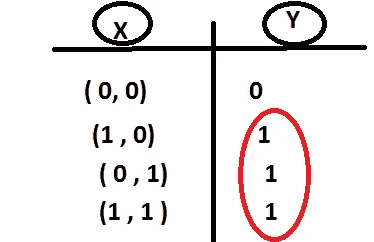
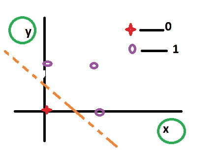
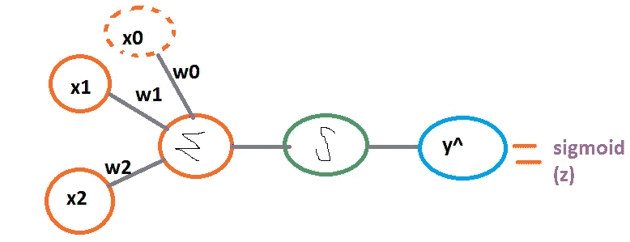
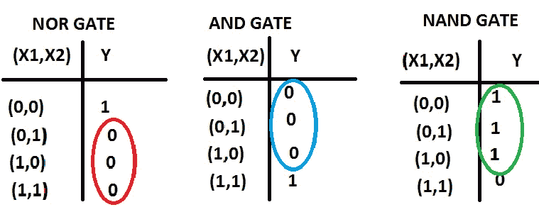
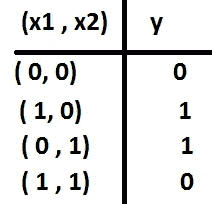
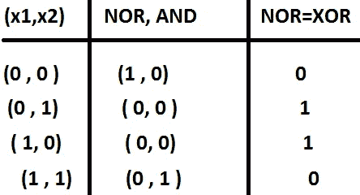
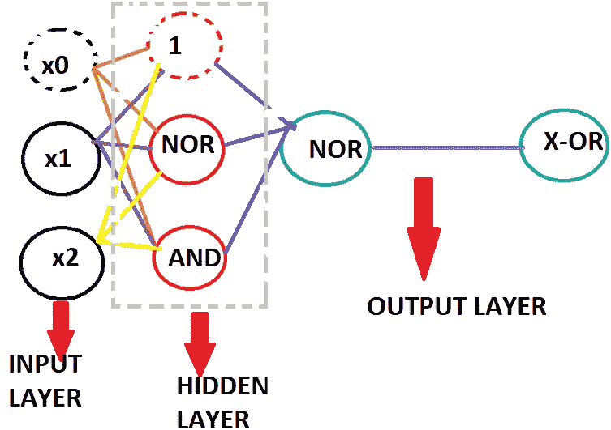
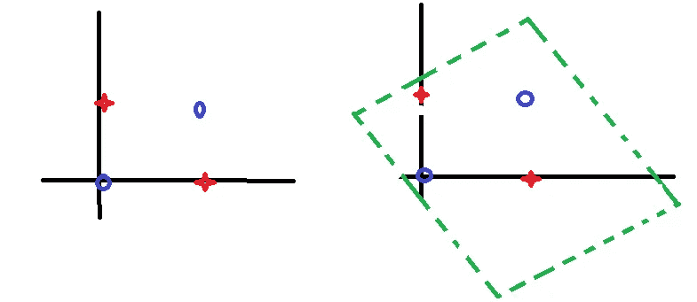

# 可视化梯度下降(第 3a 部分)

> 原文：<https://medium.datadriveninvestor.com/visualizing-gradient-descent-part-3a-598972d091aa?source=collection_archive---------16----------------------->

当我开始发现机器学习的更多内容时，我发现这个主题是最相互关联的，也是更有趣的，如果你想对机器学习有一个很好的理解，那么你必须知道梯度下降优化。在本文中，你将对梯度下降求解机器学习算法有一个详细而直观的了解。希望这篇文章能以正确的概念结束，而不是与主题相关的混乱。

本文包括以下主题:

**。或门通过分类**

**。或非门、与门、与非门通过分类**

**。所有的逻辑门可以用一个简单的神经网络来表示吗？？**

# 或门通路分类:

THIS IS THE TRUTH TABLE OF OR GATE

当我们绘制这个图时，它看起来就像下图一样。这是一个有两类 0& 1 的分类问题。

graph of an or gate

下图表示 or 门的前馈模型，其中 z=w0+w1x1+w2x2 ( *点记住:w0 也很重要，w0、w1、w2 在一般情况下不唯一逻辑回归的结果不一定是唯一的，这意味着分类线可以平移和旋转一点&但分类仍然有效*

NEURAL NETWORK OF OR GATE

# 或非门、与门、与非门的分类:

truth tables of nor , and , nand gates

这些门的神经网络类似于上述与门的神经网络

> [DDI 编辑推荐——斯坦福大学的机器学习](http://go.datadriveninvestor.com/stanfordML/matf)

# 但是这种简单的神经网络能代表所有的逻辑门吗？？？？？？？

所有神经网络或所有基本感知器能做的一个反例是 X-OR 门。

当绘制 x-or 门的图形时，我们注意到没有分类线来分隔这些点！因此，我们得出结论，这些点不是线性可分的，因此这将被称为非线性分类。由于这不是线性可分的，我们不能直接使用逻辑回归来分离这些点，有两种可能的解决方案

(1)非线性特征，如“内核技巧”

(2)添加额外的层“深度神经网络”

X-OR 可以写成 NOR(或非、与门)

这代表了 X-OR 门的神经图

*** *通用逼近定理:-任何函数都可以表示为一个只有一个隐层的神经网络**

Left image is the graph before adding extra layers and right one is after adding extra layer

当引入一个隐藏层时，旧点的投影将被创建，这样以前不可分离的点现在被一个“平面”分离。有时引入不可线性分离的更高维度，如果使用更高维度，以后会被分离。

> * * *画出所有的图表并进行深入解释需要很大的努力，因为我觉得图表有助于我们更好地理解，所以我花了很大的努力来画它们。如果我能在你们的掌声中写更多的文章，那将是对我的鼓励！请跟随以获得更多美丽的图片理解！***

在我的下一篇博客中，我会发布更多关于逻辑回归梯度的数学部分的内容