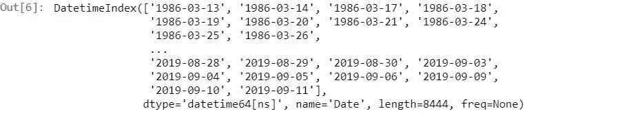
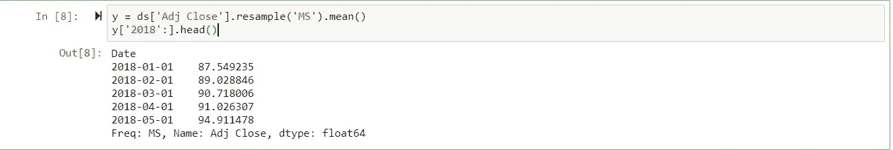
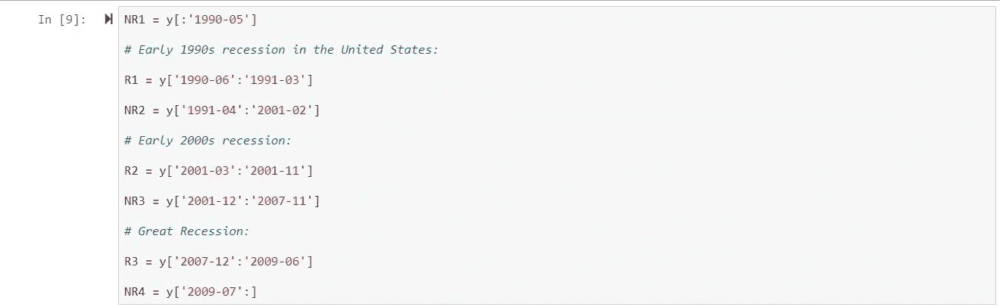
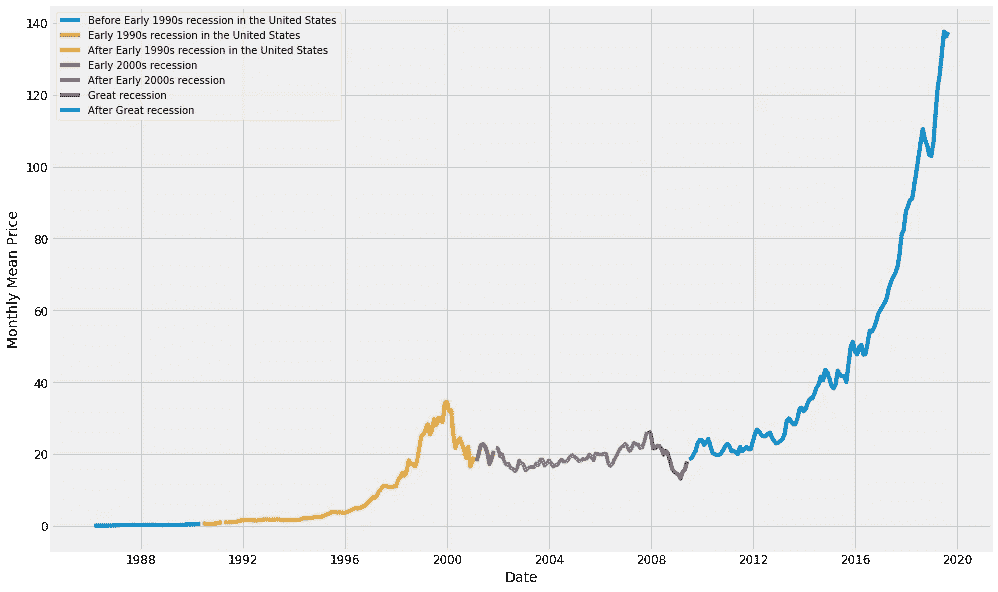

# 可视化最近三次衰退中的标准普尔 500 时间序列数据

> 原文：<https://medium.datadriveninvestor.com/visualizing-s-p-500-time-series-data-in-last-three-recession-timeframe-c1b9447ddc25?source=collection_archive---------7----------------------->

# 让我们继续，从一些导入开始:

> 从 pandas import Series 导入 pandas 作为 pd
> ，DataFrame
> 导入 numpy 作为 np
> 
> #从雅虎
> 上读取股票数据
> 
> #从日期时间导入日期时间的时间戳
> 
> 导入警告
> 导入工具
> 
> #用于可视化
> 
> import matplotlib
> import matplotlib . py plot as PLT
> import matplotlib . py plot as PLT
> warnings . filter warnings(" ignore ")
> PLT . style . use(' fivethirtyeight ')
> % matplotlib inline
> 
> #用于清晰和对比图形绘制
> 
> matplotlib . RC params[' axes . label size ']= 14
> matplotlib . RC params[' x tick . label size ']= 12
> matplotlib . RC params[' ytick . label size ']= 12
> matplotlib . RC params[' text . color ']= ' k '

## 要设置数据抓取的结束和开始时间:

> end = datetime . now()
> start = datetime(end . year—40，end.month，end.day)
> 
> df = web。datareader('^gspc','yahoo',start,end)

 [## 成为数据科学家所需的 8 项技能|数据驱动型投资者

### 数字吓不倒你？没有什么比一张漂亮的 excel 表更令人满意的了？你会说几种语言…

www.datadriveninvestor.com](https://www.datadriveninvestor.com/2019/02/07/8-skills-you-need-to-become-a-data-scientist/) 

## 将文件保存为 CSV 格式，并将其读入 Jupiter 笔记本:

> df.to_csv('stock.csv ')
> 
> stock = pd.read_csv('df.csv '，parse_dates=True)

## 仅选择相关数据:

> stock[' Date ']= PD . to _ datetime(stock[' Date '])
> ds _ stock = stock[[" Date "，" Adj Close"]]

## 根据时间序列索引数据:

> ds = ds _ stock . set _ index(' Date ')
> ds . index

因为我们希望将数据集划分为不同的时间范围。处理当前的日期时间数据可能会很棘手，因此我们将使用一年中特定月份的每日“调整收盘”价格的平均值以及与时间戳相对应的每个月的月初。

 [## 美国经济衰退列表

### 美国有多达 47 次衰退，可以追溯到联邦条款，而且…

en.wikipedia.org](https://en.wikipedia.org/wiki/List_of_recessions_in_the_United_States) 

查看上面的链接，设定衰退时间表

## 将数据集划分为衰退时间段:

## 可视化 S&P 月平均“Adj Close”价格时序数据:

> plt.figure(figsize=(15，10))
> PLT . grid(True)
> PLT . plot(NR1，label= '美国 90 年代初衰退前')
> plt.plot(R1，label= '美国 90 年代初衰退')
> plt.plot(NR2，label= '美国 90 年代初衰退后')
> plt.plot(R2，label = ' 2000 年代初衰退')
> PLT . plot(NR2

