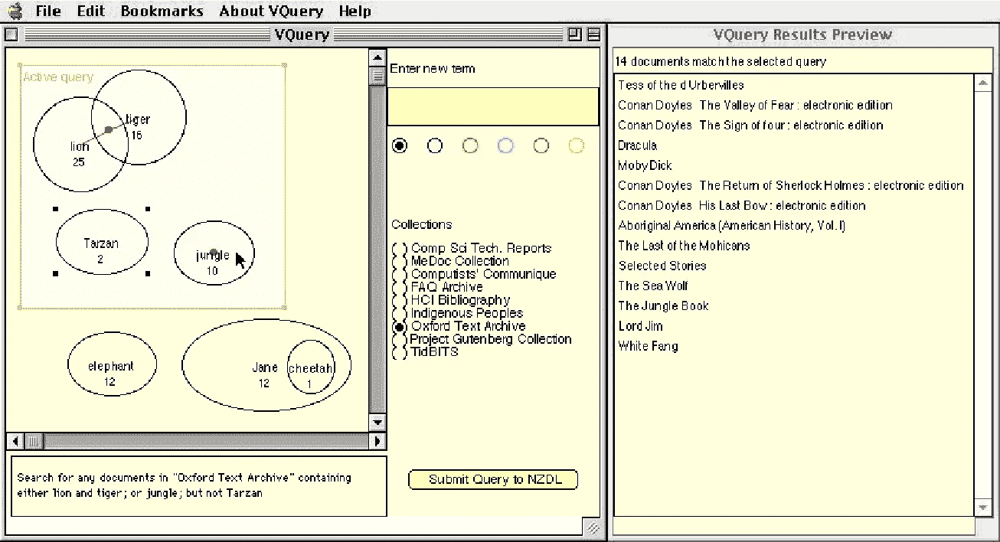
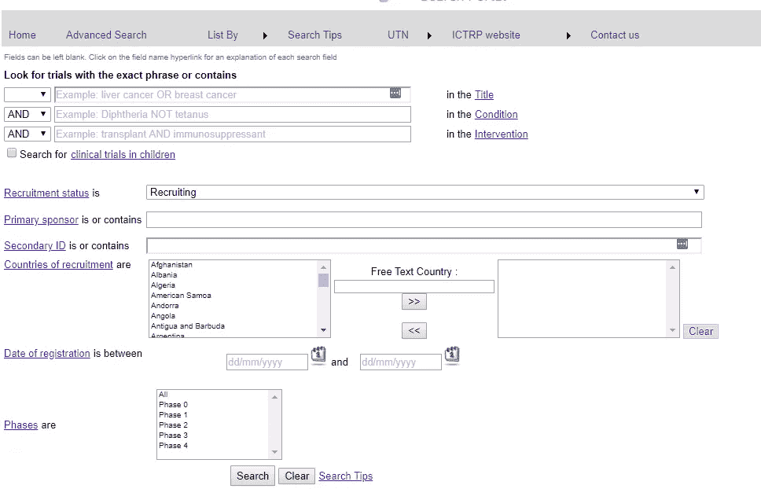
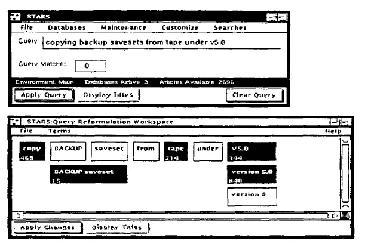
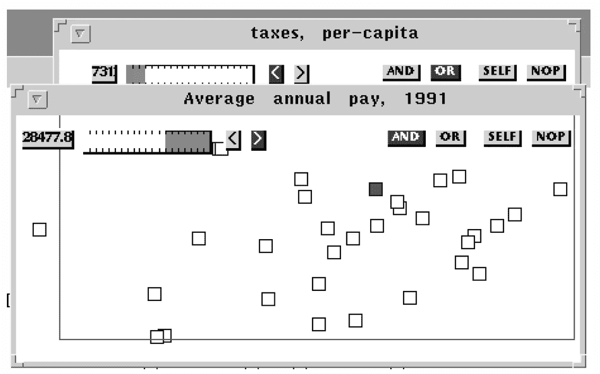

# 可视化搜索策略(第 1 部分)

> 原文：<https://medium.datadriveninvestor.com/visualizing-search-strategies-part-1-8383714c0e3b?source=collection_archive---------3----------------------->

根据 IDC 白皮书[找不到信息的高成本](http://www.ejitime.com/materials/IDC%20on%20The%20High%20Cost%20Of%20Not%20Finding%20Information.pdf)，知识工作者每天花费 2.5 小时搜索信息。无论他们最终找到了他们想要的还是停下来做一个次优的决定，两种结果都有很高的成本。例如，招聘行业依靠[布尔搜索](http://booleanblackbelt.com/2008/12/basic-boolean-search-operators-and-query-modifiers-explained/)作为候选人寻找过程的基础，然而找到具有适当技能和经验的候选人[仍然是一个持续的挑战](https://devskiller.com/50-recruitment-stats-hr-pros-must-know-2017/)。同样，医疗保健信息专业人员对文献来源进行艰苦的搜索，作为循证医学方法的基础，但系统的文献综述可能需要[年才能完成](https://onlinelibrary.wiley.com/doi/10.1002/9780470712184.ch6)，新的研究结果可能在此期间发表，导致[缺乏流通性和潜在的不准确性](http://annals.org/aim/fullarticle/736284)。同样，专利代理人依赖准确的现有技术搜索作为其尽职调查流程的基础，然而由于后来[发现了他们的原始搜索工具未能发现的现有技术](https://pdfs.semanticscholar.org/a7f4/6accffdfb06ce61333ae1bd811460345733d.pdf)，侵权诉讼以每天 10 起以上的速度被提起。

这些职业的共同点是需要开发准确、可重复和透明的搜索策略。这个问题的传统解决方案是使用逐行查询构建器，它要求用户输入[布尔字符串](https://en.wikipedia.org/wiki/Boolean_algebra)，然后可以组合这些字符串以形成[多行搜索策略](https://isquared.wordpress.com/2018/06/14/think-outside-the-search-box/):

然而，这样的查询构建器通常为错误检查或查询优化提供有限的支持，并且它们的输出通常受到错误和低效的损害。在本帖中，我们回顾了三个早期但极具原创性和影响力的替代方案，并讨论了它们对当代问题和设计挑战的贡献。

# 替代方法

将数据可视化应用到搜索查询公式中可以为[带来显著的好处](https://patents.google.com/patent/US7383513B2/en)，例如更少的零命中查询、更好的查询理解，以及对探索陌生数据库的更好支持。这种方法的一个早期例子是 [Anick 等人的](https://dl.acm.org/citation.cfm?id=98015)。(1989)，他开发了一个可以解析自然语言查询并使用“查询重构工作空间”来表示它们的系统。虽然早期的工作，这个系统引入了许多关键的设计思想:

*   该查询被表示为可视画布上的一组“小块”,可以通过直接操作(重新)排列
*   可以将查询元素设置为“活动”或“非活动”
*   布局是从左到右阅读的，垂直重叠的瓷砖是 or，没有重叠的瓷砖是 and。

例如，自然语言查询“从~5.0 下的磁带复制*备份保存集”*将表示如下:

布尔语义解释(显示在下半部分)将是:

> (“复制”和“备份保存集”和“磁带”以及(“~5.0”或“版本 5.0”))。

检索到的结果集被定义为所有那些包含从左到右通过图表的任何可能路径的术语组合的文档。至关重要的是，用户可以自由地重新排列这些瓦片，以重新表达，并激活或停用替代元素，以优化查询。此外，该系统提供了与叙词表集成的支持，它还在每个区块的左下角显示点击次数。这些都是非常有先见之明的想法，也是我们在自己的作品中回归的主题。

在随后的工作中， [Fishkin 和 Stone](http://citeseerx.ist.psu.edu/viewdoc/summary?doi=10.1.1.37.6381) (1995)研究了直接操作技术在数据库查询公式问题中的应用，使用“透镜”系统来提炼和过滤数据。可以通过堆叠透镜并应用合适的运算符(例如 AND/OR 等)来组合透镜。例如，用户可以搜索美国人口普查数据的数据库来查找高工资(上面的过滤器)和低税收(下面的过滤器)的城市:

此外，这些透镜可以组合起来创建*复合透镜*，从而支持任意复杂度的查询封装。这是我们在[的作品](https://www.2dsearch.com/)中再次提到的主题。

更有影响力的工作是 Jones(1998)的工作，他反映了用户在处理布尔逻辑时遇到的困难，特别指出了查询说明和结果浏览之间的脱节，以及由于缺乏关于单个术语有效性的反馈而导致的低效率。他提出了一种替代方案，其中使用[维恩图](https://en.wikipedia.org/wiki/Venn_diagram)符号结合集成的查询结果预览来表达概念。可以通过在工作空间内重叠对象来形成查询，以创建交集和析取，并且可以选择子集来促进整个查询的子组件的执行:

至关重要的是，Jones 指出，虽然这种表示提供了一定程度的表达普遍性，但语义解释必须与被搜索的特定集合的语义解释相联系，因此每个这样的数据库都需要独立的适配器。这也是我们在自己的作品中回到[的主题。](https://www.2dsearch.com/)

# 概括起来

在这篇短文中，我们简要回顾了阐明复杂搜索策略和布尔表达式所涉及的一些挑战，并研究了三种早期但高度原创的替代方法。考虑到这些系统开发的十年(第一个系统比网络早几年)，这是一项非凡的工作，提供了具有持久价值的设计见解和原则。在我们的下一篇文章中，我们将回顾一些最新的方法，并思考如何利用他们的设计思想和见解来应对当代的搜索挑战。