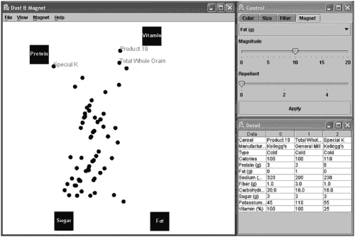
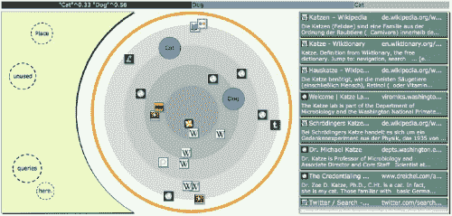
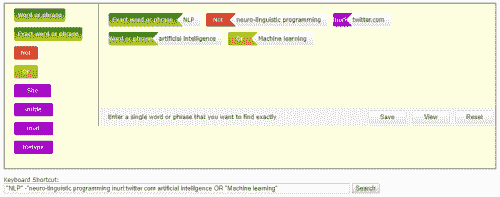

# 可视化搜索策略(第 2 部分)

> 原文：<https://medium.datadriveninvestor.com/visualizing-search-strategies-part-2-bffecfb892bb?source=collection_archive---------6----------------------->

在[我们的上一篇文章](https://isquared.wordpress.com/2018/06/21/visualizing-search-strategies-part-1/)中，我们回顾了在开发复杂搜索问题的[有效解决方案](https://isquared.wordpress.com/2018/06/14/think-outside-the-search-box/)中涉及的一些问题，并探讨了在制定和表示[布尔字符串和表达式](http://booleanblackbelt.com/2008/12/basic-boolean-search-operators-and-query-modifiers-explained/)中涉及的一些挑战。特别是，我们探索了三个实验系统的[贡献，这些系统旨在提供一种替代传统方法的方法，例如逐行查询构建器和‘高级搜索’表单。在这篇文章中，我们回顾了一些最近的例子，并思考了他们的想法，见解和创新可以有效地应用于解决当代搜索挑战的方式。](https://isquared.wordpress.com/2018/06/21/visualizing-search-strategies-part-1/)

# 替代方法

我们的第一个例子是 Yi 等人(2005) 的研究，他们研究了信息可视化技术应用于[多元数据集](https://en.wikipedia.org/wiki/Multivariate_statistics)的探索和查询的方法。特别是，他们开发了一个基于“灰尘和磁铁”隐喻的系统，其中数据中感兴趣的维度可以在可视画布上表示为“磁铁”，数据中点之间的关系可以通过观察“磁力”对单个“数据粒子”的影响来理解。例如，可以通过选择与数据中感兴趣的维度(例如，蛋白质、维生素、糖、脂肪含量)相对应的磁体来探索谷物品牌的数据库，然后布局将表示它们之间的竞争力量的平衡:

至关重要的是，Yi el al 认识到他们方法的有效性不仅依赖于选择合适的隐喻，还依赖于在执行过程中对细节的关注，强调使用*动画*和*交互*来传达数据中关系的本质。对他们来说，动画不仅仅是装饰:它是用户理解可视化实际上是如何产生的手段。这是我们在自己的作品中再次提到的主题。

我们的第二个例子涉及一个更近的系统，即[Nitsche&Nur nberg er(2013)](https://link.springer.com/chapter/10.1007/978-3-642-39209-2_28)的系统。他们观察到，当用户在不熟悉的领域搜索信息时，他们经常努力制定有效的查询，最终可能重复重新制定，而不一定达到他们的目标。作为回应，他们开发了一个基于辐射状界面的系统，在这个界面中，查询和结果可以被集成和共同操作。

这个概念利用了一个伪桌面隐喻，其中感兴趣的物体聚集在中心。查询对象可以直接输入到这个画布上(显示为圆形图标)，并且它们与中心和其他对象的接近度被用作相关性提示，影响搜索结果的选择和位置(显示为方形图标)。放射状画布的左边是未使用的查询词的“暂存空间”,右边是传统的结果列表:

值得注意的是，Nitsche 和 Nurberger 明白，提供即时反馈是有效的探索性搜索的基础，因此用户不仅可以在传统意义上查询数据，还可以编写“假设”问题来探索和优化他们自己的搜索查询。他们还认识到，他们的系统的探索性质需要通过非桌面(即基于触摸的)平台进行交互，并为原生平板设备(如 iPad)和移动网络(HTML5)开发了版本。这些想法也影响了[我们自己的工作](https://www.2dsearch.com/)。

我们的最后一个例子在目标上要温和得多，但由于它的简单性，提供了也许是最令人信服的主张。 [Boolify](https://www.kidzsearch.com/boolify/) 是作为一种教育工具开发的，用来教用户如何在谷歌中创建布尔搜索。邀请用户将彩色块拖到画布上，例如绿色代表术语或短语，黄色或红色代表布尔运算符(分别为 or 和 NOT)，紫色代表特定于平台的运算符(例如“intitle”“inurl”等)。):

至关重要的是，通过在画布下面显示生成的布尔字符串，Boolify 促进了对查询语法的理解及其语义的优化，并促进了输出到其他系统的可移植性。这些是我们在[自己的作品](https://www.2dsearch.com/)中回归的关键主题。

Boolify 的简单鼓励有趣的互动和探索。然而，它的极简主义也是它的主要缺点:缺乏对结构定界的支持(例如括号)意味着没有内在的方法来区分“A 和(B 或 C)”和“A 和 B”或“C”。因此，Boolify 作为一种学习工具很出色，但并不能很好地适应专业搜索实践的严格性。

# 概括起来

在这篇文章和[之前的](https://isquared.wordpress.com/2018/06/21/visualizing-search-strategies-part-1/)文章中，我们回顾了开发复杂搜索问题的有效解决方案所涉及的一些问题，并探索了许多关键替代方案的贡献。这些系统中的每一个都为[搜索策略制定](https://isquared.wordpress.com/2018/06/14/think-outside-the-search-box/)的问题提供了自己独特的解决方案，它们共同提供了许多关键原则和见解，例如:

*   布尔表达式可以被公式化为画布上的对象，并通过直接操作来排列
*   可以单独调用或询问查询元素，以便于探索
*   通过嵌套聚合结构，可以创建任意复杂的查询
*   互动和动画可以用来传达意义和结构
*   实时反馈是有效查询优化的基础

然而，尽管这些原则具有持久的价值，但应该注意的是，上述系统都没有在实际产品中实现，甚至也没有(除了 Boolify 之外)在生产基础上部署到实时的、公开可用的端点。这样做的原因当然是多方面的，但是值得思考一下这一点的含义以及任何试图挑战传统查询构建器霸权的人所面临的任务的重要性。像 [Dvorak 键盘](https://simple.wikipedia.org/wiki/Dvorak_keyboard)一样，仅仅成为更好的解决方案是不够的。相反，它必须好得让用户乐意接受转换的内在成本，或者，它必须专注于对当前方法的[缺点感受最深的社区部分](https://isquared.wordpress.com/2015/09/08/search-strategies-considered-harmful/)。这些是我们将在未来的博客文章中回归的原则，以及对我们自己的[研发](https://www.2dsearch.com/randd/)活动成果的评论。

*原载于 2018 年 6 月 27 日*[*【isquared.wordpress.com】*](https://isquared.wordpress.com/2018/06/27/visualizing-search-strategies-part-2/)*。*