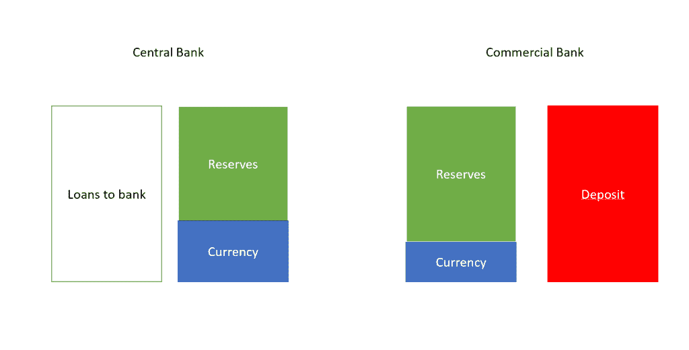
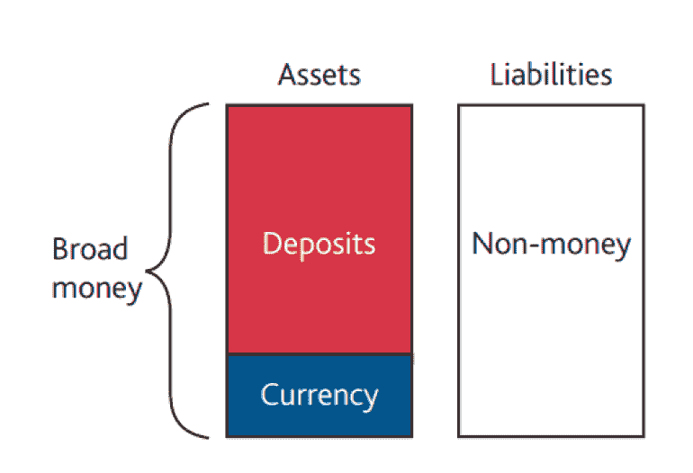
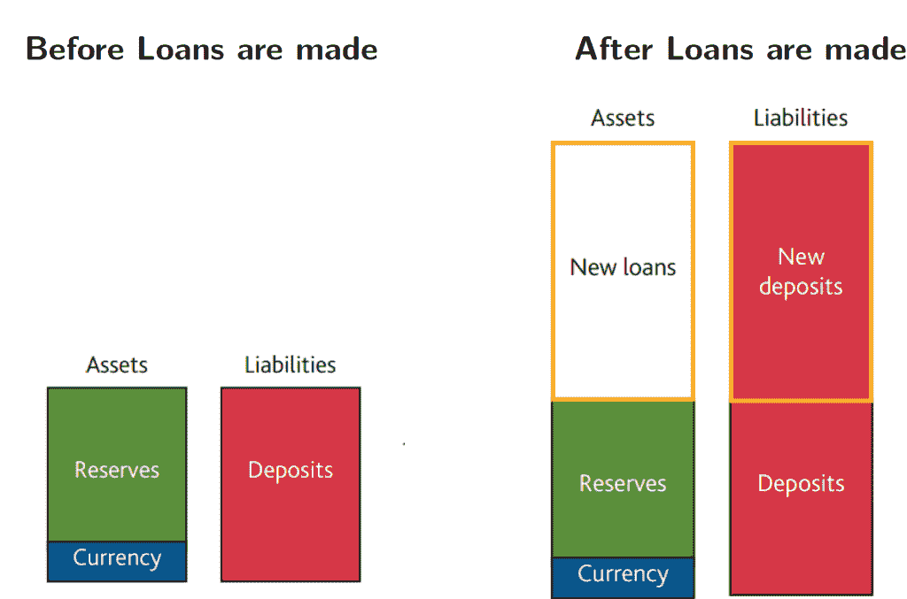
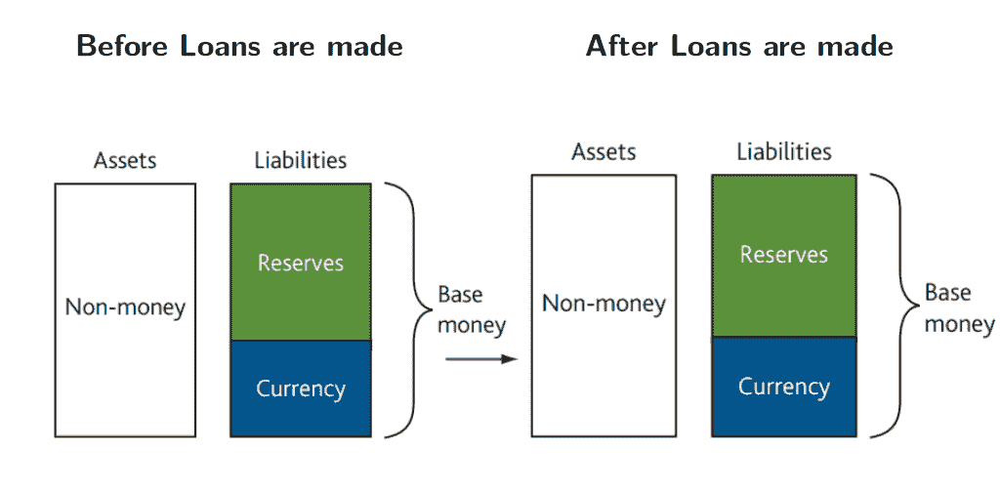
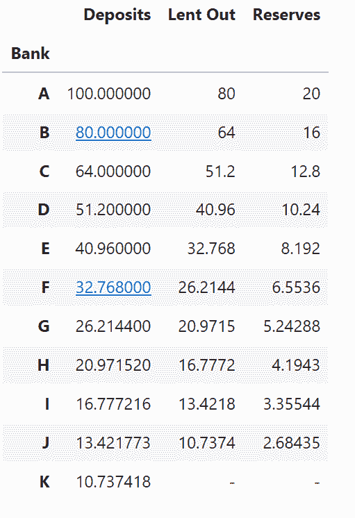
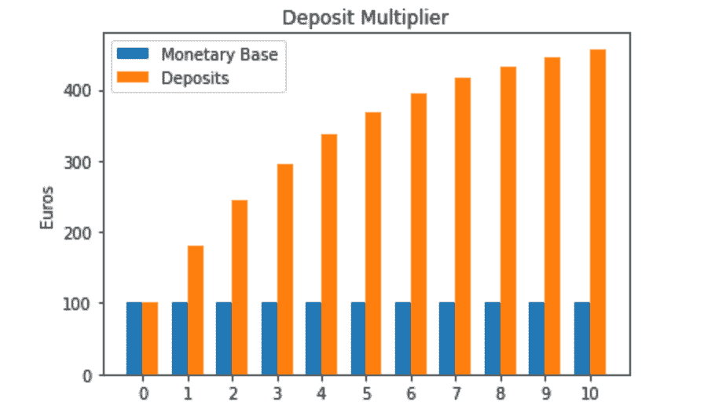
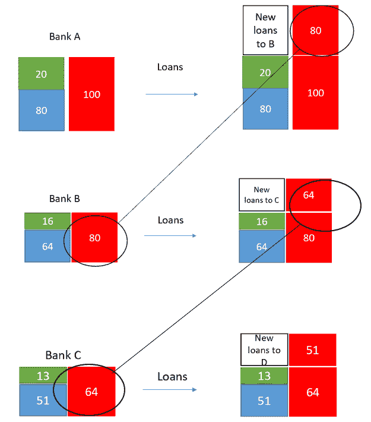

# 用 Python 可视化存款乘数

> 原文：<https://medium.datadriveninvestor.com/visualizing-the-deposits-multiplier-with-python-19f5bbdbd6e4?source=collection_archive---------4----------------------->

在本文中，我将提出用 Python 对所谓的存款乘数进行可视化解释。后者是一个宏观经济指标，描述了初始存款如何导致总货币供应量的最终增加。

为了充分理解它是如何运作的，我们必须考虑市场中的三个参与者:央行、商业银行和家庭。这个想法是，存在一个所谓的货币基础，它由货币或商业银行持有的储备构成，代表着它们的资产，而从央行的角度来看，这些是负债。



另一方面，商业银行贷款给家庭，他们的资产负债表看起来是这样的:



如你所见，从消费者的角度来看，存款是一种资产(有利可图，保证正利率)。

[](https://www.datadriveninvestor.com/2019/03/08/why-inclusive-wealth-index-is-a-better-measure-of-societal-progress-than-gdp/) [## 为什么包容性财富指数比 GDP 更能衡量社会进步？|数据驱动…

### 你不需要成为一个经济奇才或金融大师就能知道 GDP 的定义。即使你从未拿过 ECON 奖…

www.datadriveninvestor.com](https://www.datadriveninvestor.com/2019/03/08/why-inclusive-wealth-index-is-a-better-measure-of-societal-progress-than-gdp/) 

由于商业银行只不过是社会，因此他们的目标是在年底获得利润，既可以回报股东，也可以再投资于社会本身，他们不能简单地将存款产生的流动性留在钱箱里。

相反，目的是将这种流动性再投资于更有利可图的资产:事实上，它们依赖于这样一个事实，即一旦存入一定金额的资金，客户不会立即使用全部金额，因此银行可以自由投资这种流动性，唯一的限制是保留一笔“应急基金”。后者是由准备金率决定的，准备金率是商业银行必须持有的可储备负债部分，而不是贷款或投资。这是该国央行确定的要求，在本文中，我们将假设它等于 20%。

现在想象一下下面的场景，有两家银行 A 和 b。A 银行有 100 笔存款，其中 20 笔有准备金担保。剩下的 80 英镑作为贷款给了 B 银行。从 B 银行的角度来看，这笔贷款是存款，因此是负债。因此，B 将被迫在其钱箱中获得 16 英镑，而对于剩余的 64 英镑，它决定向第三家银行提供贷款，比如说银行 c。对于许多银行来说，这一过程可能会继续下去，最终我们的存款总额将远远大于实际货币基础，实际货币基础与最初的 100 英镑相比没有任何变化。

给你一个概念，这是商业银行贷款后的资产负债表:



尽管央行的资产负债表保持不变:



当然，在市场现实中，商业银行不会将 80%的存款全部转移给其他商业银行:它们还向家庭发放贷款，这对于保证商品和服务需求至关重要。然而，我们每天通过信用卡消费的钱并不总是有“实物”对应物:它们可能只是来自存款乘数。

现在让我们考虑 11 家银行的情况，其中列表中的每家银行都将其可用存款的 80%借给列表的后续银行:

```
import numpy as np
deposits.clear()
deposits=[]
deposits.append(100)
for i in range(1,11):
    deposits.append(0.8*deposits[i-1])loans=deposits[1:12]
reserves=np.asarray(deposits[0:10])-np.asarray(loans)
reserves=reserves.tolist()
loans.append('-')
reserves.append('-')
banks=['A','B','C','D','E','F','G','H','I','J','K']
data_tuples = list(zip(banks,deposits,loans,reserves))
df=pd.DataFrame(data_tuples, columns=['Bank','Deposits','Lent Out','Reserves'])df.set_index('Bank', inplace=True)df
```



如你所见，每家银行都在前一家银行获得 80%的存款的基础上放贷，而只获得其中的 20%。结果，货币供应量越来越多，没有一个真正的对应物，即货币基础，它仍然处于 100 的初始水平。让我们想象一下:

```
import matplotlib.pyplot as pltx = np.arange(len(banks))  
width = 0.35fig, ax = plt.subplots()
rects1 = ax.bar(x - width/2, monetary_base, width, label='Monetary Base')
rects2 = ax.bar(x + width/2, increasing_deposits, width, label='Deposits')ax.set_ylabel('Euros')
ax.set_title('Deposit Multiplier')
ax.set_xticks(x)
ax.legend()plt.show()
```



现在让我们看看贷款后前三家银行的资产负债表会发生什么。简单来说，假设 A 银行从 100 笔存款(让我们看看，来自央行)的初始情况开始，它已经担保了其中的 20 笔作为准备金。其他银行的资产负债表是空的，直到它们收到前一家银行的存款(即，B 银行只有从 A 银行收到的存款):



再一次，记住真实的，一致的钱数仍然是 100，即使存款数更高。

正如预期的那样，货币乘数保证了经济中的良性循环，因为它允许家庭获得贷款以进行购买，因此它保持了高需求。然而，硬币的另一面是，银行可能会同时收到大额提款请求，这是完全合法的，因为客户在存款合同中完全可以提取。那么，在这种情况下，由于银行只保留了这些存款的 20%，他们将无法偿还所有的存款，其结果是传播对银行的负面情绪，让更多的人决定退出。

这种现象被称为“银行挤兑”，在金融市场的历史上，这样的事件不止一次(想想 1929 年的金融危机就知道了)。这就是为什么有很多关于银行资产负债表稳健性的争论和创新，从法定准备金的数量到存款应该投资的资产种类。

*原载于 2019 年 9 月 3 日*[*【http://datasciencechalktalk.com】*](https://datasciencechalktalk.com/2019/09/03/visualizing-the-deposits-multiplier-with-python/)*。*