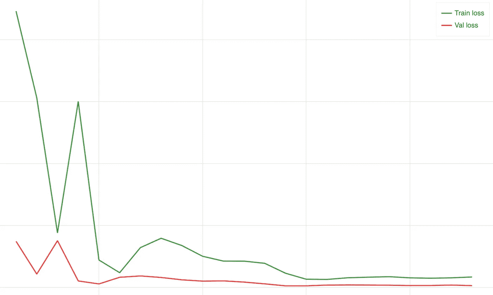
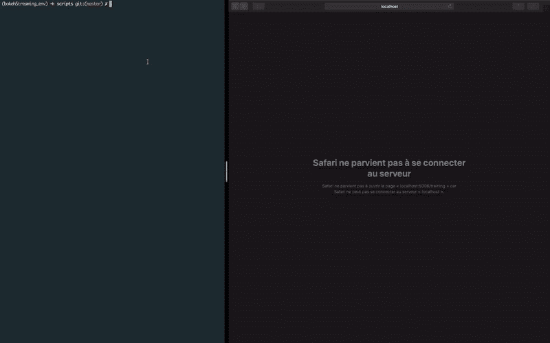

# 使用 PyTorch 和 Bokeh 实时可视化训练和验证损失

> 原文：<https://medium.datadriveninvestor.com/visualizing-training-and-validation-loss-in-real-time-using-pytorch-and-bokeh-5522401bc9dd?source=collection_archive---------1----------------------->

[](http://www.track.datadriveninvestor.com/1B9E)

在训练神经网络的过程中，我有时会留意一些输出，比如当前的历元数、训练损失和验证损失。所有这些都是为了了解算法的发展方向，并尝试回答如下问题:

> 我应该选择更大/更小的学习率吗？
> 我应该走衰变道吗？
> 我是否应该停止训练，也许减少纪元的数量和许多其他问题。

这些问题中的许多可以通过像**早停**或其他的一些软件包来回答。但是我发现实时可视化这些价值的事实很有趣。我说的实时，是指在训练过程中。

[](https://www.datadriveninvestor.com/2019/01/07/the-ultimate-learning-path-for-deep-learning-in-2019-more/) [## 2019 年深度学习的终极学习路径及更多...-数据驱动型投资者

### Faisal 在加拿大工作，拥有金融/经济和计算机方面的背景。他一直积极从事外汇交易…

www.datadriveninvestor.com](https://www.datadriveninvestor.com/2019/01/07/the-ultimate-learning-path-for-deep-learning-in-2019-more/) 

你知道吗？这里有一个快速教程，介绍如何使用精彩的深度学习框架 [PyTorch](https://pytorch.org) 和 sublime [Bokeh 库](https://bokeh.pydata.org/en/latest/)进行绘图。

## 步骤 1:安装依赖项

```
bokeh==1.1.0
cycler==0.10.0
Jinja2==2.10.1
kiwisolver==1.1.0
MarkupSafe==1.1.1
matplotlib==3.0.3
numpy==1.16.3
opencv-python==4.1.0.25
packaging==19.0
pandas==0.24.2
Pillow==6.0.0
pyparsing==2.4.0
python-dateutil==2.8.0
pytz==2019.1
PyYAML==5.1
six==1.12.0
torch==1.0.1.post2
torchvision==0.2.2.post3
tornado==6.0.2 
```

## 步骤 2:导入必要的模块

```
#PyTorch
import torch
…# Bokeh
from bokeh.io import curdoc
from bokeh.layouts import column
from bokeh.models import ColumnDataSource
from bokeh.plotting import figurefrom functools import partial
from threading import Thread
from tornado import gen
```

## 第三步:准备情节

首先，我们必须定义一个名为**column data source 的对象，它包含一个变量的字典，如果你需要的话，你可以将它包含在带有初始值的绘图中。这里我没有初始值。**

```
source = ColumnDataSource(data={‘epochs’: [],
 ‘trainlosses’: [],
 ‘vallosses’: [] }
)
```

然后通过调用 **figure()** 创建窗口对象，并将列车和 val 损耗添加为线图。

```
plot = figure()
plot.line(x= ‘epochs’, y=’trainlosses’,
 color=’green’, alpha=0.8, legend=’Train loss’, line_width=2,
 source=source)plot.line(x= ‘epochs’, y=’vallosses’,
 color=’red’, alpha=0.8, legend=’Val loss’, line_width=2,
 source=source)
```

最后，我们通过调用 **curdoc()** 方法来创建将要显示的文档。这里，在 **doc** 变量中保存 curdoc()的本地副本很重要，这样所有线程都可以访问同一个文档。

```
doc = curdoc()
# Add the plot to the current document
doc.add_root(plot)
```

## 步骤 4:更新绘图

这里有一个函数，它将包含与在**步骤 3** 中声明的数据字典相同项目的字典作为输入。该功能负责从**步骤 5 中定义的训练循环中获取新的损失和当前时期。**

```
[@gen](http://twitter.com/gen).coroutine
def update(new_data):
    source.stream(new_data)
```

## 第五步:像往常一样处理数据并编写训练循环

这里我假设你知道如何使用 PyTorch 训练一个神经网络，为了使事情更清楚，我将只关注代码的某一部分。

```
def train(n_epochs):
 model = Net()
 … 
 model.train()
 for epoch in range(1, n_epochs+1):
     # Keep track of training and validation loss
     train_loss = 0.0
     valid_loss = 0.0 for data in train_loader:
        …
        # compute your training loss as usual 
        train_loss += loss.item()*images.size(0)

    model.eval()
    for data in valid_loader:
        …
        #compute your validation loss as usual 
        valid_loss += loss.item()*images.size(0) # calculate average losses as Usual
    train_loss = train_loss/len(train_loader)
    valid_loss = valid_loss/len(valid_loader) 
```

在此之前，与我们通常在训练神经网络时所做的相比，没有什么变化。在最后一行之后，在 for 循环中，我们唯一需要添加的是下面几行。
我们构建新的数据字典，然后使用**步骤 4** 中定义的**更新**方法更新图表。

```
new_data = {‘epochs’: [epoch],
            ‘trainlosses’: [train_loss],
            ‘vallosses’: [valid_loss] }doc.add_next_tick_callback(partial(update, new_data))
```

所以 **train()** 方法应该是这样的

```
def train(n_epochs):
    model = Net()
    … 
    model.train()
    for epoch in range(1, n_epochs+1):
        …
        for data in train_loader:
            …
            # compute your training loss as usual 
            train_loss += loss.item()*images.size(0)

        model.eval()
        for data in valid_loader:
            …
            #compute your validation loss as usual 
            valid_loss += loss.item()*images.size(0) # calculate average losses as Usual
        train_loss = train_loss/len(train_loader)
        valid_loss = valid_loss/len(valid_loader) new_data = {‘epochs’: [epoch],
                    ‘trainlosses’: [train_loss],
                    ‘vallosses’: [valid_loss] } doc.add_next_tick_callback(partial(update, new_data))
```

最后，我们通过添加这两行来结束程序

```
thread = Thread(target=train)
thread.start()
```

## 步骤 6:通过终端显示结果

如果您的文件名是 **training.py** 而不是启动 python 命令，我们必须启动散景服务器并通过在终端中键入来执行 python 脚本

```
bokeh serve --show training.py
```

我们可以在浏览器中看到结果



# 更新

现在，我称之为 **Epochsviz** 的一个简单的高级可视化模块可以从[repo here](https://github.com/Mdhvince/Epochsviz)获得。所以你可以很容易地在 3 行代码中获得上面的结果

```
from Epochsviz.epochsviz import Epochsvizeviz = Epochsviz()# In the train function
eviz.send_data(current_epoch, current_train_loss, current_val_loss)# After the train function
eviz.start_thread(train_function=train)
```

然后使用以下命令启动脚本

```
bokeh serve --show training.py
```

我希望你喜欢这个教程，我尽力做了简单的解释。

谢谢大家！