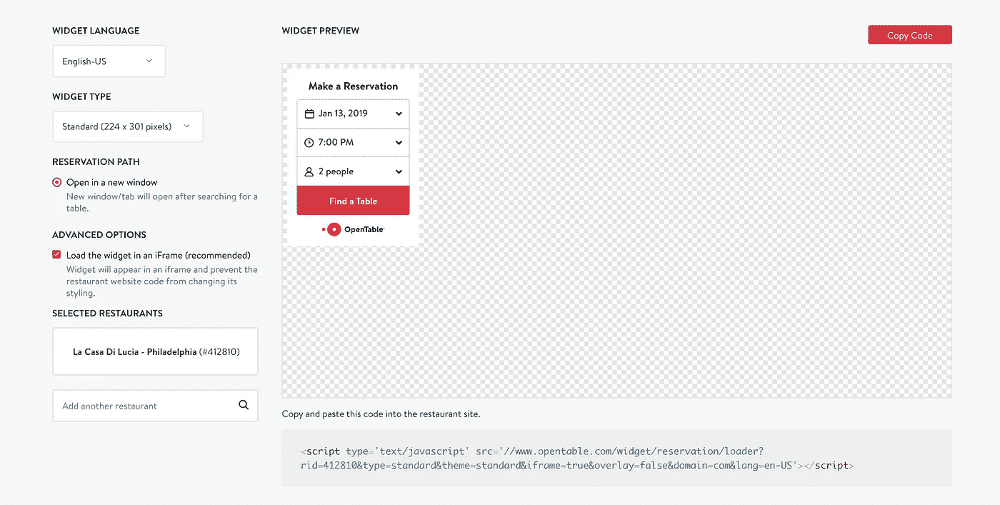
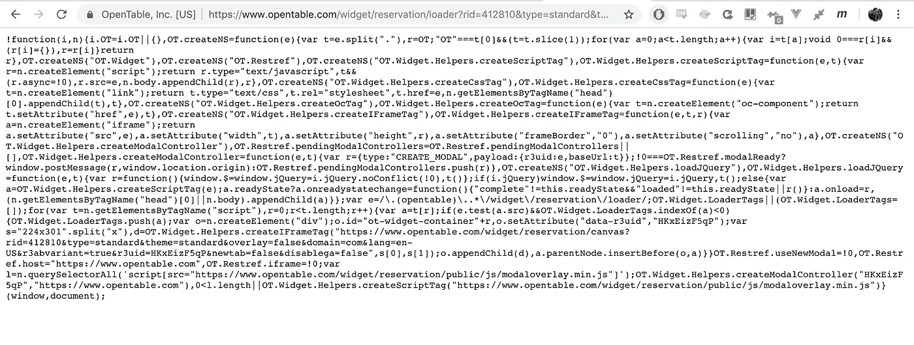
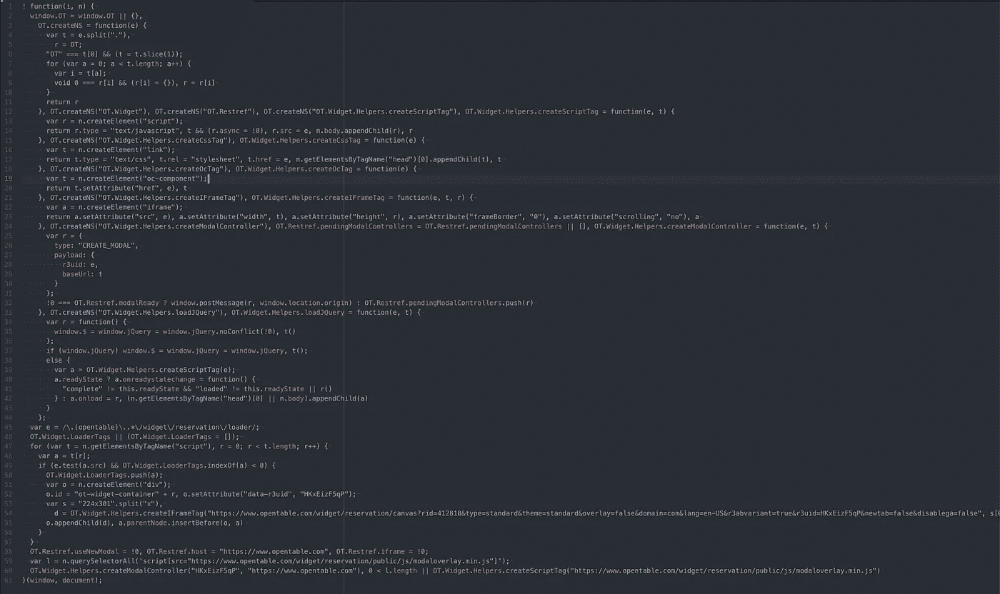
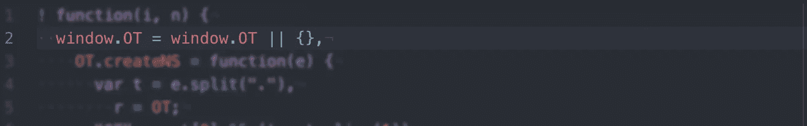
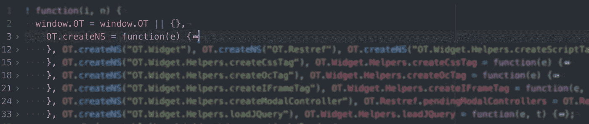
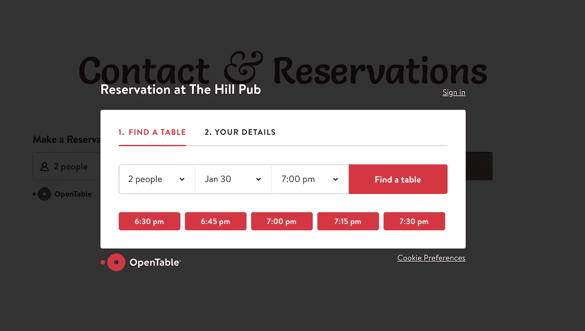
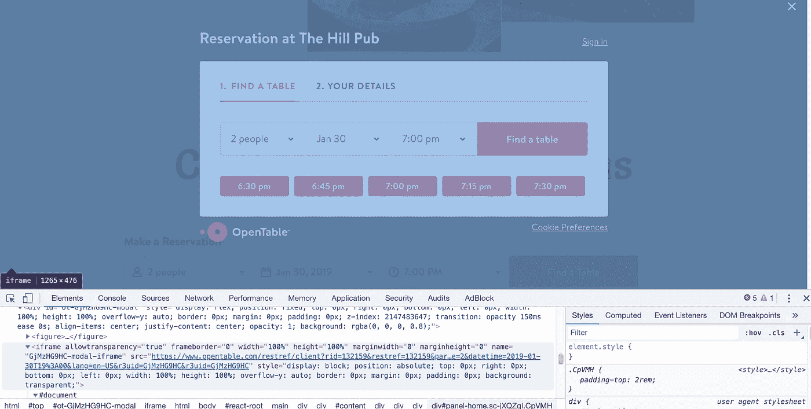

# OpenTable 小部件的活体解剖。

> 原文：<https://medium.datadriveninvestor.com/vivisection-of-opentable-widget-ea0618d4531c?source=collection_archive---------12----------------------->

[](http://www.track.datadriveninvestor.com/1B9E)

你可能对 OpenTable 很熟悉，这是一个围绕餐馆预订而建立的服务。他们的主要特点之一是一个可嵌入的小部件，餐馆可以将它插入到他们的网站中，让顾客预订桌子。这是它在野外的样子:


OpenTable widget on [http://thehillpub.ie/](http://thehillpub.ie/)

该小部件由 OpenTable 小部件构建器页面生成，如下所示:



Try it yourself at: [opentable](https://www.opentable.com/widget/reservation/preview?rid=412810&language=en-US&domainId=1&countryCode=US)

如你所见，我们可以更改一些设置，然后将代码复制到我们自己的网站上。非常方便，但是它是如何工作的呢？

# 加载脚本

我们复制的脚本只是一个`<script/>`标签，用来加载 javascript。我们可以简单地将 URL 复制到浏览器窗口中，以查看将要加载的代码:



呀。它显然被缩小了(正如你所料)，但希望并没有失去。让我们将它复制到文本编辑器中，并运行一些自动格式化:



好吧，这看起来更容易接近。作为参考，我使用 Atom 文本编辑器和 Atom-美化来自动格式化。

## 第一印象

这里首先要注意的是外部函数语法:

```
! function(i, n) {
  ...
}(window, document);
```

这是一个**自执行匿名函数。**也就是说，函数一加载就被调用(“自执行”)，它没有名字，也没有变量引用(“匿名”)。这是插件和小部件的常用方法，对于 jQuery 插件尤其常见。根据我的经验，我见过这种使用双括号对语法:`(function(){})()`的情况，但这做的是同样的事情。

`!` 只是一个一元运算(逻辑“非”)，强制 javascript 执行该函数。如果函数的输出存储在一个变量中，它将被求反，但是因为函数不返回任何东西，并且结果不被存储或在任何地方使用，所以它没有任何作用。

接下来要注意的是，`window`和`document`被传入函数，在函数内部将分别被`i`和`n`引用。

为了清楚起见，让我们找到并替换出现的`i` 和`n`。

## 默认值和逗号运算符

查看函数的内部，我们看到小部件通过给窗口分配 *stuff* 开始，但这是一种相当有趣的方式，首先使用`||`检查现有的`window.OT`值，如果不存在(即如果窗口。OT 未定义)，执行`||`后的代码。



为什么我们要费心去检查一个已经存在的窗口。OT 值？ *我假设这是为了处理一个在多个地方嵌入代码的网站。这样我们只执行一次* `*||*` *之后的代码。*

所以，在`||`之后…



Note: I have “folded” each function to highlight the comma operator syntax.

我们看到一个空的物体后面跟着一个逗号…奇怪。

通常我们希望逗号出现在函数声明、数组或对象中，对吗？在这种情况下，逗号被用作**运算符。**

> **逗号运算符**评估其每个操作数(从左到右)并返回最后一个操作数的值。 [MDN](https://developer.mozilla.org/en-US/docs/Web/JavaScript/Reference/Operators/Comma_Operator)

基于该描述，空对象被“求值”*【参见下面的注释】*，然后一个函数被声明并赋值给`OT.createNS` *【注释 2】*然后这个函数被调用几次。

***注:为什么是空物体？如果每一步都求值，只返回最后一个值，那么空对象有什么用？*** *稍微摆弄了一下，我发现在* `*||*` *运算符之后赋值* `*OT.createNS*` *函数时，空对象是避免错误所必需的。具体来说:“未捕获的 ReferenceError:赋值中的左侧无效”。*

## 创建函数

这个函数被调用了几次，据我所知，它只是用来设置带有嵌套属性的 OT 对象。我认为 NS 可能代表名称空间，但这只是猜测。

简而言之，它将字符串“ot . something . else . completely”转换为一个对象。

这相当简单，唯一有趣的地方是使用了`**void**`操作符:

> `**void**` **运算符**对给定的`*expression*`求值，然后返回`undefined`。 [MSDN](https://developer.mozilla.org/en-US/docs/Web/JavaScript/Reference/Operators/void)

## 加班职能

接下来的几行使用 createNS 函数来确保 OT 对象有一个特定名称的属性，然后为每个属性分配一个函数。这些函数不言自明:

createScriptTag，createCssTag，createOcTag，createIFrameTag，loadJQuery

## 模态

所有这些额外的工作都是为了能够将“模态”注入到主页面中。当您点按“查找表格”按钮时，会出现有问题的模态:



情态动词是一个相当具有挑战性的(也是有争议的！)UI 元素。他们必须坐在你的页面上，把自己放在屏幕的中央，并且在你需要的时候离开。

如果可能的话，我尽量避免使用它们，因为它们也会导致可访问性问题，并对屏幕阅读器构成挑战。

所有这些导致了复杂的 CSS 和 JS，这在我们复制的代码中并不明显…那么它在哪里呢？

进一步深入这个兔子洞，我们可以检查模型并发现内容实际上来自 i-frame。这意味着 UI 和元素实际上是一个完全独立的网页，从不同的服务器加载，简单地放在主网站上。



我们正在活体解剖的代码实际上只为 iframe 构建了`src`，传入了特定餐馆的细节。

从这里开始，它非常简单，远远超出了本文的范围。模态 i-frame 是一个全功能的 web 应用程序(如果类名“react-root”可信的话，它是一个 react 应用程序)。

# 结论

我们在这里看到了一些有趣的模式——其中大部分(例如逗号操作符的用法)都非常具体，可能是预处理器试图产生一个更小的 JS 的结果。我不太确定是什么，如何或为什么，但希望有人能给出解释。

然而，整个事情可以归结为一个相当简单的方法:

1.  让用户在主页面中复制一个
2.  使用
3.  在脚本标签附近插入一个<i-frame>标签，然后…</i-frame>
4.  从你自己的服务器加载你的部件。

感谢阅读！

我是[艾丹·布林](https://twitter.com/aidanbreen)，我在爱尔兰都柏林经营一家[软件咨询公司](http://apbsoftware.ie)。如果你喜欢这篇文章，可以考虑在 twitter 上关注我，或者注册我的个人邮件列表。

## 来自 DDI 的相关故事:

[](https://www.datadriveninvestor.com/2019/01/23/which-is-more-promising-data-science-or-software-engineering/) [## 数据科学和软件工程哪个更有前途？-数据驱动型投资者

### 大约一个月前，当我坐在咖啡馆里为一个客户开发网站时，我发现了这个女人…

www.datadriveninvestor.com](https://www.datadriveninvestor.com/2019/01/23/which-is-more-promising-data-science-or-software-engineering/)